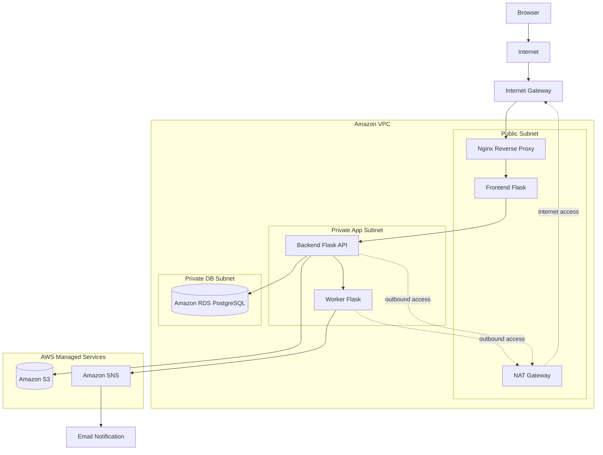

<h1 align="center">TaskFlow</h1>

<p align="center">
  <b>A multi-service AWS DevOps project built with Flask, PostgreSQL, S3, SNS and Nginx</b>
</p>

<p align="center">
  
  
  
  
  
  
  
  
  
</p>

---

## 🟣 Project Overview

TaskFlow is a simple multi-service todo application deployed on AWS as part of a DevOps learning project.

The project demonstrates a production-style cloud architecture with separated application services, public and private network zones, managed AWS services, and secure service-to-service communication.

TaskFlow allows users to:

* register an account and log in
* create todo tasks
* view their own tasks
* mark tasks as completed
* delete completed tasks
* upload files to tasks
* open uploaded files through S3 presigned URLs
* trigger email notifications through Amazon SNS

Email notifications are sent to the configured SNS email subscription.

AWS infrastructure was provisioned manually. Application process management is handled by Gunicorn and systemd. Full Infrastructure as Code with Terraform and Ansible is planned for Part B.

---

## 🟣 Architecture

The application is built from three Flask services:

| Service  | Role                                                           |
| -------- | -------------------------------------------------------------- |
| Frontend | User interface, session management, communication with Backend |
| Backend  | Main API, business logic, PostgreSQL access, S3 file uploads   |
| Worker   | Internal notification service that publishes messages to SNS   |



---

## 🟣 Request Flow

A full request from the browser to email notification follows this path:

```
Browser
  → Nginx (public port 80, Frontend EC2)
    → Frontend Flask (127.0.0.1:8000)
      → Backend Flask API (private IP:5000)
        → Amazon RDS PostgreSQL   (task data)
        → Amazon S3               (file storage)
        → Worker Flask (private IP:6000)
          → Amazon SNS
            → Email Notification
```

Nginx is the only public entry point. Frontend, Backend, and Worker are not directly accessible from the internet.

---

## 🟣 AWS Infrastructure

The project uses the following AWS components:

| Component             | Purpose                                         |
| --------------------- | ----------------------------------------------- |
| Amazon EC2            | Application servers (Frontend, Backend, Worker) |
| Amazon VPC            | Isolated network environment                    |
| Public Subnet         | Public entry point with Nginx and Frontend      |
| Private App Subnet    | Backend and Worker services                     |
| Private DB Subnet     | Database isolation                              |
| Amazon RDS PostgreSQL | Relational database                             |
| Amazon S3             | File storage                                    |
| Amazon SNS            | Email notifications                             |
| NAT Gateway           | Outbound internet access for private instances  |
| IAM Roles             | Least privilege access to AWS services          |
| Security Groups       | Controlled network access between components    |

All AWS resources were created manually. Infrastructure as Code is planned for Part B.

---

## 🟣 Services Overview

| Service  | Bind Address   | Gunicorn Workers | Role                         |
| -------- | -------------- | ---------------- | ---------------------------- |
| Worker   | 0.0.0.0:6000   | 1                | SNS email notifications      |
| Backend  | 0.0.0.0:5000   | 2                | REST API, database, storage  |
| Frontend | 127.0.0.1:8000 | 2                | Web UI, session management   |
| Nginx    | 0.0.0.0:80     | —                | Reverse proxy to Frontend    |

**Why Frontend binds to 127.0.0.1:**
Frontend is not exposed directly to the internet. Nginx listens on public port 80 and proxies all traffic to the Frontend at `127.0.0.1:8000`. This ensures all public traffic passes through Nginx.

**Backend and Worker** bind to `0.0.0.0` but are located in a private subnet and are not reachable from the internet. Security Groups restrict access to specific internal sources only.

---

## 🟣 Security Design

The project follows several security principles:

* Backend and Worker are not publicly accessible from the internet.
* RDS is isolated in a private database subnet.
* Frontend communicates with Backend through the private network.
* Backend uses a dedicated IAM role for S3 access.
* Worker uses a dedicated IAM role for SNS publishing.
* Uploaded files are accessed using presigned S3 URLs with a 1-hour expiry.
* Sensitive configuration is stored in `.env` files and excluded from Git.
* Example environment files are provided as `.env.example`.
* Passwords are stored as secure password hashes — never in plain text.
* Flask debug mode is disabled in all services.
* File uploads are validated by extension (jpg, jpeg, png, gif, pdf, txt) and limited to 30 MB.
* Each user can only access their own todos and uploaded files.

---

## 🟣 Project Structure

```text
TaskFlow/
├── backend/
│   ├── app.py
│   ├── db.py
│   ├── requirements.txt
│   └── .env.example
│
├── frontend/
│   ├── app.py
│   ├── requirements.txt
│   ├── .env.example
│   └── templates/
│       ├── index.html
│       ├── login.html
│       └── register.html
│
├── worker/
│   ├── worker.py
│   ├── requirements.txt
│   └── .env.example
│
├── nginx/
│   ├── nginx.conf
│   └── sites-available/
│       └── taskflow
│
├── systemd/
│   ├── taskflow-backend.service
│   ├── taskflow-frontend.service
│   └── taskflow-worker.service
│
├── .gitignore
└── README.md
```

---

## 🟣 Prerequisites

Before setting up the project, make sure the following are available:

* Python 3
* pip
* Python virtual environment support
* A PostgreSQL database

  * AWS RDS PostgreSQL is used in the deployed environment
  * A local PostgreSQL instance can be used for local testing if configured in `.env`
* AWS access for Amazon S3 and Amazon SNS

If the project runs on AWS EC2, AWS permissions should be provided through IAM roles attached to the instances. For local testing, AWS credentials must be configured securely outside the source code.

---

## 🟣 Environment Variables

Each service has its own `.env.example` file.

Create a real `.env` file inside each service directory based on the example:

```text
backend/.env.example   → backend/.env
frontend/.env.example  → frontend/.env
worker/.env.example    → worker/.env
```

Required configuration:

| Service  | Variable        | Purpose                               |
| -------- | --------------- | ------------------------------------- |
| Backend  | `DB_HOST`       | RDS endpoint                          |
| Backend  | `DB_NAME`       | Database name                         |
| Backend  | `DB_USER`       | Database user                         |
| Backend  | `DB_PASSWORD`   | Database password                     |
| Backend  | `DB_PORT`       | Database port (default: 5432)         |
| Backend  | `AWS_REGION`    | AWS region                            |
| Backend  | `S3_BUCKET_NAME`| S3 bucket for file uploads            |
| Backend  | `WORKER_URL`    | Internal URL of the Worker service    |
| Frontend | `BACKEND_URL`   | Internal URL of the Backend service   |
| Frontend | `SECRET_KEY`    | Secret key for Flask session signing  |
| Worker   | `AWS_REGION`    | AWS region                            |
| Worker   | `SNS_TOPIC_ARN` | SNS topic for email notifications     |

Real `.env` files are not committed to the repository.

---

## 🟣 Local Development Setup

This section describes how to set up the project for local development and testing.

For the deployed AWS environment, see [AWS Deployment: Gunicorn + systemd](#-aws-deployment-gunicorn--systemd) below.

Clone the repository:

```bash
git clone <repository-url>
cd taskflow-devops
```

Create a virtual environment and install dependencies for each service.

Commands below use Linux/macOS syntax. On Windows, the virtual environment activation command is different.

**Backend:**

```bash
cd backend
python3 -m venv venv
source venv/bin/activate
pip install -r requirements.txt
deactivate
cd ..
```

**Frontend:**

```bash
cd frontend
python3 -m venv venv
source venv/bin/activate
pip install -r requirements.txt
deactivate
cd ..
```

**Worker:**

```bash
cd worker
python3 -m venv venv
source venv/bin/activate
pip install -r requirements.txt
deactivate
cd ..
```

After creating `.env` files in each directory, services can be started locally in this order:

```bash
# Terminal 1 — start Worker first
cd worker && source venv/bin/activate && python3 worker.py

# Terminal 2 — start Backend
cd backend && source venv/bin/activate && python3 app.py

# Terminal 3 — start Frontend
cd frontend && source venv/bin/activate && python3 app.py
```

Local setup is for development and testing only. In the deployed AWS environment, services are managed by Gunicorn and systemd.

---

## 🟣 AWS Deployment: Gunicorn + systemd

In the deployed AWS environment, all services run under Gunicorn managed by systemd. Services are not started manually with `python3`.

### Service files

Systemd unit files are stored in the `systemd/` directory:

```text
systemd/taskflow-backend.service
systemd/taskflow-frontend.service
systemd/taskflow-worker.service
```

Copy the unit files to `/etc/systemd/system/` on the corresponding EC2 instance, then enable and start each service with `systemctl`.

### Production paths on EC2

| Service  | Path                     |
| -------- | ------------------------ |
| Backend  | `/opt/taskflow/backend`  |
| Frontend | `/opt/taskflow/frontend` |
| Worker   | `/opt/taskflow/worker`   |

Each service reads its configuration from `/opt/taskflow/<service>/.env`.

### Gunicorn configuration

| Service  | Bind           | Workers | Module     |
| -------- | -------------- | ------- | ---------- |
| Worker   | 0.0.0.0:6000   | 1       | worker:app |
| Backend  | 0.0.0.0:5000   | 2       | app:app    |
| Frontend | 127.0.0.1:8000 | 2       | app:app    |

### Startup order

Services must be started in this order:

```
1. Worker
2. Backend
3. Frontend
4. Nginx
```

### systemd behavior

* Services restart automatically on failure (`Restart=on-failure`).
* Runtime output and errors go to journald (`StandardOutput=journal`).
* Logs can be followed with `journalctl -u taskflow-<service> -f`.

---

## 🟣 Nginx Reverse Proxy

Nginx serves as the public entry point for all incoming HTTP traffic.

The site configuration is stored in `nginx/sites-available/taskflow`:

```nginx
server {
    listen 80;

    location / {
        proxy_pass http://127.0.0.1:8000;
        proxy_set_header Host $host;
        proxy_set_header X-Real-IP $remote_addr;
    }
}
```

The global Nginx configuration file is stored in `nginx/nginx.conf` as a reference.

Nginx forwards all requests from public port 80 to the Frontend Gunicorn process at `127.0.0.1:8000`. Backend and Worker are not reachable through Nginx.

---

## 🟣 Health Checks

Each Flask service includes a `/health` endpoint for basic availability checks.

After the services are running, they can be tested with:

```bash
curl http://127.0.0.1:6000/health   # Worker
curl http://127.0.0.1:5000/health   # Backend
curl http://127.0.0.1:8000/health   # Frontend (on same host)
curl http://localhost/health         # Public entry through Nginx
```

These checks confirm that the services are running and responding to HTTP requests.

---

## 🟣 Operational Commands

Use these commands on the EC2 instances to monitor and manage the services.

**Check service status:**

```bash
systemctl status taskflow-frontend
systemctl status taskflow-backend
systemctl status taskflow-worker
```

**Follow live logs:**

```bash
journalctl -u taskflow-frontend -f
journalctl -u taskflow-backend -f
journalctl -u taskflow-worker -f
```

**Nginx:**

```bash
sudo nginx -t
sudo systemctl reload nginx
```

**Check listening ports:**

```bash
ss -tlnp
```

**Smoke test:**

```bash
curl http://localhost/
curl http://localhost/health
```

---

## 🟣 Implemented Features

* Multi-service Flask application
* User registration and login
* Session-based authentication in Frontend (Flask session stores `user_id` and `username`)
* Frontend sends `X-User-Id` header to Backend on every authenticated request
* Backend returns only the current user's todos
* Passwords are stored as secure password hashes
* Todo CRUD: create, read, mark as done, delete completed
* PostgreSQL / RDS integration with connection timeout
* S3 file upload flow
* S3 presigned URL file access with 1-hour expiry
* SNS email notification flow (todo created, completed, file uploaded)
* Nginx reverse proxy
* Public/private subnet separation
* IAM role separation by service responsibility
* File type validation (allowed: jpg, jpeg, png, gif, pdf, txt)
* File size limit (30 MB maximum)
* Application-level error logging in all services
* Gunicorn + systemd service management
* systemd/journald for runtime logs in the deployed environment
* S3 upload failures return a clear 503 error response
* Worker notification errors are logged as warnings without failing the main request
* SNS publish errors are handled and logged by the Worker
* PostgreSQL connection timeout
* Flask debug mode disabled in all services

---

## 🟣 Current Limitations

This is the current manual AWS deployment state before full Part B automation.

| Limitation                          | Notes                                                                        |
| ----------------------------------- | ---------------------------------------------------------------------------- |
| No HTTPS                            | HTTP only, no TLS certificate                                                |
| No centralized logging              | Logs are available via journald on each instance; no CloudWatch integration  |
| No Infrastructure as Code           | AWS resources were created manually                                          |
| No automated configuration management | Server setup was done manually; no Ansible yet                             |

---

## 🟣 Planned Improvements for Part B

The next stage of the project will focus on automation, security, and operational improvements:

* Terraform for AWS infrastructure provisioning
* Ansible for server configuration and application deployment
* Possible Ansible automation for systemd/Gunicorn setup (venvs, unit files, env files)
* HTTPS / TLS certificate
* CloudWatch centralized logging
* Infrastructure recreation from code
* Cleaner, repeatable deployment workflow

---

## 🟣 Tech Stack

| Category      | Technologies                                |
| ------------- | ------------------------------------------- |
| Backend       | Python, Flask, Gunicorn                     |
| Database      | PostgreSQL, Amazon RDS                      |
| Storage       | Amazon S3                                   |
| Notifications | Amazon SNS                                  |
| Web Server    | Nginx                                       |
| Process Mgmt  | Gunicorn, systemd                           |
| Cloud         | AWS EC2, VPC, IAM, Security Groups          |
| DevOps        | Git, GitHub, manual AWS provisioning        |

---

## 🟣 Repository Notes

This repository does not include:

* `.env` files with real credentials
* Private SSH keys
* AWS credentials
* Virtual environments (`venv/`)
* Log files
* Local cache files

These files are intentionally excluded using `.gitignore`.

`.env.example` files are safe templates with placeholder values only.
