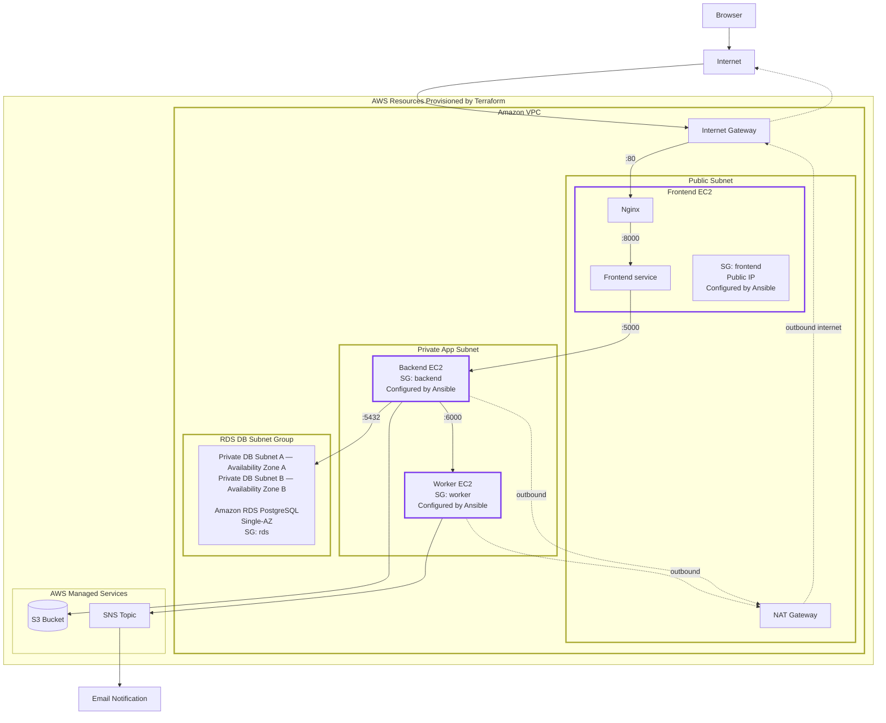

<h1 align="center">TaskFlow</h1>

<p align="center">
  <b>A multi-service AWS todo application, provisioned with Terraform and configured with Ansible</b>
</p>

<p align="center">
  
  
  
  
  
  
  
  
  
  
  
</p>

---

## 🟣 Project Overview

TaskFlow is a simple multi-service todo application deployed on AWS as part of a DevOps learning project.

The application is built from three Flask services (Frontend, Backend, Worker), a managed PostgreSQL database, file storage, and email notifications. All AWS infrastructure is provisioned by Terraform. Server configuration and application deployment are automated with Ansible. A few documented operator steps, such as preparing local configuration files and transferring Terraform outputs to Ansible, are still performed manually.

TaskFlow allows users to:

* register an account and log in
* create todo tasks
* view their own tasks
* mark tasks as completed
* delete completed tasks
* upload files to tasks
* open uploaded files through S3 presigned URLs
* trigger email notifications through Amazon SNS

Email notifications are sent to the confirmed SNS email subscription.

---

## 🟣 Architecture

The application is built from three Flask services:

| Service  | Role                                                           |
| -------- | --------------------------------------------------------------- |
| Frontend | User interface, session management, communication with Backend |
| Backend  | Main API, business logic, PostgreSQL access, S3 file uploads   |
| Worker   | Internal notification service that publishes messages to SNS   |

All AWS infrastructure below is created by Terraform:

| Component                    | Purpose                                                                    |
| ----------------------------- | --------------------------------------------------------------------------- |
| Amazon VPC                    | Isolated network with public and private subnets                          |
| Public Subnet                 | Hosts the Frontend EC2 instance and the NAT Gateway                       |
| Private App Subnet            | Hosts the Backend and Worker EC2 instances                                |
| Private DB Subnets (2 AZs)    | Form the RDS DB subnet group across two Availability Zones; the Single-AZ RDS instance is placed in one selected subnet  |
| Internet Gateway              | Gives the public subnet access to the internet                            |
| NAT Gateway                   | Gives the private subnet outbound internet access (for S3 and SNS calls)  |
| Amazon EC2 (× 3)               | Frontend, Backend, and Worker application servers                         |
| Amazon RDS PostgreSQL         | Relational database for users and todos                                   |
| Amazon S3                     | Stores uploaded files                                                     |
| Amazon SNS                    | Sends email notifications                                                 |
| IAM Roles                     | Give Backend and Worker only the AWS permissions they actually need       |
| Security Groups               | Control which service can reach which, and on what port                  |

---

## 🟣 Architecture Diagram



The dashed lines show outbound-only traffic: Backend reaches Amazon S3, and Worker reaches Amazon SNS through the NAT Gateway and Internet Gateway. Internal Security Group rules use source Security Group references wherever possible — for example, the `backend` Security Group only accepts port 5000 from Frontend, not from anywhere else. Public HTTP access to Nginx and operator SSH access to the Frontend EC2 instance are the documented exceptions.

---

## 🟣 Request Flow

A request from the browser branches out from Backend to three independent destinations:

```
Browser
  -> Nginx (public port 80, Frontend EC2)
    -> Frontend Flask (127.0.0.1:8000)
      -> Backend Flask API (private IP:5000)
         |-- Amazon RDS PostgreSQL (users and todos)
         |-- Amazon S3 (file storage)
         +-- Worker Flask (private IP:6000)
               -> Amazon SNS
                 -> Email Notification
```

RDS, S3, and Worker are three separate calls made by Backend, not a chain — Backend does not go through RDS to reach S3, or through S3 to reach Worker. Nginx is the only public application entry point. Backend and Worker have no public IP. SSH access to the Frontend EC2 instance is restricted to the operator address defined by `allowed_ssh_cidr`.

---

## 🟣 Terraform

Terraform provisions the AWS resources TaskFlow uses: the network, the three EC2 instances, RDS, S3, SNS, IAM roles, and Security Groups. It references an existing EC2 Key Pair for SSH access rather than creating one (see [Key pair](#key-pair) below). It does not install software or run application code on the servers — that is Ansible's job (see [Ansible](#-ansible)). None of the Terraform files use `user_data` or any other in-server provisioning.

### Project structure

```text
terraform/
├── versions.tf              # Terraform and provider version requirements
├── variables.tf             # Input variables
├── data.tf                  # AMI lookup, account ID, availability zones
├── network.tf                # VPC, subnets, route tables, Internet Gateway, NAT Gateway
├── security_groups.tf        # Security Groups and rules
├── compute.tf                 # EC2 instances
├── rds.tf                     # RDS PostgreSQL
├── s3.tf                      # S3 bucket
├── sns.tf                     # SNS topic and email subscription
├── iam.tf                     # IAM roles and instance profiles
├── outputs.tf                 # Values used by Ansible and by the operator
└── terraform.tfvars.example   # Example variable values
```

### Required versions

Terraform `>= 1.11.0` (needed for the write-only password feature described below) and AWS provider `~> 5.0`.

### Variables

`variables.tf` defines 16 input variables:

| Variable                    | Type   | Default          | Notes                                             |
| ---------------------------- | ------ | ---------------- | -------------------------------------------------- |
| `aws_region`                 | string | `eu-north-1`      |                                                    |
| `project_name`                | string | `taskflow`        | validated: lowercase letters, digits, hyphens     |
| `environment`                  | string | `part-b`           | validated: lowercase letters, digits, hyphens     |
| `instance_type`                | string | `t3.micro`         | used by all three EC2 instances                   |
| `key_pair_name`                | string | *(required)*      | name of an existing EC2 Key Pair                  |
| `db_name`                       | string | `todo_db`          |                                                    |
| `db_username`                    | string | *(required)*      | marked `sensitive`                                |
| `db_password`                     | string | *(required)*      | marked `sensitive` **and** `ephemeral` (see below) |
| `db_password_wo_version`          | number | `1`                | rotation counter for the password                 |
| `notification_email`               | string | *(required)*      | validated as an email address                     |
| `vpc_cidr`                          | string | `10.0.0.0/16`      |                                                    |
| `public_subnet_cidr`                 | string | `10.0.1.0/24`      |                                                    |
| `private_app_subnet_cidr`             | string | `10.0.2.0/24`      |                                                    |
| `private_db_subnet_1_cidr`             | string | `10.0.3.0/24`      |                                                    |
| `private_db_subnet_2_cidr`              | string | `10.0.4.0/24`      |                                                    |
| `allowed_ssh_cidr`                       | string | *(required)*      | your own IP, e.g. `203.0.113.10/32`               |

Only `db_username` and `db_password` are marked sensitive. `db_password` is the only variable also marked `ephemeral` — no other variable has either property.

**AMI:** instead of a fixed AMI ID or a plain variable, `data.tf` looks up the latest official Ubuntu 22.04 AMI at plan time (`data "aws_ami" "ubuntu"`). This avoids both a stale hardcoded ID and a variable that someone has to update manually.

### Outputs

`outputs.tf` defines 15 outputs, used by Ansible and by the operator to verify the deployment:

`aws_region`, `vpc_id`, `public_subnet_id`, `private_app_subnet_id`, `private_db_subnet_ids`, `sg_frontend_id`, `sg_backend_id`, `sg_worker_id`, `sg_rds_id`, `frontend_public_ip`, `backend_private_ip`, `worker_private_ip`, `rds_endpoint`, `s3_bucket_name`, `sns_topic_arn`.

No output exposes a password or any other secret.

### RDS password handling

The RDS master password is passed through Terraform's `password_wo` (write-only) argument instead of the normal `password` argument, together with `db_password_wo_version` as a rotation counter. Combined with `ephemeral = true` on the `db_password` variable, this means the password value is never written to `terraform.tfstate` and never shown in `terraform plan` output. To rotate the password, change `db_password` and increment `db_password_wo_version`.

### Terraform state

* No `backend` block is configured, so Terraform uses its default local backend.
* The state file is `terraform/terraform.tfstate`, on the machine where `terraform apply` is run.
* It is excluded from Git through `.gitignore`. State can contain resource IDs and other values that should not be public, and for a single-operator learning project a local backend is simple and sufficient. A shared backend (for example, S3 with state locking) would be the next step for a team or production setup.

### Key pair

Terraform does not create an SSH key pair — it references one that already exists in your AWS account, through the `key_pair_name` variable. Create a key pair in the AWS Console or with the AWS CLI first, and keep the private key file outside this repository.

### Commands

Run from the `terraform/` directory:

```bash
terraform init
terraform fmt -recursive
terraform validate
terraform plan
terraform apply
terraform output
terraform destroy
```

Before `terraform apply`, copy `terraform.tfvars.example` to `terraform.tfvars` and fill in real values. `terraform.tfvars` is gitignored and must never be committed.

---

## 🟣 Terraform to Ansible Bridge

Ansible needs several values that only exist after Terraform has run: server IP addresses, the RDS endpoint, the S3 bucket name, and the SNS topic ARN. This hand-off is a deliberate manual step, not an oversight — it keeps the inventory simple and easy to inspect. A dynamic inventory generated from Terraform outputs could automate this hand-off in a future iteration. The current static inventory approach is intentionally simple, explicit, and easy to inspect.

After `terraform apply`, run `terraform output` and copy the values into two local files. Both are gitignored — they never contain real values in Git.

**`ansible/inventory.ini`** (copy from `inventory.ini.example`):

| Placeholder           | Terraform output      |
| ----------------------- | ------------------------ |
| `FRONTEND_PUBLIC_IP`      | `frontend_public_ip`     |
| `BACKEND_PRIVATE_IP`       | `backend_private_ip`     |
| `WORKER_PRIVATE_IP`         | `worker_private_ip`      |

`FRONTEND_PUBLIC_IP` appears three times in this file — the `[frontend]` host line, and both `ProxyCommand` strings used to reach Backend and Worker through Frontend as a bastion. All three must use the same value.

The private key path (`/path/to/YOUR_KEY.pem`) also appears three times — once in `ansible_ssh_private_key_file` under `[all:vars]`, and once inside each `ProxyCommand` string under `[backend:vars]` and `[worker:vars]`. All three must point to the same local private key file for the `key_pair_name` used in `terraform.tfvars`.

**`ansible/group_vars/all/vars.yml`** (copy from `vars.yml.example`):

| Variable          | Source                                                                                    |
| ------------------ | -------------------------------------------------------------------------------------------- |
| `aws_region`         | Terraform output `aws_region`                                                                |
| `sns_topic_arn`        | Terraform output `sns_topic_arn`                                                             |
| `db_host`               | Terraform output `rds_endpoint`. `rds_endpoint` includes the port as `host:port`, but `db_host` must contain only the hostname and must not include the `:5432` port suffix. |
| `db_name`                | Must match `db_name` in `terraform.tfvars`                                                   |
| `db_user`                 | Must match `db_username` in `terraform.tfvars`                                               |
| `db_port`                  | Fixed at `5432` — the standard PostgreSQL port, not a Terraform value                        |
| `s3_bucket_name`             | Terraform output `s3_bucket_name`                                                             |

The database password is never passed through a Terraform output. It is set independently in Ansible Vault (see [Ansible Vault](#-ansible-vault)). The `db_password` value in Ansible Vault must match the password used in `terraform.tfvars` when the RDS instance was created. Terraform and Ansible store this value separately, but both sides must use the same password.

---

## 🟣 Ansible

Ansible configures the three EC2 instances that Terraform created: it installs packages, deploys the application code, and starts the services. It never creates or changes an AWS resource.

**Control node:** Ansible runs from your own machine (or any machine with SSH access to the instances) — not from one of the EC2 instances themselves.

**Inventory:** a static inventory file (`inventory.ini`, copied from `inventory.ini.example`) lists the three servers in three groups — `frontend`, `backend`, `worker`. See [Terraform to Ansible Bridge](#-terraform-to-ansible-bridge) for how it is filled in.

**Bastion access:** Backend and Worker have no public IP. Ansible reaches them through the Frontend instance, using `ProxyCommand` in the inventory file. Frontend is reached directly over SSH.

**Playbook order** (`ansible/playbook.yml`):

```
1. Worker    (roles: common, worker)
2. Backend   (roles: common, backend)
3. Frontend  (roles: common, frontend — also installs and configures Nginx)
```

**Roles:**

| Role       | What it does                                                                                   |
| ----------- | -------------------------------------------------------------------------------------------------- |
| `common`      | Installs Python 3, `venv`, and `pip`; creates the base `/opt/taskflow` directory                    |
| `backend`      | Copies `app.py`/`db.py`, installs dependencies into a virtualenv, writes `.env`, creates and starts the `taskflow-backend` systemd service |
| `frontend`      | Same pattern for the Frontend app, plus installs and configures Nginx as the reverse proxy         |
| `worker`         | Same pattern for the Worker app                                                                     |

Each role uses Ansible's built-in modules (`apt`, `pip`, `template`, `systemd`) instead of raw shell commands, so re-running the playbook is safe — it only changes what actually needs to change. The one exception is `nginx -t`, used to validate the Nginx configuration; there is no dedicated Ansible module for this, and the task is marked so it never reports as a change.

**Health checks:** after each service starts, Ansible checks its `/health` endpoint before moving on — see [Health Checks](#-health-checks).

---

## 🟣 Ansible Vault

Two values are secret: the RDS master password (`db_password`) and the Frontend session signing key (`frontend_secret_key`). These values are never stored in plain text in Git. Ansible Vault protects the committed secrets file (`ansible/group_vars/all/secrets.yml`), while Ansible creates the required `.env` files on the EC2 instances with restricted file permissions.

The encrypted file **is** committed to Git — that is safe, because Ansible Vault encryption makes the file unreadable without the vault password. The vault password itself is kept outside the repository and is never committed.

`ansible/group_vars/all/secrets.yml.example` shows the two keys with placeholder values, so anyone can see what the file should contain without seeing the real secrets.

**For a first deployment**, replace the repository's copy with your own encrypted file, using your own Vault password:

```bash
cd ansible
rm group_vars/all/secrets.yml
ansible-vault create group_vars/all/secrets.yml
```

Add the same structure as `secrets.yml.example` inside the editor:

```yaml
db_password: YOUR_DATABASE_PASSWORD
frontend_secret_key: YOUR_SECRET_KEY
```

**To edit the secrets file** after that:

```bash
cd ansible
ansible-vault edit group_vars/all/secrets.yml
```

**To run the playbook**, Ansible needs the vault password:

```bash
cd ansible
ansible-playbook -i inventory.ini playbook.yml --ask-vault-pass
```

**Why secrets do not appear in logs:** the tasks that write `.env` files from these values are marked `no_log: true`, so Ansible never prints their content, even in verbose mode.

---

## 🟣 Nginx Reverse Proxy

Nginx is deployed and configured by the `frontend` Ansible role, from the template `ansible/roles/frontend/templates/taskflow.conf.j2`. It is the only public entry point for incoming HTTP traffic.

```nginx
server {
    listen 80;

    client_max_body_size 30M;

    location / {
        proxy_pass http://127.0.0.1:8000;
        proxy_set_header Host $host;
        proxy_set_header X-Real-IP $remote_addr;
    }
}
```

Nginx forwards all requests from public port 80 to the Frontend Gunicorn process at `127.0.0.1:8000`. `client_max_body_size 30M` matches Backend's own 30 MB upload limit. Backend and Worker are not reachable through Nginx.

`nginx/` and `systemd/` at the repository root hold reference copies of this same configuration. They are not read by Terraform or Ansible during deployment — the Ansible templates under `ansible/roles/*/templates/` are the source of truth for what actually runs on the servers.

---

## 🟣 Environment Variables

| Service   | Variable          | Purpose                              | Source                                          |
| ---------- | ------------------ | --------------------------------------- | -------------------------------------------------- |
| Backend      | `DB_HOST`             | RDS hostname                            | Terraform output `rds_endpoint` (host only)         |
| Backend       | `DB_NAME`              | Database name                           | `terraform.tfvars` (`db_name`)                      |
| Backend        | `DB_USER`               | Database user                           | `terraform.tfvars` (`db_username`)                  |
| Backend         | `DB_PASSWORD`            | Database password                       | Ansible Vault                                       |
| Backend          | `DB_PORT`                 | Database port                           | Fixed (`5432`)                                      |
| Backend           | `AWS_REGION`                | AWS region                              | Terraform output `aws_region`                       |
| Backend            | `S3_BUCKET_NAME`             | Upload bucket                           | Terraform output `s3_bucket_name`                   |
| Backend             | `WORKER_URL`                   | Internal Worker URL                     | Ansible inventory (`worker_private_ip`)             |
| Frontend               | `BACKEND_URL`                    | Internal Backend URL                    | Ansible inventory (`backend_private_ip`)            |
| Frontend                | `SECRET_KEY`                       | Flask session signing key               | Ansible Vault                                       |
| Worker                    | `AWS_REGION`                         | AWS region                              | Terraform output `aws_region`                       |
| Worker                     | `SNS_TOPIC_ARN`                        | SNS topic                               | Terraform output `sns_topic_arn`                    |

In the deployed environment, Ansible writes these into each service's `.env` file. For local development, copy each `.env.example` to `.env` and fill in the values yourself. Real `.env` files are never committed — only the `.env.example` templates are.

---

## 🟣 Security Design

* Backend and Worker have no public IP and are not reachable from the internet.
* RDS is placed in a private DB subnet selected from a DB subnet group that spans two Availability Zones, and it is not reachable from the internet (`publicly_accessible = false`).
* Amazon S3 is a managed service outside the VPC. The bucket has all public access blocked (Block Public Access enabled on all four settings); files are only reachable through short-lived presigned URLs generated by Backend.
* Security Groups reference each other directly for inbound service-to-service traffic — for example, Backend only accepts port 5000 from the Frontend Security Group — instead of using broad CIDR ranges. The documented exceptions are public HTTP access to Nginx on port 80 and SSH access to the Frontend restricted to one operator IP (`allowed_ssh_cidr`).
* Outbound traffic from the Frontend, Backend, and Worker Security Groups is left open (`0.0.0.0/0`, all ports) — a deliberate learning-project simplification so package installation, AWS API calls to S3 and SNS through the NAT Gateway, and general connectivity work without extra configuration. A production setup would tighten this with narrower egress rules or VPC Endpoints for AWS services.
* Backend and Worker each use a dedicated, narrowly-scoped IAM role. Backend can only `PutObject`/`GetObject`/`AbortMultipartUpload` on its own S3 bucket. Worker can only `Publish` to its own SNS topic. Frontend has no IAM role, since it never calls AWS directly.
* SSH to Backend and Worker goes through Frontend as a bastion host; they have no direct SSH access from outside the VPC.
* Passwords are stored as salted password hashes (Werkzeug), never in plain text.
* The RDS password and the Frontend session key are stored in Ansible Vault, not in plain text anywhere in the repository.
* `.env` files hold the remaining configuration and are excluded from Git; only `.env.example` files with placeholders are committed.
* Flask debug mode is disabled in all three services.
* File uploads are validated by extension (jpg, jpeg, png, gif, pdf, txt) and limited to 30 MB.
* Each user can only see and modify their own todos and files.

---

## 🟣 Health Checks

Each Flask service has a `/health` endpoint used for basic availability checks.

Ansible checks these automatically during deployment, using the `ansible.builtin.uri` module with retries (5 attempts, 2 seconds apart):

* Worker — `http://127.0.0.1:6000/health`
* Backend — `http://127.0.0.1:5000/health`
* Frontend — `http://127.0.0.1:8000/health`
* Through Nginx (public path) — `http://127.0.0.1/health`

If a service does not become healthy in time, the Ansible run fails at that step instead of continuing silently.

Backend also checks the database before it starts serving requests: the systemd unit's `ExecStartPre` calls `init_database()`, so the required tables exist before Gunicorn takes traffic.

Manual checks after deployment:

```bash
# On Worker EC2
curl http://127.0.0.1:6000/health

# On Backend EC2
curl http://127.0.0.1:5000/health

# On Frontend EC2
curl http://127.0.0.1:8000/health
curl http://127.0.0.1/health
```

These automated checks make service availability part of the deployment process instead of a separate manual verification step.

---

## 🟣 Project Structure

```text
TaskFlow/
├── terraform/
│   ├── versions.tf
│   ├── .terraform.lock.hcl     # Locked provider versions
│   ├── variables.tf
│   ├── data.tf
│   ├── network.tf
│   ├── security_groups.tf
│   ├── compute.tf
│   ├── rds.tf
│   ├── s3.tf
│   ├── sns.tf
│   ├── iam.tf
│   ├── outputs.tf
│   └── terraform.tfvars.example
│
├── ansible/
│   ├── ansible.cfg
│   ├── playbook.yml
│   ├── inventory.ini.example
│   ├── group_vars/
│   │   └── all/
│   │       ├── vars.yml.example
│   │       ├── secrets.yml            # Ansible Vault encrypted
│   │       └── secrets.yml.example
│   └── roles/
│       ├── common/tasks/
│       ├── backend/{tasks,handlers,templates}/
│       ├── frontend/{tasks,handlers,templates}/
│       └── worker/{tasks,handlers,templates}/
│
├── backend/
│   ├── app.py
│   ├── db.py
│   ├── requirements.txt
│   └── .env.example
│
├── frontend/
│   ├── app.py
│   ├── requirements.txt
│   ├── .env.example
│   └── templates/
│       ├── index.html
│       ├── login.html
│       └── register.html
│
├── worker/
│   ├── worker.py
│   ├── requirements.txt
│   └── .env.example
│
├── nginx/                      # reference copy, see Nginx Reverse Proxy
│   ├── nginx.conf
│   └── sites-available/taskflow
│
├── systemd/                    # reference copy, see AWS Deployment
│   ├── taskflow-backend.service
│   ├── taskflow-frontend.service
│   └── taskflow-worker.service
│
├── .gitignore
└── README.md
```

---

## 🟣 Prerequisites

Before setting up the project, make sure the following are available:

* Terraform `>= 1.11.0`
* An AWS account and AWS credentials (environment variables or `~/.aws/credentials`)
* Ansible, on your control machine (not needed on the EC2 instances)
* An existing EC2 Key Pair in your AWS account, for SSH access
* Python 3, pip, and Python virtual environment support (for local development)

On the EC2 instances themselves, Backend and Worker get their AWS permissions from IAM roles — no AWS credentials are stored on the servers.

---

## 🟣 Local Development Setup

This section describes how to run the services locally for development and testing. For the deployed AWS environment, see [AWS Deployment: Terraform + Ansible](#-aws-deployment-terraform--ansible).

For local testing, the services still require a reachable PostgreSQL database and valid AWS resources for S3 and SNS. Set `BACKEND_URL` to `http://127.0.0.1:5000` and `WORKER_URL` to `http://127.0.0.1:6000`. `DB_HOST` may point to either a reachable RDS instance or your own local PostgreSQL server.

Clone the repository:

```bash
git clone https://github.com/viktoriazel/taskflow-devops.git
cd taskflow-devops
```

Create a virtual environment and install dependencies for each service. Commands below use Linux/macOS syntax; on Windows the virtual environment activation command is different.

**Backend:**

```bash
cd backend
python3 -m venv venv
source venv/bin/activate
pip install -r requirements.txt
deactivate
cd ..
```

**Frontend:**

```bash
cd frontend
python3 -m venv venv
source venv/bin/activate
pip install -r requirements.txt
deactivate
cd ..
```

**Worker:**

```bash
cd worker
python3 -m venv venv
source venv/bin/activate
pip install -r requirements.txt
deactivate
cd ..
```

After creating `.env` files in each directory (see [Environment Variables](#-environment-variables)), start the services locally in this order:

```bash
# Terminal 1 — start Worker first
cd worker && source venv/bin/activate && python3 worker.py

# Terminal 2 — start Backend
cd backend && source venv/bin/activate && python3 app.py

# Terminal 3 — start Frontend
cd frontend && source venv/bin/activate && python3 app.py
```

Local setup is for development and testing only. In the deployed AWS environment, services are provisioned by Terraform and configured by Ansible.

---

## 🟣 AWS Deployment: Terraform + Ansible

In the deployed environment, all three services run under Gunicorn, managed by systemd, configured automatically by Ansible.

**Bind addresses:**

| Service   | Bind             | Gunicorn Workers | Module        |
| ---------- | ----------------- | ------------------ | --------------- |
| Worker       | `0.0.0.0:6000`      | 1                   | `worker:app`     |
| Backend       | `0.0.0.0:5000`       | 2                   | `app:app`         |
| Frontend       | `127.0.0.1:8000`      | 2                   | `app:app`          |
| Nginx           | `0.0.0.0:80`            | —                   | reverse proxy to Frontend |

Frontend binds to `127.0.0.1` only, so it cannot be reached directly — Nginx is the only public entry point. Backend and Worker bind to `0.0.0.0`, but they sit in a private subnet with no public IP; it is the Security Groups, not the bind address, that actually keep them unreachable from the internet.

**Production paths:**

| Service   | Path                       |
| ---------- | ---------------------------- |
| Backend      | `/opt/taskflow/backend`        |
| Frontend      | `/opt/taskflow/frontend`        |
| Worker         | `/opt/taskflow/worker`           |

Each service reads its `.env` file from the same directory.

**Startup order:** the Ansible playbook applies roles in this order — Worker, then Backend, then Frontend (which also installs and starts Nginx last).

**systemd behavior:**

* Services restart automatically on failure (`Restart=on-failure`).
* Output and errors go to journald (`StandardOutput=journal`).
* Logs: `journalctl -u taskflow-<service> -f`.

---

## 🟣 Verification

After `terraform apply` and a full Ansible run, verify the environment step by step:

1. **Terraform outputs** — `terraform output` shows all 15 values (IPs, RDS endpoint, S3 bucket name, SNS topic ARN).
2. **Ansible run** — from the `ansible/` directory, `ansible-playbook -i inventory.ini playbook.yml --ask-vault-pass` finishes without errors; the built-in health checks confirm each service came up.
3. **Idempotency** — run the same command again. Nothing fails, and most tasks report no change.
4. **Service health** — `curl http://localhost/health` through Nginx, and (over SSH, through the bastion) the individual `/health` endpoints on Backend and Worker.
5. **HTTP access** — open `http://<frontend_public_ip>/` in a browser, using the `frontend_public_ip` Terraform output.
6. **Browser functionality** — register a new account, log in, create a todo, mark it done, delete it.
7. **User isolation** — log in as a second user and confirm you cannot see the first user's todos.
8. **File upload** — attach a file to a todo and open it; it should load from S3 through a presigned URL.
9. **Email notification** — after `terraform apply`, confirm the SNS subscription using the link AWS emails to that address; notifications are not delivered until the subscription is confirmed. Then, after creating or completing a todo, check the inbox for the notification.

---

## 🟣 Operational Commands

Use these commands on the EC2 instances to monitor and manage the services.

**Check service status:**

```bash
systemctl status taskflow-frontend
systemctl status taskflow-backend
systemctl status taskflow-worker
```

**Follow live logs:**

```bash
journalctl -u taskflow-frontend -f
journalctl -u taskflow-backend -f
journalctl -u taskflow-worker -f
```

**Nginx:**

```bash
sudo nginx -t
sudo systemctl reload nginx
```

**Check listening ports:**

```bash
ss -tlnp
```

**Smoke test:**

```bash
curl http://localhost/
curl http://localhost/health
```

---

## 🟣 Destroy and Cost Warning

To remove the entire AWS environment, run from the `terraform/` directory:

```bash
terraform destroy
```

This deletes every resource Terraform created: the three EC2 instances, RDS, the S3 bucket, the SNS topic, the VPC, the NAT Gateway, and everything else.

A few settings make `destroy` fully automatic, without manual cleanup first:

* `force_destroy = true` on the S3 bucket — it is deleted even if it still has uploaded files in it.
* `skip_final_snapshot = true` and `deletion_protection = false` on RDS — no manual snapshot step, and the instance is not protected from deletion.

These are deliberate learning-project trade-offs, not a production setup — a production RDS instance would normally keep a final snapshot and have deletion protection enabled.

**Cost warning:** The NAT Gateway and RDS continue to generate charges while they exist. Running EC2 instances also generate compute charges. Stopped EC2 instances do not generate instance compute charges, but their attached EBS volumes may still generate storage charges. Run `terraform destroy` once you are done reviewing or demonstrating the project.

---

## 🟣 Implemented Features

* Multi-service Flask application (Frontend, Backend, Worker)
* User registration and login, with session-based authentication in Frontend
* Backend returns only the current user's todos and files
* Passwords stored as salted password hashes
* Todo CRUD: create, list, mark as done, delete completed
* File upload to S3, with extension and size validation
* File access through short-lived S3 presigned URLs
* Email notifications through SNS (todo created, completed, file uploaded)
* PostgreSQL / RDS integration
* Nginx reverse proxy, Gunicorn + systemd process management
* Full AWS infrastructure provisioned by Terraform
* Full server configuration and application deployment automated by Ansible
* Secrets (database password, session key) encrypted with Ansible Vault
* Automated health checks for all three services during deployment
* S3 upload failures return a clear error response instead of failing silently
* Worker notification failures are logged as warnings without breaking the main request
* SNS publish errors are caught and logged by the Worker
* Flask debug mode disabled in all services
* Application-level error logging in all services

---

## 🟣 Current Limitations

| Limitation                                  | Notes                                                                                                                                                                          |
| --------------------------------------------- | -------------------------------------------------------------------------------------------------------------------------------------------------------------------------------- |
| No HTTPS                                        | HTTP only, no TLS certificate                                                                                                                                                  |
| No centralized logging                            | Logs are available through journald on each instance; no CloudWatch integration                                                                                               |
| X-User-Id is not cryptographically verified          | Frontend sends the current user's ID to Backend in a header. Backend trusts it because Security Groups only allow this traffic from Frontend. A signed or otherwise cryptographically verified request would add defense-in-depth at the application level — a possible future hardening step, not yet implemented. |
| No Elastic IP | The Frontend public IP may change after an EC2 stop/start. Before the next Ansible run, update the Frontend address in `inventory.ini` and in both `ProxyCommand` values. |

---

## 🟣 Tech Stack

| Category                    | Technologies                                |
| ----------------------------- | ---------------------------------------------- |
| Infrastructure as Code          | Terraform                                       |
| Configuration Management          | Ansible, Ansible Vault                          |
| Backend                             | Python, Flask, Gunicorn                         |
| Database                              | PostgreSQL, Amazon RDS                          |
| Storage                                 | Amazon S3                                       |
| Notifications                             | Amazon SNS                                      |
| Web Server                                  | Nginx                                           |
| Process Management                            | Gunicorn, systemd                               |
| Cloud                                            | AWS EC2, VPC, IAM, Security Groups              |
| DevOps                                             | Git, GitHub                                     |

---

## 🟣 Repository Notes

This repository does not include:

* `.env` files with real values
* Private SSH keys
* AWS credentials
* `terraform.tfstate` and `terraform.tfvars`
* `ansible/inventory.ini` and `ansible/group_vars/all/vars.yml`
* The Ansible Vault password
* Virtual environments (`venv/`)
* Log files and local cache files

These are excluded through `.gitignore`. `ansible/group_vars/all/secrets.yml` **is** committed — it is encrypted with Ansible Vault, so this is safe. Create local copies only for the required runtime configuration files, such as `terraform.tfvars`, `inventory.ini`, `vars.yml`, and the service `.env` files. SSH keys, AWS credentials, the Vault password, virtual environments, logs, and cache files are managed separately outside Git.

`.env.example`, `terraform.tfvars.example`, `inventory.ini.example`, `vars.yml.example`, and `secrets.yml.example` are safe templates with placeholder values only.
