<h1 align="center">TaskFlow</h1>

<p align="center">
  <b>A multi-service todo application on Amazon EKS, delivered by a Jenkins CI/CD platform running inside the same cluster</b>
</p>

<p align="center">
  
  
  
  
  
</p>

<p align="center">
  
  
  
  
  
  
</p>

---

## 🟣 Overview

TaskFlow is a todo application built from three services: a **Frontend** (web interface and sessions), a **Backend** (REST API and business logic) and a **Worker** (notifications). All three are Python and Flask services running under Gunicorn, deployed as containers on an Amazon EKS cluster. The database, file storage and notifications are managed AWS services outside the cluster: Amazon RDS for PostgreSQL, Amazon S3 and Amazon SNS. Users register, manage tasks, attach files to a task and receive email notifications when a task changes.

The second half of this project is the delivery platform. Jenkins runs **inside the same EKS cluster**, in its own namespace, installed entirely from code — Helm values, pinned plugins, Configuration as Code and job definitions all live in this repository. The controller schedules work but never runs it. Every build and every deployment happens on a temporary Agent Pod that is created for that run and deleted with it.

The chain from a code change to a running version:

```text
git push -> GitHub webhook -> ci-application (CI Agent Pod)
  -> tests, lint, image build, vulnerability scan
    -> Amazon ECR + image-manifest.json
      -> application-cd (CD Agent Pod)
        -> Kustomize release -> rollout -> digest verification -> HTTPS smoke test
```

What the platform gives you:

* Jenkins is reproducible from this repository — no manual UI configuration
* CI and CD are two separate jobs with two separate Jenkinsfiles and two separate identities
* An image is built once, scanned, pushed, and the exact same digest is deployed
* CI holds no Kubernetes deployment credential at all
* A release that fails after the deployment is applied rolls back automatically and keeps the build red

---

## 🟣 Architecture

The application and the CI/CD platform share one Amazon EKS cluster, `taskflow-dev-eks`, in `eu-north-1`, running Kubernetes 1.35. The network is a single VPC across two Availability Zones, with public subnets for the load balancers, private application subnets for the worker nodes, and private database subnets for RDS.

**Two namespaces, two node groups.**

| | Application | Jenkins |
| --- | --- | --- |
| Namespace | `devops-app` | `jenkins` |
| Node group | 3 × `t3.small` | 1 × `m7i-flex.large` |
| Scheduling | default | label `workload=jenkins`, taint `workload=jenkins:NoSchedule` |
| Workloads | Frontend, Backend, Worker (2 replicas each) | Jenkins controller + temporary Agent Pods |

Neither namespace is `default`. The taint keeps application Pods off the Jenkins node, and the matching `nodeSelector` and toleration on the controller and both agent templates keep build work off the application nodes.

**Why Amazon EKS and not on-premises.** TaskFlow already runs on AWS and depends on AWS-managed services such as RDS, S3, SNS and ECR, so a managed cluster in the same account keeps the platform next to the services it uses; it also lets the setup rely on EKS Pod Identity and on Terraform-managed infrastructure consistently, instead of running and maintaining Kubernetes control plane hardware on-premises.

**Why Jenkins runs in the same cluster.** A second EKS cluster would mean a second control plane, a second node group and a second set of AWS resources to pay for and keep in step, for one team and one environment. Instead, separation is enforced where it actually matters: a dedicated namespace, dedicated compute, dedicated ServiceAccounts, and RBAC that is namespace-scoped on both sides. The Jenkins controller has no permissions in `devops-app`. The CI agent runs under its own ServiceAccount but has no Role or RoleBinding, and no Kubernetes API token is mounted into its Pod, so it holds no usable Kubernetes credential and no deploy permissions. Only the CD agent can touch the application, and only the three Deployments it is allowed to patch.

**Controller.** One permanent Pod in the `jenkins` namespace, from the official Jenkins Helm chart. It runs with `numExecutors: 0` and no node label, so it cannot accept build work even if a job asked for it — every build waits for an Agent Pod. Jenkins home is a 20Gi PersistentVolumeClaim on the `taskflow-gp3` StorageClass (encrypted gp3, `WaitForFirstConsumer`, provisioned by the EBS CSI driver).

**Agents.** Two Pod templates in `jenkins/jcasc/clouds.yaml`: `taskflow-ci` (containers for Python tooling, BuildKit, Trivy, skopeo and the AWS CLI) and `taskflow-cd` (kubectl, Kustomize and the AWS CLI). Both use `podRetention: Never` and `idleMinutes: 0`, so a Pod is created for one build and deleted when it ends. The workspace is an `emptyDir` that the kubelet destroys with the Pod.

**How CD authenticates to the cluster.** There is no kubeconfig anywhere in this repository and no static cluster credential in Jenkins. The CD Agent Pod runs as the `jenkins-cd-agent` ServiceAccount, and its token is projected into the `kubectl` container only — the Pod itself sets `automountServiceAccountToken: false`, so the other containers in the same Pod receive no Kubernetes credential. Before any cluster work, the CD pipeline runs `kubectl auth whoami` and `kubectl auth can-i patch deployment/<service>`, so a missing grant fails the build before any cluster change starts.

**And CI cannot deploy.** The `jenkins-ci-agent` ServiceAccount has no Role and no RoleBinding, and its token is not mounted either. That is a credential boundary, not a policy one: the CI pipeline has no usable credential it could authenticate a deployment with.

### Deployment View

```mermaid
flowchart TB

%% TaskFlow - Deployment View
%% Reading the diagram:
%%   the two sides of the platform are drawn next to each other: the
%%     application side and the Jenkins side, each reading top to bottom
%%   solid line  = runtime traffic or control action
%%   dotted line = configuration or provisioning relationship
%%   an Ingress is not a traffic hop: each ALB is created from the Ingress
%%     rule declared inside the namespace, so that relation is dotted
%%   each ALB uses target-type ip, so runtime traffic reaches Pod endpoints
%%     directly; a Service object is not a traffic hop either
%%   a namespace is a logical boundary inside the cluster, not a place: it is
%%     drawn beside its node group, never inside it, and only Pods are
%%     scheduled onto nodes - Services, Ingresses, ConfigMaps, Secrets and
%%     PVCs are namespace-scoped objects and live on no node
%%   dotted "scheduled onto" line = placement of a namespace's workload Pods
%%     onto the EC2 nodes of a node group; it is not traffic
%%   Route 53 and ACM are outside the customer VPC; both ALBs live inside
%%     it, in the public subnets
%%   subnet tiers are stated on the blocks that live in them
%%   build and scan tooling is detailed in the Pipeline Flow diagram

%% ---------------------------------------------------------
%% EXTERNAL ACTORS
%% ---------------------------------------------------------

USER["User<br/>browser"]
GITHUB["GitHub<br/>repository · webhook"]
OPERATOR["Operator<br/>kubectl"]

subgraph AWS["AWS · eu-north-1"]

    %% -----------------------------------------------------
    %% PUBLIC ENTRY - DNS AND TLS, OUTSIDE THE CUSTOMER VPC
    %% -----------------------------------------------------

    APPDNS["taskflow.plus<br/>Route 53 · ACM"]

    WHDNS["jenkins.taskflow.plus<br/>Route 53 · ACM"]

    PF["Operator access<br/>kubectl port-forward<br/>Jenkins UI not public"]

    %% -----------------------------------------------------
    %% CUSTOMER VPC
    %% -----------------------------------------------------

    subgraph VPC["Customer VPC · 2 AZs"]

        subgraph PUBSUB["Public subnets"]

            APPALB["Application HTTPS ALB<br/>open to the internet"]

            WHALB["Webhook HTTPS ALB<br/>/github-webhook/<br/>GitHub CIDRs only"]

        end

        subgraph APPSIDE["Application side"]
        direction TB

            subgraph APPNS["namespace: devops-app · logical boundary in the cluster"]
            direction TB

                subgraph APPPODS["workload Pods · Deployments"]

                    FRONTEND["Frontend · 2 replicas<br/>SA taskflow-frontend<br/>no AWS role"]

                    BACKEND["Backend · 2 replicas<br/>SA taskflow-backend<br/>Pod Identity → S3"]

                    WORKER["Worker · 2 replicas<br/>SA taskflow-worker<br/>Pod Identity → SNS"]

                end

                APPRES["Namespace-scoped objects<br/>Ingress · ClusterIP Services<br/>ConfigMap · Secrets<br/>on no node"]

            end

            NGAPP["Application Node Group<br/>3 × t3.small<br/>private application subnets"]

            subgraph APPDB["Private database subnets"]

                RDS[("Amazon RDS PostgreSQL<br/>private · no internet")]

            end

        end

        subgraph JENSIDE["Jenkins side"]
        direction TB

            subgraph JENKINSNS["namespace: jenkins · logical boundary in the cluster"]
            direction TB

                subgraph JENPODS["Controller and Agent Pods"]

                    CTRL["Jenkins Controller<br/>permanent Pod<br/>numExecutors = 0<br/>no application deploy<br/>permissions"]

                    CIAG["CI Agent · ephemeral<br/>SA jenkins-ci-agent<br/>Pod Identity → ECR push<br/>no Kubernetes deploy access"]

                    CDAG["CD Agent · ephemeral<br/>SA jenkins-cd-agent<br/>limited deploy RBAC<br/>ECR metadata read-only"]

                end

                JSVC["Jenkins Service · ClusterIP<br/>namespace-scoped object<br/>on no node"]

                JRES["Jenkins configuration<br/>JCasC · plugins<br/>Job DSL · Jobs as Code<br/>Kubernetes Secrets<br/>webhook Ingress<br/>on no node"]

                JPVC["PVC · taskflow-gp3<br/>Jenkins home<br/>namespace-scoped object"]

            end

            NGJEN["Jenkins Node Group<br/>1 × m7i-flex.large<br/>private application subnets<br/>taint workload=jenkins:NoSchedule"]

        end

    end

    %% -----------------------------------------------------
    %% CONTROL PLANE
    %% -----------------------------------------------------

    KAPI["EKS Control Plane<br/>taskflow-dev-eks<br/>AWS-managed<br/>outside customer VPC"]

    %% -----------------------------------------------------
    %% AWS-MANAGED SERVICES OUTSIDE THE VPC
    %% -----------------------------------------------------

    subgraph OUTSIDE["AWS managed services"]

        ECR["Amazon ECR<br/>3 repositories<br/>immutable tags"]

        EBS["Amazon EBS<br/>gp3 · Jenkins home"]

        S3["Amazon S3<br/>private uploads"]

        SNS["Amazon SNS<br/>notifications"]

    end

end

%% ---------------------------------------------------------
%% PUBLIC ENTRY - RUNTIME TRAFFIC
%% ---------------------------------------------------------

USER -->|"HTTPS"| APPDNS
APPDNS --> APPALB
APPALB -->|"to Pod IP"| FRONTEND

GITHUB -->|"HTTPS webhook"| WHDNS
WHDNS --> WHALB
WHALB -->|"HTTP :8080 · to Pod IP"| CTRL

OPERATOR --> PF
PF -->|"to Controller Pod"| CTRL

%% ---------------------------------------------------------
%% SCHEDULING - ONLY PODS LAND ON NODES
%% ---------------------------------------------------------

APPPODS -. "Pods scheduled onto" .-> NGAPP
JENPODS -. "Pods scheduled onto<br/>tolerate workload=jenkins" .-> NGJEN

%% ---------------------------------------------------------
%% CONFIGURATION - AN INGRESS IS NOT A TRAFFIC HOP
%% ---------------------------------------------------------

APPALB -. "declared by Ingress" .-> APPRES
WHALB -. "declared by Ingress" .-> JRES

JRES -. "configures" .-> CTRL
JSVC -. "selects Controller Pod" .-> CTRL

%% ---------------------------------------------------------
%% JENKINS CONTROL / AGENTS
%% ---------------------------------------------------------

CTRL -->|"schedules work"| CIAG
CTRL -->|"schedules work"| CDAG

CTRL -->|"creates Agent Pods"| KAPI
CDAG -->|"deploy · rollout"| KAPI

CIAG -->|"push images"| ECR
CDAG -->|"verify metadata"| ECR

JPVC -.-> EBS

%% ---------------------------------------------------------
%% APPLICATION RUNTIME
%% ---------------------------------------------------------

FRONTEND -->|"HTTP"| BACKEND
FRONTEND -->|"presigned URL"| S3

BACKEND -->|"/notify"| WORKER
BACKEND -->|"PostgreSQL"| RDS
BACKEND -->|"PutObject"| S3

WORKER -->|"Publish"| SNS

%% ---------------------------------------------------------
%% STYLES
%% Same purple palette as the Pipeline Flow diagram:
%%   actor  = outside the platform entirely
%%   entry  = public entry point into the platform
%%   work   = running workload Pods
%%   note   = declared Kubernetes objects and access paths, not workloads
%%   ctx    = AWS-managed Kubernetes control plane
%%   ext    = AWS managed services outside the cluster
%%   nodegrp = EC2 capacity a namespace's Pods are scheduled onto
%% ---------------------------------------------------------

classDef actor  fill:#F3F4F6,stroke:#4B5563,stroke-width:2px,color:#111827
classDef entry  fill:#DDD6FE,stroke:#7C3AED,stroke-width:2px,color:#1F2937
classDef work   fill:#EDE9FE,stroke:#6D28D9,stroke-width:2px,color:#1F2937
classDef note   fill:#FFFFFF,stroke:#7C3AED,stroke-width:1px,color:#4C1D95
classDef ctx    fill:#F5F3FF,stroke:#7C3AED,stroke-width:2px,color:#1F2937
classDef ext    fill:#F3F4F6,stroke:#6B7280,stroke-width:1px,color:#1F2937
classDef cloud  fill:#FDFCFF,stroke:#4C1D95,stroke-width:2px,color:#3B0764
classDef vpcbox fill:#F5F3FF,stroke:#6D28D9,stroke-width:3px,color:#4C1D95
classDef zone   fill:#FDFCFF,stroke:#4C1D95,stroke-width:2px,color:#3B0764
classDef nodegrp fill:#F5F3FF,stroke:#4C1D95,stroke-width:2px,color:#3B0764

class USER,GITHUB,OPERATOR actor
class APPDNS,WHDNS,APPALB,WHALB entry
class FRONTEND,BACKEND,WORKER,CTRL,CIAG,CDAG work
class PF,APPRES,JSVC,JRES,JPVC note
class NGAPP,NGJEN nodegrp
class KAPI ctx
class RDS,ECR,EBS,S3,SNS ext
class AWS cloud
class VPC vpcbox
class PUBSUB,APPSIDE,APPNS,APPPODS,APPDB,JENSIDE,JENKINSNS,JENPODS,OUTSIDE zone
```



**Reading the diagram.** The application side and the Jenkins side are drawn next to each other. A namespace is a logical boundary inside the cluster, not a location, so it is drawn beside its node group rather than inside it: only Pods are scheduled onto nodes, while Services, Ingresses, ConfigMaps, Secrets and PVCs are namespace-scoped objects that live on no node. The dotted "scheduled onto" relation shows the placement — the application workload Pods of `devops-app` run on the Application Node Group, and the Jenkins Controller and Agent Pods of `jenkins` tolerate `workload=jenkins:NoSchedule` and run on the Jenkins Node Group. Solid lines are runtime traffic or control actions, dotted lines are configuration. An Ingress is not a hop — the AWS Load Balancer Controller reads it and configures an ALB, and because both use `target-type: ip`, traffic goes straight to Pod addresses. Two public names exist: `taskflow.plus` for the application, and `jenkins.taskflow.plus` for one webhook path. The Jenkins UI has no public route; an operator reaches it through `kubectl port-forward`.

---

## 🟣 How a Change Reaches the Application

### Pipeline Flow

```mermaid
%%{init: {'flowchart': {'wrappingWidth': 240}}}%%
flowchart LR

%% TaskFlow - Pipeline Flow
%% What happens to a code change, in order, from a Git push to a running version.
%% Stages are grouped into logical blocks. Inside every block the names are listed
%% in the order the pipeline runs them.
%% ---
%% The diagram reads as one wide line from left to right:
%%   trigger, then CI, then the hand-off, then CD, then the running release.
%% Each grouped block is compact inside: CI and CD read top to bottom, the
%% hand-off is a small stack of what CI leaves behind, and automatic rollback
%% reads left to right in one low band on the right, under the running release.
%% Blocks are linked block to block rather than box to box, which is what keeps
%% each block laid out in its own direction.
%% ---
%% Where the components run - VPC, subnets, node groups, storage, application
%% topology - is covered by the separate Deployment View diagram and is not
%% repeated here.
%% Solid lines are the successful path. Dashed lines are failure and recovery.

    %% =========================================================
    %% TRIGGER
    %% =========================================================

    subgraph TRIG["Trigger"]
        direction TB

        GH["GitHub repository<br/>a developer pushes a commit"]

        WH["Signed HTTPS webhook<br/>HMAC SHA-256 on every delivery<br/>received by the Jenkins controller,<br/>which schedules the jobs and runs<br/>no build and no deploy work"]

        GH --> WH
    end

    %% =========================================================
    %% CI
    %% =========================================================

    subgraph CISEC["CI · job ci-application"]
        direction TB

        CIINFO["ephemeral CI Agent Pod, created for<br/>this build and deleted with it<br/>SA jenkins-ci-agent · ECR push<br/>no Kubernetes deploy access<br/>no deploy stage in this pipeline"]

        CI1["Checkout · Validation · Lint<br/>Tests · Tag<br/>commit SHA · branch · build number<br/>project structure, lint and unit tests<br/>must all pass<br/>one unique immutable tag for<br/>all three services<br/>the tag must not already exist<br/>in the registry<br/>latest is never produced"]

        CI2["Build · Scan<br/>rootless build, one OCI artifact<br/>per service<br/>built exactly once and never<br/>rebuilt afterwards<br/>the scanner reads those exact<br/>artifacts<br/>a fixable HIGH or CRITICAL finding<br/>stops the build<br/>any secret found in an image<br/>stops the build"]

        CI3["Push · Verify Digest<br/>the scanned artifacts are copied<br/>to Amazon ECR<br/>digests preserved, nothing is<br/>re-encoded or rebuilt<br/>the stored digest is then read<br/>back from the registry<br/>D_build == D_ecr for all<br/>three images<br/>a mismatch fails the build"]

        CI4["Publish Metadata<br/>image-manifest.json is written<br/>Git commit · CI build number<br/>image tag<br/>verified digest for each of the<br/>three services"]

        CIINFO ~~~ CI1
        CI1 --> CI2
        CI2 --> CI3
        CI3 --> CI4
    end

    CIFAIL(["CI failed<br/>the pipeline stops here<br/>no image is promoted and<br/>application-cd is not started"])

    %% =========================================================
    %% HAND-OFF
    %% =========================================================

    subgraph HAND["Artifact and registry hand-off"]
        direction LR

        MANIFEST["image-manifest.json<br/>archived and fingerprinted<br/>Jenkins artifact<br/>the only place CD reads<br/>digests from"]

        ECR[("Amazon ECR<br/>three repositories<br/>immutable tags<br/>the exact image digests<br/>CI verified")]

        PROMO["CI post success starts<br/>application-cd<br/>promotion branch only<br/>parameters: IMAGE_TAG<br/>CI_BUILD_NUMBER · ENVIRONMENT<br/>RELEASE_NOTE<br/>no rebuild: the artifact tested<br/>by CI is the artifact deployed<br/>by CD"]
    end

    %% =========================================================
    %% CD
    %% =========================================================

    subgraph CDSEC["CD · job application-cd"]
        direction TB

        CDINFO["ephemeral CD Agent Pod, created for<br/>this deployment and deleted with it<br/>SA jenkins-cd-agent · limited deploy RBAC<br/>ECR read-only<br/>no build stage and no image push"]

        CD1["Prepare<br/>Checkout · Validate Parameters<br/>Authenticate · Fetch CI Metadata<br/>the deployment manifests are<br/>checked out<br/>an empty, malformed or latest tag<br/>is rejected<br/>the target namespace comes from<br/>an allow list<br/>in-cluster ServiceAccount, deploy<br/>rights confirmed before any work<br/>copyArtifacts brings<br/>image-manifest.json from that<br/>specific CI build"]

        CD2["Verify<br/>Verify Provenance · Verify Registry<br/>the manifest must describe that<br/>CI job, that build and that tag<br/>repository names are owned by this<br/>pipeline, not read from the artifact<br/>each digest must exist in Amazon ECR<br/>and still carry that tag<br/>read-only lookup: nothing is built<br/>and nothing is pushed"]

        CD3["Render and Plan<br/>Render Release · Validate Manifests<br/>Release Plan · Capture Previous State<br/>the release overlay is pinned to<br/>those exact verified digests<br/>server-side dry run over the<br/>release scope<br/>the full release plan is printed<br/>before anything changes<br/>the digests running now are recorded<br/>first, as the state to return to"]

        CD4["Deploy<br/>Deploy · Rollout · Verify Release<br/>Smoke Test<br/>applied to namespace devops-app<br/>waits until every Deployment<br/>has rolled out<br/>the running Pod digests are compared<br/>with the verified digests<br/>the smoke test runs last,<br/>after that verification"]

        CDINFO ~~~ CD1
        CD1 --> CD2
        CD2 --> CD3
        CD3 --> CD4
    end

    CDPRE(["Failed before Deploy<br/>the environment is unchanged<br/>no rollback is required"])

    OK(["Running TaskFlow<br/>the exact image digests CI built,<br/>scanned and verified<br/>runtime digests confirmed<br/>after the rollout"])

    LEG["Legend<br/>CI builds once. CD never rebuilds an image.<br/>The exact digest is preserved end to end.<br/>A release that fails after Deploy triggers<br/>an automatic rollback."]

    %% =========================================================
    %% AUTOMATIC ROLLBACK - ONE LOW BAND UNDER THE RUNNING RELEASE
    %% =========================================================

    subgraph RBK["Automatic rollback · runs when a release fails after it was applied"]
        direction LR

        RB1["Collect diagnostics · Drift check<br/>Deployments, events and logs<br/>of unhealthy Pods collected first,<br/>before anything is changed back<br/>the declared Pod template and<br/>every running Pod compared with<br/>the recorded previous state"]

        RB2["Primary · kubectl rollout undo<br/>on the drifted Deployments only,<br/>then wait for the rollout<br/>the restored runtime state<br/>is verified"]

        RB3["Fallback · reapply the recorded<br/>previous digests and their<br/>provenance annotations from<br/>previous-images.json,<br/>then wait for the rollout<br/>the restored runtime state<br/>is verified again"]

        PREV["previous-images.json<br/>recorded digests and provenance<br/>archived with the build<br/>read by the rollback fallback"]

        RBNOT["Rollback not needed<br/>nothing was changed<br/>every Deployment still matches<br/>the recorded state"]

        RESTORED(["Previous known state restored<br/>the build stays FAILED:<br/>the release did not deploy"])

        RBFAIL(["ROLLBACK FAILED<br/>the environment needs manual<br/>attention<br/>the recorded previous state<br/>stays archived with the build"])

        RB1 -.->|"no drift"| RBNOT
        RB1 -->|"drifted Deployments"| RB2
        RB2 -->|"state restored"| RESTORED
        RB2 -.->|"undo failed or<br/>state not restored"| RB3
        PREV -.-> RB3
        RB3 -->|"state restored"| RESTORED
        RB3 -.-> RBFAIL
    end

    %% =========================================================
    %% BLOCK TO BLOCK
    %% =========================================================

    TRIG -->|"starts ci-application"| CISEC
    CISEC -->|"images pushed and digests<br/>read back · image-manifest.json<br/>archived"| HAND
    HAND -->|"promotion: the artifact tested<br/>by CI is the artifact deployed"| CDSEC
    CDSEC --> OK

    CISEC -.->|"a CI gate fails"| CIFAIL
    CDSEC -.->|"failure in Prepare, Verify or<br/>Render and Plan"| CDPRE
    CDSEC -.->|"release failed in Deploy, Rollout,<br/>Verify Release or Smoke Test"| RBK

    CDSEC ~~~ LEG

    %% =========================================================
    %% STYLES
    %% =========================================================

    classDef entry fill:#DDD6FE,stroke:#7C3AED,stroke-width:2px,color:#1F2937
    classDef step fill:#EDE9FE,stroke:#6D28D9,stroke-width:2px,color:#1F2937
    classDef ext fill:#F3F4F6,stroke:#6B7280,stroke-width:1px,color:#1F2937
    classDef good fill:#D1FAE5,stroke:#047857,stroke-width:2px,color:#1F2937
    classDef fail fill:#FEF3C7,stroke:#B45309,stroke-width:2px,color:#1F2937
    classDef zone fill:#FDFCFF,stroke:#4C1D95,stroke-width:2px,color:#3B0764
    classDef legend fill:#FFFFFF,stroke:#9CA3AF,stroke-width:1px,color:#374151
    classDef note fill:#FFFFFF,stroke:#7C3AED,stroke-width:1px,color:#4C1D95

    class WH,PROMO entry
    class CI1,CI2,CI3,CI4 step
    class CD1,CD2,CD3,CD4 step
    class RB1,RB2,RB3 step
    class GH,ECR,MANIFEST,PREV ext
    class CIINFO,CDINFO note
    class OK,RESTORED good
    class CIFAIL,CDPRE,RBNOT,RBFAIL fail
    class TRIG,CISEC,HAND,CDSEC,RBK zone
    class LEG legend
```



A push to the configured branch reaches the Jenkins controller as a signed GitHub webhook. The controller starts `ci-application`, which runs on a fresh CI Agent Pod: it validates the repository, lints, tests, builds one image per service with rootless BuildKit, scans those artifacts with Trivy, pushes them to Amazon ECR and reads the stored digests back to prove nothing changed on the way. The run ends by writing `image-manifest.json`, which records the Git commit, the CI build, the image tag and the verified digest of each service.

**How CI hands over to CD.** Only on `success`, and only for the promotion branch, the CI pipeline calls `build job: 'application-cd'` with `IMAGE_TAG` and `CI_BUILD_NUMBER` (plus `ENVIRONMENT` and a release note). It does not wait for the deployment and it does not deploy anything itself — it still holds no cluster credential. `application-cd` then uses `copyArtifacts` to fetch `image-manifest.json` from that exact CI build, checks that the manifest really describes that job, that build number and that tag, and deploys the digests recorded in it. Nothing is rebuilt in CD.

**Traceability.** Every deployment can be walked back:

```text
Git commit -> ci-application #N -> unique image tag -> verified sha256 digest
   -> application-cd #M -> Deployment annotations + running Pod image digest
```

The CD build prints the whole chain in its release plan, archives the manifest it used, and writes `kubernetes.io/change-cause` on each Deployment plus `taskflow.io/git-commit`, `taskflow.io/ci-build`, `taskflow.io/image-tag` and `taskflow.io/deployed-by` on the Pod template. The verification stage reads those annotations and the running image back from the cluster and fails if they do not match the release.

---

## 🟣 Repository Structure

```text
taskflow-devops/
├── ci-Jenkinsfile              # CI pipeline: test, build, scan, push. No deploy stage
├── cd-Jenkinsfile              # CD pipeline: deploy a digest CI already verified
│
├── backend/                    # Backend API service, Dockerfile and tests
├── frontend/                   # Frontend web service, Dockerfile and tests
├── worker/                     # Worker notification service, Dockerfile and tests
│
├── jenkins/
│   ├── chart.env               # Pinned Helm chart version and its SHA256
│   ├── values.yaml             # Controller values: image, plugins, probes, securityContext
│   ├── namespace.yaml          # The jenkins namespace
│   ├── storageclass-gp3.yaml   # Encrypted gp3 StorageClass for Jenkins home
│   ├── webhook-ingress.yaml    # Public HTTPS entry point, one path only
│   ├── jcasc/                  # Configuration as Code: system, clouds, credentials, github, jobs
│   ├── rbac/                   # Controller Role, agent ServiceAccounts, CD Role
│   └── examples/               # Secret templates with placeholder values
│
├── scripts/
│   ├── install-jenkins.sh      # Create the installation from this repository
│   ├── configure-jenkins.sh    # Reconcile an existing installation
│   ├── create-jobs.sh          # Apply and verify the two pipeline jobs
│   ├── verify-jenkins.sh       # Read-only checks against this repository
│   ├── uninstall-jenkins.sh    # Remove Jenkins, with explicit data acknowledgement
│   ├── jenkins-common.sh       # Shared Jenkins preflight, chart verification and Secret checks
│   ├── bootstrap-app.sh        # First-time application deployment from k8s/base
│   ├── configure-app-dns.sh    # Route 53 alias for taskflow.plus
│   ├── configure-webhook-dns.sh# Route 53 alias for jenkins.taskflow.plus
│   ├── check-webhook-cidrs.sh  # Compare pinned GitHub hook ranges with the published list
│   └── validate-repository.py  # Structural validation used by the CI pipeline
│
├── k8s/
│   ├── base/                   # Namespace, ServiceAccounts, ConfigMap, Services, Ingress
│   │   └── deployments/        # The three Deployments, shared by both targets
│   ├── overlays/release/       # Release scope: only the three Deployments
│   └── examples/               # Secret templates with placeholder values
│
├── terraform/                  # VPC, EKS, node groups, RDS, S3, SNS, ECR, IAM, ACM
└── diagrams/                   # Mermaid sources for the two diagrams above
```

The `ansible/`, `nginx/` and `systemd/` directories are the deployment tooling from the earlier EC2 version of TaskFlow and are kept for reference only; nothing in the Kubernetes setup uses them.

---

## 🟣 Prerequisites

Versions used by this setup:

| Component | Version | Where it is defined |
| --- | --- | --- |
| Kubernetes (Amazon EKS) | 1.35 | `terraform/variables.tf` |
| Terraform | >= 1.11.0 | `terraform/versions.tf` |
| AWS provider | ~> 6.58 | `terraform/versions.tf` |
| `terraform-aws-modules/eks` | 21.24.2 | `terraform/eks.tf` |
| Jenkins Helm chart | 5.9.54, verified by SHA256 | `jenkins/chart.env` |
| Jenkins controller image | `jenkins/jenkins:2.568.2-jdk21` | `jenkins/values.yaml` |
| Jenkins plugins | 14 plugins, each pinned | `jenkins/values.yaml` |
| AWS Load Balancer Controller | 3.5.0 | the documented install command below; its IAM policy is in `terraform/lb_controller.tf` |
| Ruff / pytest / pytest-cov / PyYAML | 0.16.3 / 9.1.1 / 7.1.0 / 6.0.3 | `requirements-dev.txt` |
| Agent container images | pinned by digest | `jenkins/jcasc/clouds.yaml` |

Local tools: `aws`, `kubectl`, `helm`, `terraform`, `git`, `curl`, `bash` 4 or newer, `sha256sum`, `python3`. You also need an AWS account with permission to create the resources above in `eu-north-1`, a registered domain, and a Route 53 public hosted zone for it.

### Values to change for another account or environment

None of these are secrets, but all of them are specific to this deployment:

| Value | Current | Where |
| --- | --- | --- |
| ECR registry (AWS account id) | `034869165452.dkr.ecr.eu-north-1.amazonaws.com` | `ci-Jenkinsfile`, `cd-Jenkinsfile`, both `kustomization.yaml` files |
| AWS region | `eu-north-1` | Jenkinsfiles, `terraform.tfvars`, script defaults |
| EKS cluster name | `taskflow-dev-eks` | `EXPECTED_CLUSTER_NAME` in the scripts, `TARGET_CLUSTER` in `cd-Jenkinsfile` |
| Domain names | `taskflow.plus`, `jenkins.taskflow.plus` | `terraform.tfvars`, `k8s/base/60-ingress.yaml`, `jenkins/webhook-ingress.yaml` |
| Repository URL and branch | this repository, branch `jenkins-cicd` | `jenkins/jcasc/jobs.yaml`, `PROMOTION_BRANCH` in `ci-Jenkinsfile` |
| Environment endpoints | RDS host, S3 bucket, SNS topic | `k8s/base/20-configmap.yaml`, from your own Terraform outputs |

---

## 🟣 Reproduce This Setup

Everything below runs from the repository root. Nothing is configured by hand in the Jenkins UI; the only manual external step is registering the webhook on GitHub, documented in step 8.

### 1. Infrastructure

```bash
cp terraform/terraform.tfvars.example terraform/terraform.tfvars
# fill in: db_username, admin_access_cidr (your own /32), sns_notification_email, domain_name

terraform -chdir=terraform init
terraform -chdir=terraform validate
terraform -chdir=terraform plan
terraform -chdir=terraform apply

aws eks update-kubeconfig --region eu-north-1 --name taskflow-dev-eks
kubectl get nodes
```

`terraform.tfvars` is excluded from Git. Terraform reads the Route 53 hosted zone as a data source and never owns it, so a later `destroy` cannot remove the zone or your domain.

### 2. AWS Load Balancer Controller

Both Ingress objects need it. Its permissions come from the EKS Pod Identity association Terraform created, so the ServiceAccount name must match exactly:

```bash
helm repo add eks https://aws.github.io/eks-charts
helm repo update eks

helm install aws-load-balancer-controller eks/aws-load-balancer-controller \
  --namespace kube-system --version 3.5.0 \
  --set clusterName=taskflow-dev-eks \
  --set region=eu-north-1 \
  --set vpcId="$(terraform -chdir=terraform output -raw vpc_id)" \
  --set serviceAccount.create=true \
  --set serviceAccount.name=aws-load-balancer-controller
```

### 3. Create the Kubernetes Secrets

The repository tracks only example files with placeholder values. Real Secret manifests stay out of Git — `/k8s/secret-*.yaml` and `/jenkins/secret-*.yaml` are ignored. Create all four the same way, and apply them **server-side**: a client-side apply would copy the whole manifest, secret values included, into the `kubectl.kubernetes.io/last-applied-configuration` annotation.

```bash
umask 077

# Each namespace has to exist before a Secret can be created in it.
# Both manifests are tracked, and applying them again later is a no-op.
kubectl apply -f k8s/base/00-namespace.yaml
kubectl apply -f jenkins/namespace.yaml

# Application: taskflow-db-credentials and taskflow-frontend-secret in devops-app
cp k8s/examples/secret-backend-db.example.yaml k8s/secret-backend-db.yaml
cp k8s/examples/secret-frontend.example.yaml   k8s/secret-frontend.yaml

# Jenkins: jenkins-admin and jenkins-github-webhook in jenkins
cp jenkins/examples/secret-jenkins-admin.example.yaml   jenkins/secret-jenkins-admin.yaml
cp jenkins/examples/secret-github-webhook.example.yaml  jenkins/secret-github-webhook.yaml
```

Then edit each copy: drop the `-example` suffix from `metadata.name` and replace the placeholders. The database user and password are the RDS-managed master credentials in AWS Secrets Manager (`aws secretsmanager get-secret-value`, piped into the file rather than printed). The Frontend session key and the Jenkins admin password are locally generated random strings. The webhook secret is a random string you will also paste into the GitHub webhook in step 8.

```bash
kubectl apply --server-side -f k8s/secret-backend-db.yaml
kubectl apply --server-side -f k8s/secret-frontend.yaml
kubectl apply --server-side -f jenkins/secret-jenkins-admin.yaml
kubectl apply --server-side -f jenkins/secret-github-webhook.yaml

git check-ignore -v k8s/secret-*.yaml jenkins/secret-*.yaml
```

### 4. Deploy the application once

`k8s/base/20-configmap.yaml` carries this environment's RDS host, S3 bucket and SNS topic. Update those three values from your own `terraform output` before the first apply. Then:

```bash
./scripts/bootstrap-app.sh --dry-run
./scripts/bootstrap-app.sh
```

This applies `k8s/base` — namespace, ServiceAccounts, ConfigMap, the three Deployments, Services and the Ingress — and waits for the rollouts. It runs once per environment; after that, releases go through the CD pipeline and touch only `k8s/overlays/release`. The `devops-app` namespace must exist before Jenkins is installed, because the CD agent's Role lives in it.

### 5. Install Jenkins from code

```bash
./scripts/install-jenkins.sh --dry-run
./scripts/install-jenkins.sh
./scripts/create-jobs.sh
./scripts/verify-jenkins.sh
```

`install-jenkins.sh` creates the namespace, the StorageClass, the controller RBAC and the agent identities, checks that both Jenkins Secrets exist, downloads the pinned Helm chart, **verifies its SHA256 before installing it**, creates the release from that verified file, and applies the webhook Ingress. `create-jobs.sh` refuses to run unless both Jenkinsfiles are present in the remote branch the jobs point at, applies the job definitions, waits for the configuration reload and reads both jobs back from the controller. `verify-jenkins.sh` is read-only and exits non-zero if anything drifts from the repository.

The controller image and all 14 plugins are pinned in `jenkins/values.yaml`. Everything else lives in `jenkins/jcasc/`, which Helm passes to the release file by file with `--set-file`: the security realm and authorization strategy, `numExecutors: 0`, the Kubernetes cloud and both agent Pod templates, the webhook credential reference, and the Job DSL job definitions. The two jobs, `ci-application` and `application-cd`, are created by Job DSL inside that same Configuration as Code reload — not through the UI.

Jenkins home is on a PersistentVolumeClaim, and there is no backup or restore procedure for it. Recovery is configuration-first: reinstall from this repository and the controller, plugins, cloud, agent templates and both jobs come back exactly as they are defined here. Build history and archived artifacts do not — they live only on that volume.

To reconcile an existing installation after changing anything under `jenkins/`:

```bash
./scripts/configure-jenkins.sh --dry-run
./scripts/configure-jenkins.sh
```

### 6. Open the Jenkins UI

```bash
kubectl port-forward -n jenkins svc/jenkins 8080:8080
# then browse to http://localhost:8080
```

The UI is deliberately not published and has no public route. It has no Ingress and no LoadBalancer of its own, and `jenkins.taskflow.plus` serves only the exact `/github-webhook/` path — nothing under it reaches the UI. Port-forward is the only way in, and it requires cluster access first. Log in with the credentials from the `jenkins-admin` Secret.

### 7. DNS

Both records are Route 53 aliases to load balancers that the AWS Load Balancer Controller created, so they are resolved at run time rather than from Terraform outputs. Neither script overwrites an existing record.

```bash
./scripts/configure-app-dns.sh apply          # taskflow.plus
./scripts/check-webhook-cidrs.sh              # confirm the pinned GitHub ranges are current
./scripts/configure-webhook-dns.sh apply      # jenkins.taskflow.plus
```

Both accept `status` and `delete` as well, and `--dry-run`.

### 8. Register the GitHub webhook

This is the one external integration that has to be created by hand, in the repository settings on GitHub. There is exactly one webhook:

| Setting | Value |
| --- | --- |
| Payload URL | `https://jenkins.taskflow.plus/github-webhook/` |
| Content type | `application/json` |
| Secret | the same value stored in the `jenkins-github-webhook` Secret |
| SSL verification | enabled |
| Events | push events only |

No GitHub token is needed anywhere. Jenkins does not manage webhooks through the GitHub API, and both jobs check the repository out anonymously over HTTPS. Jenkins verifies every delivery with HMAC SHA-256 against the shared secret.

The jobs check out the branch configured in `jenkins/jcasc/jobs.yaml`, currently `jenkins-cicd`, and CI promotes to CD only from that branch.

---

## 🟣 CI Pipeline — `ci-application`

Defined by `ci-Jenkinsfile` in the repository root, running on the `taskflow-ci` Agent Pod. Ten stages, and none of them deploys anything.

| Stage | What it does | The build fails when |
| --- | --- | --- |
| Checkout | Checks out the commit and prints commit SHA, branch, build number and agent name | the checkout fails |
| Validation | Installs the pinned tooling into the workspace, runs `scripts/validate-repository.py` | required files, Dockerfiles or Kustomize references are missing or broken |
| Lint | `ruff check .` | any lint error |
| Tests | pytest for all three services, JUnit XML published to Jenkins | any test fails — every service still runs and reports first |
| Tag | Builds the run's unique tag and checks it does not already exist in ECR | the tag exists, or the registry cannot be queried |
| Build | Rootless BuildKit builds one OCI image layout per service | a build fails, or BuildKit reports no digest |
| Scan | Trivy full report, then two gates | **Gate A:** a HIGH or CRITICAL finding that has a fix. **Gate B:** any secret found in an image |
| Push | ECR token, skopeo login, `skopeo copy --preserve-digests` | any push fails |
| Verify Digest | Reads each digest back from ECR and compares it with the digest BuildKit reported | the built and stored digests differ |
| Publish Metadata | Writes `image-manifest.json` with commit, build, tag and digests | — |

`post` always archives `image-manifest.json` and the Trivy JSON reports (fingerprinted), discards the registry authentication material, and wipes the workspace — on a red build too.

**Details worth knowing:**

* **Immutable tags.** One tag per run, shared by all three services: `git-<short12-sha>-b<BUILD_NUMBER>-<RUN_ID>`. `latest` is never produced. The ECR repositories are set to immutable tags, and the Tag stage refuses to continue if the tag already exists, so a long build cannot die on a duplicate push at the end.
* **Build once.** Each service is built exactly once, into an OCI layout in the workspace. Trivy scans that directory, skopeo copies that same directory to ECR with `--preserve-digests`, and the digest is then read back from the registry. Nothing is rebuilt or re-encoded between those steps.
* **No Docker socket.** Images are built by rootless BuildKit inside the agent Pod, over a socket on an `emptyDir`. There is no `/var/run/docker.sock` mount, no `hostPath` and no privileged Pod anywhere in this setup.
* **No deploy identity.** The CI agent has no Role, no RoleBinding and no mounted ServiceAccount token, and the Jenkinsfile carries no kubeconfig. Registry credentials are short-lived: the AWS CLI container exchanges Pod Identity credentials for an ECR token on a memory-backed volume outside the workspace, skopeo turns it into an auth file, and both are deleted as soon as the push is done.

---

## 🟣 CD Pipeline — `application-cd`

Defined by `cd-Jenkinsfile` in the repository root, running on the `taskflow-cd` Agent Pod. It never builds an image and never changes application code.

| Parameter | Meaning |
| --- | --- |
| `IMAGE_TAG` | The tag CI produced. Empty, malformed or `latest` is rejected |
| `CI_BUILD_NUMBER` | The `ci-application` build that produced that tag |
| `ENVIRONMENT` | Target environment. `dev` is the only value, and it maps to namespace `devops-app` |
| `RELEASE_NOTE` | Optional free text, sanitised and recorded in the rollout history |

Fourteen stages, in four groups:

| Group | Stages | What it establishes |
| --- | --- | --- |
| Prepare | Checkout, Validate Parameters, Authenticate, Fetch CI Metadata | manifests checked out; the tag is well formed and not `latest`; the namespace comes from an allow list; the in-cluster identity already has the rights it will need; `image-manifest.json` is copied from that specific CI build |
| Verify | Verify Provenance, Verify Registry | the manifest really describes that job, build, tag and registry; every digest still exists in ECR and still carries that tag. Repository names come from the pipeline, never from the artifact |
| Plan | Render Release, Validate Manifests, Release Plan, Capture Previous State | the release overlay is pinned to those digests; `kubectl apply -k --dry-run=server` over the release scope; the full plan is printed; the currently running digests and annotations are recorded first |
| Release | Deploy, Rollout, Verify Release, Smoke Test | apply, wait for every rollout, compare running Pod digests and annotations against the verified release, then check the application over HTTPS |

**Release Plan.** Every CD build prints who triggered the deployment, the promoted version, the target cluster and the target namespace as part of the Release Plan, so each release states its own origin and destination before anything is applied.

**Why Kustomize instead of Helm.** The release overlay contains only the three Deployments. That is what makes the narrow CD permissions possible: the agent needs `patch` on three named Deployments and nothing else — no create, no delete, no Secrets access. A Helm release would also need to create and update its own release Secrets in `devops-app`, which means a wider grant for something the deployment itself does not need. The bootstrap set (namespace, ServiceAccounts, ConfigMap, Services, Ingress) is applied once by an operator and is deliberately outside what CD can touch.

**Verification.** The rollout finishing is not treated as proof. The stage first reads the Deployments and Pods, the Services and the Ingress back from the namespace, then checks every running Pod and fails unless its image is exactly `<registry>/<repository>@<digest>` from the CI manifest and its provenance annotations match this release. Only then does the smoke test run, against `https://taskflow.plus` — the application's own public endpoint, with TLS verification on and redirects not followed — checking `/ready` and `/login`, with retries because ALB target registration lags a finished rollout.

`disableConcurrentBuilds()` is set on both pipelines, so two releases cannot race on the same Deployments.

The digests and annotations checked into `k8s/overlays/release/` are only a repository baseline for the bootstrap state; every CD run rewrites the overlay's images and release metadata in its own ephemeral workspace before deploying, and nothing is committed back.

### Rollback and failure handling

| Where it fails | What happens to the environment |
| --- | --- |
| Any CI gate | Nothing is pushed for deployment and `application-cd` is never started |
| CD, before the apply | Unchanged. The build reports that no rollback is needed |
| CD, at or after the apply | Diagnostics are collected first, then the release is rolled back automatically |

On failure after the apply, the pipeline collects Deployments, events, and descriptions and logs of unhealthy Pods — before changing anything back, because a rollback overwrites the state those describe. It then compares the declared Pod templates and every running Pod against the state recorded in the Plan group. If nothing drifted, no rollback happens. Otherwise it runs `kubectl rollout undo` on the drifted Deployments and verifies the result. If undo fails or does not restore the recorded state, it reapplies the recorded digests and their annotations directly from `previous-images.json`, which is archived with the build. Either way the Jenkins build stays **FAILED** — the release did not deploy.

**Showing an expected failure.** `backend/tests/test_ci_failure_gate.py` is skipped unless `TASKFLOW_FORCE_TEST_FAILURE=1` is set. Arming it makes the Tests stage fail, which turns the build red, publishes the JUnit report that explains why, and stops the pipeline before anything is built or pushed — so no image is produced and CD is not triggered.

---

## 🟣 Security

### RBAC and AWS identity

No component of this project has `cluster-admin`, and there is no ClusterRole or ClusterRoleBinding anywhere in `jenkins/rbac/`.

| Identity | Kubernetes permissions | AWS permissions |
| --- | --- | --- |
| `jenkins-controller` | Two Roles in `jenkins` only: Agent Pod lifecycle (`get,list,watch,create,delete` on pods, `pods/exec`, `pods/log`, `events`) and read-only ConfigMaps for the config reload | none |
| `jenkins-ci-agent` | **none** — no Role, no RoleBinding, `automountServiceAccountToken: false` | ECR push and digest read-back on the three TaskFlow repositories |
| `jenkins-cd-agent` | One Role in `devops-app` | `ecr:DescribeImages` on the three repositories, and nothing else |
| `taskflow-backend` | none | S3 read/write, limited to the uploads prefix of one bucket |
| `taskflow-worker` | none | `sns:Publish` on one topic |
| `taskflow-frontend` | none | none |

The CD Role's only write permission is `patch` on the Deployments named `backend`, `frontend` and `worker`; it also has `get` on those Deployments. Everything else it holds is read-only and exists for rollout, verification and diagnostics: `list`/`watch` on Deployments, `list` on ReplicaSets, Services, Ingresses and events, `get`/`list` on Pods, and `get` on `pods/log`. Those read-only rules are namespace-wide rather than restricted by resource name, and that is a Kubernetes limitation rather than a choice — `resourceNames` cannot restrict collection verbs like `list` and `watch`. There is still no `create`, no `delete` and no access to Secrets.

AWS access uses **EKS Pod Identity**, so no static AWS credentials exist in Git, in Jenkins or in a Jenkinsfile. Each role's trust policy is scoped by the session tags Pod Identity sets automatically — namespace, ServiceAccount and cluster ARN — so the CD agent cannot assume the CI role and gain push rights even though both run in the same namespace on the same node. The one action that cannot be scoped to a repository is `ecr:GetAuthorizationToken`, which ECR defines only at registry level; the token it returns opens nothing by itself, because every following call is authorised again against the repository-scoped statement.

### Secrets and credentials

Four Secrets exist, and none of their values is in Git: `jenkins-admin` and `jenkins-github-webhook` in the `jenkins` namespace, `taskflow-db-credentials` and `taskflow-frontend-secret` in `devops-app`. The repository tracks only `*.example.yaml` templates with placeholders, and `.gitignore` blocks the real paths. Jenkins resolves both of its secrets from files the kubelet projects out of Kubernetes Secrets, with `CASC_STRICT_SECRET_RESOLUTION=true` so an unresolved reference fails the config load instead of silently becoming empty.

Secret material is kept out of console logs by construction: the registry-credential steps in CI start with a shebang, which stops Jenkins from running them under shell tracing, the ECR token is passed on stdin rather than as a command-line argument, and the install scripts inspect Secrets by key name and value length only. Credential masking itself was verified with a disposable synthetic value created for that check alone — no real Jenkins admin, webhook, AWS or ECR credential was used as test data.

| Credential | How it is rotated | How it is revoked |
| --- | --- | --- |
| Jenkins admin | Replace the keys in the `jenkins-admin` Secret, then run `configure-jenkins.sh`; the reload re-seeds the user from the Secret | Same operation — the previous password stops working once the controller reloads |
| GitHub webhook secret | Replace the value in `jenkins-github-webhook` and in the GitHub webhook, then run `configure-jenkins.sh` | Deliveries signed with the old secret fail signature verification as soon as both sides are updated |
| ECR authorization token | Short-lived and obtained only for the Push stage; it lives on a memory-backed volume and the local copy is deleted right after the push and again in `post` | Deleting the local copy is not server-side revocation of a token already issued. To cut access off, revoke or remove the underlying Pod Identity association or its IAM permissions, so no new credentials or tokens can be obtained |
| AWS access (Pod Identity) | Change the policy in `terraform/jenkins_iam.tf` and apply | Detach the policy or delete the Pod Identity association; Pods lose access at the next credential refresh |
| CD ServiceAccount token | Projected with `expirationSeconds: 3600` and refreshed by the kubelet | Delete the RoleBinding to remove the grant, or the ServiceAccount to remove the identity |

### Agents and containers

No build runs on the controller — it has zero executors. Every build runs on a Pod that exists only for that build, with a workspace on an `emptyDir` and `cleanWs()` in `post`. Every container in both templates declares CPU and memory requests and limits.

Both Pods run as UID/GID 1000 with `runAsNonRoot: true`. Every container uses the same hardened defaults — `seccompProfile: RuntimeDefault`, `allowPrivilegeEscalation: false`, all Linux capabilities dropped, and a read-only root filesystem wherever the tool can work with one — with exactly one documented exception, the BuildKit container described below. There is no Docker socket mount and no `hostPath` volume anywhere.

The controller is hardened the same way: UID/GID 1000, `runAsNonRoot`, `allowPrivilegeEscalation: false`, a read-only root filesystem, all capabilities dropped and `seccompProfile: RuntimeDefault`.

**The BuildKit exception, stated plainly.** Rootless BuildKit still needs three things the other containers do not, and they are set on that one container only:

* `allowPrivilegeEscalation: true` and capabilities `SETUID` + `SETGID`, which `newuidmap`/`newgidmap` need to set up the user namespace
* `seccompProfile: Unconfined`, because the default profile blocks the syscalls that user namespace requires

Everything else stays: all capabilities are dropped except the explicitly required `SETUID` and `SETGID` on this container, and it still runs non-root with a read-only root filesystem. `buildkitd` runs with `--oci-worker-no-process-sandbox` rather than the broader `procMount: Unmasked`. This is the measured minimum for building images without a privileged Pod, and it is why the node's Docker socket is not mounted anywhere. The `jenkins` namespace does not enforce Pod Security Admission labels for this reason, which is noted in `jenkins/namespace.yaml`.

### Network and exposure

| Endpoint | Exposure |
| --- | --- |
| `https://taskflow.plus` | Public. Internet-facing ALB, ACM certificate, HTTP redirected to HTTPS, TLS 1.2/1.3 policy set explicitly. Reaches the Frontend only |
| `https://jenkins.taskflow.plus/github-webhook/` | Public, but only that one path (`pathType: Exact`) on its own ALB, restricted to GitHub's published hook CIDR ranges, IPv4-only so no source bypasses the filter |
| Jenkins UI | No public route. No Ingress and no LoadBalancer of its own, and the webhook host serves only that one path — `kubectl port-forward` only |
| Backend, Worker, RDS | Internal only. ClusterIP Services; RDS is private and accepts 5432 from the node security group |

The shared secret is the primary control on the webhook: Jenkins checks the `X-Hub-Signature-256` HMAC on every delivery, and the CIDR restriction is a second, independent layer. `check-webhook-cidrs.sh` compares the pinned ranges against the list GitHub publishes, because those ranges change over time. Issuing a public certificate puts `jenkins.taskflow.plus` in Certificate Transparency logs, so the name is discoverable — which is exactly why the path restriction, source filter and signature check carry the protection instead of the name being unknown.

Required communication directions: GitHub to the webhook ALB (inbound); agents to GitHub over HTTPS for checkout and to Amazon ECR through the NAT gateway (outbound); the controller and the CD agent to the Kubernetes API in-cluster; the kubelet to ECR to pull application images.

**NetworkPolicy.** No Kubernetes NetworkPolicy objects are defined here, and that is deliberate. The Amazon VPC CNI add-on is installed with its default configuration, in which the network policy agent runs with enforcement turned off (`--enable-network-policy=false`). Shipping NetworkPolicy manifests against a cluster that does not enforce them would suggest an isolation boundary that is not actually there, so this README does not claim east-west Pod isolation. The boundaries that do exist are service exposure (only the Frontend and one webhook path are reachable from outside), Kubernetes RBAC, AWS IAM scoped per ServiceAccount, node-level scheduling separation, and security groups around RDS. Enabling enforcement in the add-on and then adding policies for both namespaces is the next hardening step.

### Images

The controller image is pinned to `2.568.2-jdk21` — the chart cannot pin a digest, which is noted in `values.yaml`. Every agent container image is pinned by digest, so a repointed tag cannot change what a build runs on. Application images are built from pinned base image digests, run as a non-root user, and go to private ECR repositories with immutable tags and scan-on-push enabled. In CI, Trivy scans the exact artifact that is about to be pushed and gates on fixable HIGH/CRITICAL findings and on any secret found in an image; `.trivyignore` is intentionally empty, so nothing is currently exempt. Deployments reference images by digest, never by tag and never by `latest`.

The platform images were scanned as well, not only the application ones: the Jenkins controller, the JCasC reload sidecar the chart supplies, and every image in the two agent templates. The skopeo image is Fedora-based, which Trivy reports as an unsupported OS family rather than as a clean result, so it was scanned with Grype instead to get package matching that actually means something. These scans are a point-in-time review rather than a gate, and the findings they returned were assessed on their own — none of these images is claimed to be free of vulnerabilities.

---

## 🟣 Design Decisions and Trade-offs

| Decision | Why, and what it costs |
| --- | --- |
| Jenkins in the same EKS cluster, in its own namespace | One control plane to run and pay for. Separation comes from namespace, node group, ServiceAccounts and RBAC instead of from a second cluster. The trade-off is that a cluster-level compromise would reach both sides |
| Dedicated Jenkins node group with a taint | Predictable capacity for a workload whose Pod count changes constantly, and build work never lands on application nodes. Costs one extra instance, and it is scheduling isolation, not a security boundary |
| Official Jenkins Helm chart, pinned and checksum-verified | A maintained, well-understood installation path, with the exact artifact verified before it reaches the cluster. Chart defaults have to be overridden deliberately, which is why `values.yaml` is explicit |
| Kustomize for the application release, not Helm | The release scope is only the three Deployments, which is what allows CD's very narrow RBAC. Helm would need release Secrets in the application namespace. Costs Helm's templating and release history |
| Rootless BuildKit instead of a Docker socket | No node socket, no privileged Pod, no `hostPath`. The cost is one documented securityContext exception on the BuildKit container |
| EKS Pod Identity instead of static AWS keys | No AWS credential is stored in Git, in Jenkins or in a Jenkinsfile, and trust is scoped per ServiceAccount. Ties the design to EKS and depends on the Pod Identity Agent |
| Build once, scan that artifact, preserve digests, deploy that digest | What runs is provably what was tested and scanned. Costs extra pipeline steps: a collision guard, a digest read-back and a provenance check |
| Only the webhook path is public; UI stays private | The smallest possible public surface for a CI/CD system. Operators need cluster access and a port-forward to see anything |
| Configuration-first recovery, no Jenkins home backup | Everything that defines Jenkins is in this repository and can be reinstalled in minutes. Build history and archived artifacts are not recoverable if the volume is lost |
| No ECR lifecycle policy | Every image built stays available for rollback and inspection. Storage grows over time and would need a policy in a longer-lived environment |

---

## 🟣 Cleanup

> **This removes data permanently.** RDS is configured with `skip_final_snapshot`, the S3 bucket with `force_destroy`, and the ECR repositories with `force_delete`. Jenkins home is on a StorageClass that reclaims on delete, so removing the release destroys the volume, its build history and its archived artifacts. Back up anything you need before starting.

```bash
# 1. DNS aliases first, while the load balancers still exist
./scripts/configure-webhook-dns.sh delete
./scripts/configure-app-dns.sh delete

# 2. Ingress objects, so the controller can clean up its ALBs, target groups
#    and security groups while it and the cluster are still running
kubectl delete ingress jenkins-webhook -n jenkins
kubectl delete ingress frontend -n devops-app

# 3. Confirm nothing controller-managed is left before going further
aws resourcegroupstaggingapi get-resources --region eu-north-1 \
  --resource-type-filters elasticloadbalancing:loadbalancer elasticloadbalancing:targetgroup \
  --tag-filters Key=elbv2.k8s.aws/cluster,Values=taskflow-dev-eks \
  --query "ResourceTagMappingList[].ResourceARN" --output table

# 4. Jenkins: release, PVC, RBAC, agent identities and the namespace
./scripts/uninstall-jenkins.sh --purge-all

# 5. The application namespace
kubectl delete namespace devops-app

# 6. The load balancer controller
helm uninstall aws-load-balancer-controller -n kube-system

# 7. Everything Terraform owns
terraform -chdir=terraform destroy
```

Run `uninstall-jenkins.sh` with no flags first: it destroys nothing and reports exactly what each mode would remove. `--purge-data` removes the release and the volume but leaves the namespace, RBAC and Secrets in place.

Step 3 is worth repeating until it returns nothing. Those AWS resources were created by the load balancer controller in response to the Ingress objects, not by Terraform, so `terraform destroy` has no knowledge of them and cannot clean them up.

The Route 53 hosted zone and the domain registration are read by Terraform as data sources and are never owned by it, so they survive `destroy`. The ACM certificates and their validation records are Terraform-managed and are removed with everything else. Locally, delete the real Secret manifests once teardown is confirmed.
