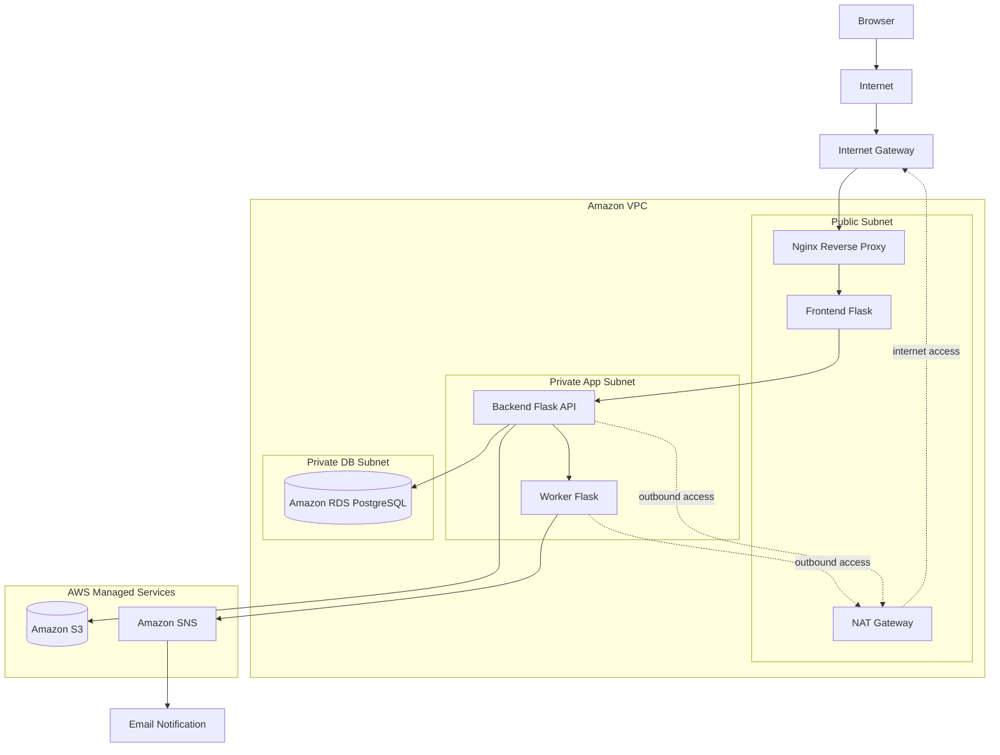

<h1 align="center">TaskFlow</h1>

<p align="center">
  <b>A multi-service AWS DevOps project built with Flask, PostgreSQL, S3, SNS and Nginx</b>
</p>

<p align="center">
  
  
  
  
  
  
  
</p>

---

## 🟣 Project Overview

TaskFlow is a simple multi-service todo application deployed on AWS as part of a DevOps learning project.

The project demonstrates a production-style cloud architecture with separated application services, public and private network zones, managed AWS services, and secure service-to-service communication.

TaskFlow allows users to:

* create todo tasks
* view all tasks
* mark tasks as completed
* delete completed tasks
* upload files to tasks
* open uploaded files through S3 presigned URLs
* receive email notifications through Amazon SNS

---

## 🟣 Architecture

The application is built from three Flask services:

| Service  | Role                                                         |
| -------- | ------------------------------------------------------------ |
| Frontend | User interface and communication with Backend                |
| Backend  | Main API, business logic, PostgreSQL access, S3 file uploads |
| Worker   | Internal notification service that publishes messages to SNS |




---

## 🟣 AWS Infrastructure

The project uses the following AWS components:

| Component             | Purpose                                        |
| --------------------- | ---------------------------------------------- |
| Amazon EC2            | Application servers                            |
| Amazon VPC            | Isolated network environment                   |
| Public Subnet         | Public entry point with Nginx and Frontend     |
| Private App Subnet    | Backend and Worker services                    |
| Private DB Subnet     | Database isolation                             |
| Amazon RDS PostgreSQL | Relational database                            |
| Amazon S3             | File storage                                   |
| Amazon SNS            | Email notifications                            |
| NAT Gateway           | Outbound internet access for private instances |
| IAM Roles             | Least privilege access to AWS services         |
| Security Groups       | Controlled network access between components   |

---

## 🟣 Security Design

The project follows several security principles:

* Backend and Worker are not publicly accessible from the internet.
* RDS is isolated in a private database subnet.
* Frontend communicates with Backend through the private network.
* Backend uses a dedicated IAM role for S3 access.
* Worker uses a dedicated IAM role for SNS publishing.
* Uploaded files are accessed using presigned S3 URLs.
* Sensitive configuration is stored in `.env` files and excluded from Git.
* Example environment files are provided as `.env.example`.

---

## 🟣 Project Structure

```text
TaskFlow/
├── backend/
│   ├── app.py
│   ├── db.py
│   ├── requirements.txt
│   └── .env.example
│
├── frontend/
│   ├── app.py
│   ├── requirements.txt
│   ├── .env.example
│   └── templates/
│       └── index.html
│
├── worker/
│   ├── worker.py
│   ├── requirements.txt
│   └── .env.example
│
├── .gitignore
└── README.md
```

---

## 🟣 Prerequisites

Before running the project, make sure the following are available:

* Python 3
* pip
* Python virtual environment support
* PostgreSQL database

  * AWS RDS PostgreSQL is used in the deployed environment
  * a local PostgreSQL instance can also be used for local testing if configured in `.env`
* AWS access for:

  * Amazon S3
  * Amazon SNS
* configured `.env` files based on the provided `.env.example` files

If the project is running on AWS EC2, AWS permissions should be provided through IAM roles.
For local testing, AWS credentials must be configured securely outside the source code.

---

## 🟣 Environment Variables

Each service has its own `.env.example` file.

Before running the project, create a real `.env` file inside each service directory based on the corresponding example file:

```text
backend/.env.example   → backend/.env
frontend/.env.example  → frontend/.env
worker/.env.example    → worker/.env
```

Required configuration includes:

| Service  | Required configuration                                      |
| -------- | ----------------------------------------------------------- |
| Backend  | Database connection, AWS region, S3 bucket name, Worker URL |
| Frontend | Backend URL                                                 |
| Worker   | AWS region, SNS topic ARN                                   |

Real `.env` files are not committed to GitHub.

---

## 🟣 Local Setup

Clone the repository:

```bash
git clone <repository-url>
cd taskflow-devops
```

Create a virtual environment and install dependencies for each service.

Commands below use Linux/macOS syntax.
On Windows, the virtual environment activation command is different.

### Backend

```bash
cd backend
python3 -m venv venv
source venv/bin/activate
pip install -r requirements.txt
deactivate
cd ..
```

### Frontend

```bash
cd frontend
python3 -m venv venv
source venv/bin/activate
pip install -r requirements.txt
deactivate
cd ..
```

### Worker

```bash
cd worker
python3 -m venv venv
source venv/bin/activate
pip install -r requirements.txt
deactivate
cd ..
```

---

## 🟣 Running the Services

The services should be started in this order:

```text
Worker → Backend → Frontend
```

### Worker

```bash
cd worker
source venv/bin/activate
python3 worker.py
```

### Backend

```bash
cd backend
source venv/bin/activate
python3 app.py
```

### Frontend

```bash
cd frontend
source venv/bin/activate
python3 app.py
```

In the deployed AWS environment, Nginx forwards public HTTP traffic to the Frontend Flask service.

For local testing without Nginx, the Frontend service can be accessed directly through its Flask port.

---

## 🟣 Health Checks

Each Flask service includes a `/health` endpoint for basic availability checks.

After starting the services, they can be tested with:

```bash
curl http://127.0.0.1:6000/health   # Worker
curl http://127.0.0.1:5000/health   # Backend
curl http://127.0.0.1:8000/health   # Frontend
curl http://127.0.0.1/health        # Public entry through Nginx
```

These checks confirm that the services are running and responding to HTTP requests.

---

## 🟣 Implemented Features

* Multi-service Flask application
* PostgreSQL database integration
* S3 file upload flow
* S3 presigned URL file access
* SNS email notification flow
* Nginx reverse proxy
* Public/private subnet separation
* IAM role separation by service responsibility
* Manual deployment on AWS EC2

---

## 🟣 Current Limitations

This is Part A of the project and uses manual deployment.

Current limitations:

* services are started manually
* no HTTPS yet
* no user registration/login yet
* no centralized logging yet
* no Infrastructure as Code yet
* no automated configuration management yet

---

## 🟣 Planned Improvements for Part B

The next stage of the project will focus on automation, security, and operational improvements:

* Terraform for AWS infrastructure provisioning
* Ansible for server configuration
* HTTPS support
* user registration and login
* Gunicorn/systemd instead of manual Flask startup
* CloudWatch logging
* improved error handling and monitoring
* cleaner production-style deployment workflow

---

## 🟣 Tech Stack

| Category      | Technologies                            |
| ------------- | --------------------------------------- |
| Backend       | Python, Flask                           |
| Database      | PostgreSQL, Amazon RDS                  |
| Storage       | Amazon S3                               |
| Notifications | Amazon SNS                              |
| Web Server    | Nginx                                   |
| Cloud         | AWS EC2, VPC, IAM, Security Groups      |
| DevOps        | Git, GitHub, manual deployment workflow |

---

## 🟣 Repository Notes

This repository does not include:

* `.env` files
* private keys
* AWS credentials
* virtual environments
* log files
* local cache files

These files are intentionally excluded using `.gitignore`.
