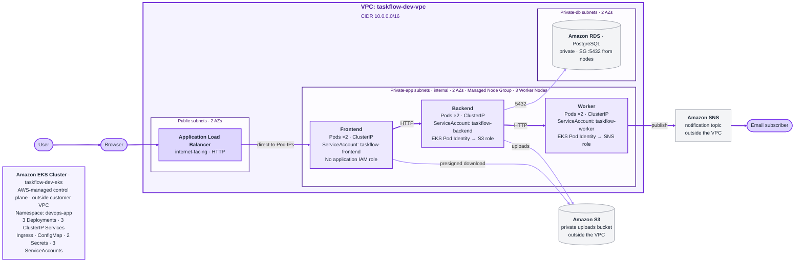

<h1 align="center">TaskFlow</h1>

<p align="center">
  <b>A multi-service todo application running on Amazon EKS</b>
</p>

<p align="center">
  
  
  
  
  
  
  
  
</p>

---

## 🟣 Project Overview

TaskFlow is a todo application built from three separate services: a Frontend, a Backend API, and a Worker. All three run as containers inside a Kubernetes cluster on Amazon EKS. The database, file storage, and notification services are managed AWS services outside the cluster.

Users can:

* register an account and log in
* create, list, complete, and delete todo tasks
* upload files to a task and open them again
* receive email notifications when tasks change

Terraform manages the core AWS infrastructure, while Kubernetes manifests define the application workloads. This Kubernetes deployment builds on an earlier EC2 and Ansible version of TaskFlow, preserved in the Git history.

---

## 🟣 Current Architecture

The application runs on an Amazon EKS cluster named `taskflow-dev-eks` in the `eu-north-1` region. All Kubernetes application resources live in a dedicated namespace called `devops-app`.

The network is a single Virtual Private Cloud (VPC) with the CIDR block `10.0.0.0/16`. It has three subnet layers, each spread across two Availability Zones:

| Layer | Contents | Internet access |
| --- | --- | --- |
| Public subnets | Application Load Balancer (ALB) | Inbound from the internet |
| Private application subnets | EKS Managed Node Group, 3 Worker Nodes, application Pods | Outbound only |
| Private database subnets | Amazon RDS for PostgreSQL | None |

There is an important difference between the EKS control plane and the data plane. The control plane is managed by AWS and runs outside the VPC. Kubernetes objects such as Deployments, Services, and ConfigMaps are records held by that control plane, not processes on a server. Only Pods are actually scheduled onto the Worker Nodes inside the private application subnets.

---

## 🟣 Architecture Diagram



**Reading the diagram.** The strong purple line is the main request path: user, browser, load balancer, Frontend, Backend, Worker, and on to SNS and the email subscriber. The lighter purple lines are the Backend and Frontend calls to the data services.

The EKS card lists the Kubernetes API objects, which the AWS-managed control plane holds outside the VPC. Only Pods run on the Worker Nodes in the private application subnets. The workload boxes name the Service, ServiceAccount, and IAM role that apply to each service.

Two details are worth pointing out. The ALB sends traffic straight to Frontend Pod IP addresses, because the Ingress uses `target-type: ip`. The Frontend Service is therefore not a hop in the external request path, even though the Ingress references it and it selects the same Pods. The Ingress itself is a declarative Kubernetes object, not a running proxy; the AWS Load Balancer Controller reads it and applies the matching configuration to the ALB.

The Frontend also reaches S3 on one specific path: when a user opens an uploaded file. That request uses a presigned URL issued by the Backend, so it needs no AWS credentials of its own. The file download section below describes the full path.

---

## 🟣 Running Inside and Outside the Cluster

| Inside Kubernetes | Outside Kubernetes |
| --- | --- |
| Frontend, Backend, and Worker Pods | Amazon RDS for PostgreSQL |
| Services, Ingress, ConfigMap, Secrets | Amazon S3 |
| ServiceAccounts | Amazon SNS |
| | Application Load Balancer |
| | Container images in Amazon ECR |

The cluster runs the application code. Persistent application data and notifications use managed AWS services outside the cluster. The ALB is created by AWS but driven by the Kubernetes Ingress object.

---

## 🟣 Application Components

| Service | Role | Container Port | Talks to |
| --- | --- | --- | --- |
| Frontend | Web interface and user sessions | 8000 | Backend, S3 (file downloads) |
| Backend | REST API, business logic | 5000 | PostgreSQL, S3, Worker |
| Worker | Publishes notifications | 6000 | SNS |

All three are Python and Flask services running under Gunicorn. Each one runs with 2 replicas, so a single Pod failure does not take the service down.

Each service exposes `/live` and `/ready` health endpoints. Kubernetes uses `/live` for liveness checks and `/ready` for readiness checks on all three services. The ALB also uses the Frontend `/ready` endpoint as its target health check.

The Frontend has no AWS permissions of its own. It sends all application requests to the Backend. The one time it reaches an AWS service is when a user downloads a file: the Backend issues a short-lived presigned S3 URL, and the Frontend uses that URL to fetch the object. A presigned URL carries its own signature, so this needs no IAM role and no static AWS credentials on the Frontend.

---

## 🟣 Traffic Flow

Public traffic enters through one place only:

```text
Browser
  -> Application Load Balancer (internet-facing, HTTP)
    -> Frontend Pods
      |-- Amazon S3 (file downloads, using a presigned URL)
      +-- Backend Service -> Backend Pods
            |-- Amazon RDS PostgreSQL
            |-- Amazon S3 (file uploads)
            +-- Worker Service -> Worker Pods
                  -> Amazon SNS -> Email subscriber
```

The Backend makes three independent calls. It does not chain through RDS to reach S3, or through S3 to reach the Worker.

Internal calls use Kubernetes Service discovery. The Frontend reaches the Backend at its Service name, and the Backend reaches the Worker the same way. All three Services are `ClusterIP`, which means they are only reachable from inside the cluster. The Backend and the Worker have no public address of any kind.

---

## 🟣 AWS Integrations

| Service | Used by | Purpose |
| --- | --- | --- |
| Amazon RDS for PostgreSQL | Backend | Stores users and todos |
| Amazon S3 | Backend, Frontend | Stores uploaded files |
| Amazon SNS | Worker | Sends email notifications |

**Amazon RDS.** The database runs in the private database subnets and has `publicly_accessible = false`. Its Security Group allows PostgreSQL traffic on port 5432 only from the EKS Worker Node Security Group. The Backend reads the endpoint and database name from the ConfigMap, and the credentials from a Kubernetes Secret.

**Amazon S3.** Uploaded files go to a private bucket with all public access blocked. Traffic reaches S3 through an S3 VPC Gateway Endpoint attached to the private application route table, so it does not leave the AWS network. The Backend uploads files directly, using the permissions from its IAM role.

File downloads work differently. The Backend generates a short-lived presigned URL and answers with a redirect to it. The Frontend follows that redirect server-side, fetches the object from S3, and returns the file to the browser. The browser never contacts S3 itself.

**Amazon SNS.** The Worker publishes a message to an SNS topic when a task is created, completed, or has a file attached. SNS then delivers an email to the confirmed subscriber.

---

## 🟣 Configuration and Identity

Configuration is split by sensitivity. Non-sensitive values live in a ConfigMap named `taskflow-config`: the database host, database name and port, the AWS region, the S3 bucket name, the SNS topic ARN, and the internal service URLs. Sensitive values live in Kubernetes Secrets. The Backend reads its database username and password from one Secret, and the Frontend reads its Flask session key from another. The Worker needs no Secret of its own.

Real Secret values are never committed. The repository only contains example files with placeholder values, under `k8s/examples/`.

AWS permissions use **EKS Pod Identity**, not static credentials. Each service has its own ServiceAccount. The Backend and Worker ServiceAccounts are linked to dedicated IAM roles through EKS Pod Identity. The Frontend does not need an application IAM role:

| ServiceAccount | IAM role | Permissions |
| --- | --- | --- |
| `taskflow-frontend` | none | No AWS permissions |
| `taskflow-backend` | Backend role | S3 object read and write, limited to the uploads prefix |
| `taskflow-worker` | Worker role | `sns:Publish` on one topic |

The roles do not overlap. The Backend cannot publish to SNS, and the Worker cannot read the S3 bucket. The Frontend has no application IAM role or Pod Identity association, because it does not need AWS permissions.

---

## 🟣 Terraform and Kubernetes Responsibilities

The project uses two tools with a clear split. Terraform builds the AWS infrastructure. Kubernetes manifests describe what runs inside the cluster.

| Created by Terraform | Created by Kubernetes manifests |
| --- | --- |
| VPC, subnets, route tables, gateways | Namespace |
| EKS cluster and Managed Node Group | Deployments |
| Amazon ECR repositories | Services |
| Amazon RDS instance and its Security Group | Ingress |
| S3 bucket, SNS topic, and email subscription | ConfigMap |
| IAM roles, policies, and Pod Identity associations | ServiceAccounts |

Two things sit outside both lists. The AWS Load Balancer Controller is installed into the cluster with Helm, and it creates the ALB in response to the Ingress. Kubernetes Secret values are supplied from local files that are excluded from Git, so they are not managed by Terraform and are never committed.

---

## 🟣 Repository Structure

```text
TaskFlow/
├── backend/                  # Backend API service and its Dockerfile
├── frontend/                 # Frontend web service and its Dockerfile
├── worker/                   # Worker notification service and its Dockerfile
│
├── k8s/                      # Kubernetes manifests, applied in numbered order
│   ├── 00-namespace.yaml
│   ├── 10-serviceaccounts.yaml
│   ├── 20-configmap.yaml
│   ├── 30-backend-deployment.yaml
│   ├── 31-backend-service.yaml
│   ├── 40-worker-deployment.yaml
│   ├── 41-worker-service.yaml
│   ├── 50-frontend-deployment.yaml
│   ├── 51-frontend-service.yaml
│   ├── 60-ingress.yaml
│   └── examples/             # Secret templates with placeholder values
│
├── terraform/                # AWS infrastructure
│   ├── network.tf            # VPC, subnets, routing, S3 VPC endpoint
│   ├── eks.tf                # EKS cluster and Managed Node Group
│   ├── application_iam.tf    # Pod Identity roles for Backend and Worker
│   ├── lb_controller.tf      # IAM setup for the AWS Load Balancer Controller
│   ├── ecr.tf                # Container image repositories
│   ├── rds.tf                # PostgreSQL database
│   ├── s3.tf                 # Uploads bucket
│   ├── sns.tf                # Notification topic and email subscription
│   └── security_groups.tf    # Database access rules
│
├── ansible/                  # From the earlier EC2 deployment
├── nginx/                    # From the earlier EC2 deployment
├── systemd/                  # From the earlier EC2 deployment
│
├── .gitignore
└── README.md
```

The `k8s/` files are numbered in the order they should be applied, so lower numbers create the resources that later ones depend on.

The `ansible/`, `nginx/`, and `systemd/` directories belong to the earlier EC2 deployment. They are kept for reference and are not used by the Kubernetes setup.

---

## 🟣 Container Images

Each service has its own Dockerfile and its own repository in Amazon ECR. Images are built from `python:3.12-slim-bookworm` and run as a non-root user with a fixed UID and GID of 1000.

Every image is published with a fixed version tag. The `latest` tag is never used, and the ECR repositories are set to immutable tags, so an existing tag cannot be overwritten by a later push. ECR scans each image when it is pushed.

Inside the cluster, containers run with a restrictive security context: no privilege escalation, a read-only root filesystem, and all Linux capabilities dropped. Each Pod also declares CPU and memory requests and limits.

---

## 🟣 Prerequisites

You need the following tools installed and working:

* AWS CLI, with credentials configured for the target account
* Terraform
* Docker
* kubectl
* Helm
* Python 3
* curl

You also need permission to create the AWS resources described above in the `eu-north-1` region.

---

## 🟣 Infrastructure Prerequisite

Terraform builds the AWS resources the application runs on, so it must be applied before anything is deployed to Kubernetes.

Every command in this guide is run from the repository root.

Start from the tracked example file and fill in your own values:

```bash
cp terraform/terraform.tfvars.example terraform/terraform.tfvars
```

Three values in `terraform/terraform.tfvars` are specific to you and must be replaced:

| Variable | What to put there |
| --- | --- |
| `db_username` | the master username for the PostgreSQL instance |
| `admin_access_cidr` | your own public IP as an exact `/32`, never a wider range |
| `sns_notification_email` | the address that will receive notifications |

`terraform/terraform.tfvars` is excluded from Git and must never be committed. The remaining values in the example file are working defaults.

Then create the infrastructure:

```bash
terraform -chdir=terraform init
terraform -chdir=terraform validate
terraform -chdir=terraform plan
terraform -chdir=terraform apply
```

Once the cluster exists, point kubectl at it and confirm the nodes are up:

```bash
aws eks update-kubeconfig --region eu-north-1 --name taskflow-dev-eks
kubectl get nodes
```

---

## 🟣 Build and Push Images

Resolve the registry address from the current AWS identity rather than hardcoding an account number, then log Docker in to ECR:

```bash
AWS_REGION=eu-north-1
ECR_REGISTRY="$(aws sts get-caller-identity --query Account --output text).dkr.ecr.${AWS_REGION}.amazonaws.com"

aws ecr get-login-password --region "$AWS_REGION" \
  | docker login --username AWS --password-stdin "$ECR_REGISTRY"
```

Pick the version you are publishing. Each push needs a tag that does not exist yet, because the ECR repositories use immutable tags:

```bash
BACKEND_TAG="vX.Y.Z"
FRONTEND_TAG="vX.Y.Z"
WORKER_TAG="vX.Y.Z"
```

Replace `vX.Y.Z` with a new, unused version tag for each service before running the build and push commands below.

Build each service from its own directory:

```bash
docker build --provenance=false -t "$ECR_REGISTRY/taskflow-dev-backend:$BACKEND_TAG"   backend/
docker build --provenance=false -t "$ECR_REGISTRY/taskflow-dev-frontend:$FRONTEND_TAG" frontend/
docker build --provenance=false -t "$ECR_REGISTRY/taskflow-dev-worker:$WORKER_TAG"     worker/
```

This project disables default build provenance so that pushed images use the single-image manifest format verified with its ECR basic-scanning workflow.

Push the images:

```bash
docker push "$ECR_REGISTRY/taskflow-dev-backend:$BACKEND_TAG"
docker push "$ECR_REGISTRY/taskflow-dev-frontend:$FRONTEND_TAG"
docker push "$ECR_REGISTRY/taskflow-dev-worker:$WORKER_TAG"
```

The versions currently deployed are `v0.1.3` for Backend, `v0.1.3` for Frontend, and `v0.1.2` for Worker. Those tags already exist and cannot be pushed again, so publishing a change always means choosing a new version. The `latest` tag is never used.

After pushing, update the `image:` line in the matching Deployment manifest before applying it.

---

## 🟣 Create the Namespace

All application resources live in their own namespace:

```bash
kubectl apply -f k8s/00-namespace.yaml
```

---

## 🟣 Create the Kubernetes Secrets

The repository tracks only example Secret files under `k8s/examples/`. They contain placeholder values and use object names ending in `-example`. They are not part of the deployment sequence and must not be applied to the cluster. The real Secrets are created locally and stay out of Git.

Set a restrictive umask first, so the files are created with owner-only permissions from the start:

```bash
umask 077
```

The database password is managed by RDS and stored in AWS Secrets Manager. Read it and write the manifest in one step, so no value is printed, passed as a command-line argument, or left in shell history:

```bash
DB_SECRET_ARN=$(aws rds describe-db-instances \
  --db-instance-identifier taskflow-dev-rds-postgres \
  --region eu-north-1 \
  --query "DBInstances[0].MasterUserSecret.SecretArn" \
  --output text)

aws secretsmanager get-secret-value \
  --secret-id "$DB_SECRET_ARN" \
  --region eu-north-1 \
  --query SecretString --output text \
| python3 -c '
import json, pathlib, sys
c = json.load(sys.stdin)
doc = (
    "apiVersion: v1\n"
    "kind: Secret\n"
    "metadata:\n"
    "  name: taskflow-db-credentials\n"
    "  namespace: devops-app\n"
    "  labels:\n"
    "    app.kubernetes.io/name: backend\n"
    "    app.kubernetes.io/part-of: taskflow\n"
    "type: Opaque\n"
    "stringData:\n"
    "  DB_USER: " + json.dumps(c["username"]) + "\n"
    "  DB_PASSWORD: " + json.dumps(c["password"]) + "\n"
)
p = pathlib.Path("k8s/secret-backend-db.yaml")
p.write_text(doc)
p.chmod(0o600)
print("wrote", p)
'
```

The Frontend session key is generated locally and written the same way:

```bash
python3 -c '
import json, pathlib, secrets
doc = (
    "apiVersion: v1\n"
    "kind: Secret\n"
    "metadata:\n"
    "  name: taskflow-frontend-secret\n"
    "  namespace: devops-app\n"
    "  labels:\n"
    "    app.kubernetes.io/name: frontend\n"
    "    app.kubernetes.io/part-of: taskflow\n"
    "type: Opaque\n"
    "stringData:\n"
    "  SECRET_KEY: " + json.dumps(secrets.token_hex(32)) + "\n"
)
p = pathlib.Path("k8s/secret-frontend.yaml")
p.write_text(doc)
p.chmod(0o600)
print("wrote", p)
'
```

Check the permissions, and confirm Git ignores both files:

```bash
ls -l k8s/secret-backend-db.yaml k8s/secret-frontend.yaml
git check-ignore -v k8s/secret-backend-db.yaml k8s/secret-frontend.yaml
```

The Worker needs no Secret of its own.

---

## 🟣 Deploy TaskFlow

Apply the manifests in this order. It is the project's dependency-aware sequence: the namespace comes first, then identity and configuration, then the Secrets the workloads read, then the workloads themselves, and finally the Ingress that exposes the Frontend.

```bash
kubectl apply -f k8s/00-namespace.yaml
kubectl apply -f k8s/10-serviceaccounts.yaml
```

`k8s/20-configmap.yaml` is tracked with the values from this project's own deployment. `DB_HOST`, `S3_BUCKET_NAME`, and `SNS_TOPIC_ARN` are environment-specific, non-sensitive configuration — not Secrets — and must match the AWS resources your own `terraform apply` created, not the ones already in the cloned file. Update them from your current Terraform outputs before applying the ConfigMap:

```bash
export RDS_ADDRESS=$(terraform -chdir=terraform output -raw rds_address)
export S3_BUCKET=$(terraform -chdir=terraform output -raw s3_bucket_name)
export SNS_ARN=$(terraform -chdir=terraform output -raw sns_topic_arn)

python3 -c '
import json, os, pathlib, re, sys

path = pathlib.Path("k8s/20-configmap.yaml")
text = path.read_text()

def set_value(text, key, value):
    pattern = re.compile(r"^(\s*" + re.escape(key) + r":\s*).*$", re.MULTILINE)
    text, count = pattern.subn(lambda m: m.group(1) + json.dumps(value), text)
    if count != 1:
        sys.exit(f"expected exactly one {key!r} line in k8s/20-configmap.yaml, found {count}")
    return text

text = set_value(text, "DB_HOST", os.environ["RDS_ADDRESS"])
text = set_value(text, "S3_BUCKET_NAME", os.environ["S3_BUCKET"])
text = set_value(text, "SNS_TOPIC_ARN", os.environ["SNS_ARN"])

path.write_text(text)
print("updated DB_HOST, S3_BUCKET_NAME, SNS_TOPIC_ARN in", path)
'
```

Check the three values before applying:

```bash
grep -E "DB_HOST|S3_BUCKET_NAME|SNS_TOPIC_ARN" k8s/20-configmap.yaml
```

After this, `k8s/20-configmap.yaml` will show as locally modified — expected, since it now carries your environment's values. Treat that change the same way as the `image:` line updates elsewhere in this guide: review it before any future commit, and don't carry one environment's values into another.

```bash
kubectl apply -f k8s/20-configmap.yaml
kubectl apply -f k8s/secret-backend-db.yaml
kubectl apply -f k8s/secret-frontend.yaml
kubectl apply -f k8s/30-backend-deployment.yaml
kubectl apply -f k8s/31-backend-service.yaml
kubectl apply -f k8s/40-worker-deployment.yaml
kubectl apply -f k8s/41-worker-service.yaml
kubectl apply -f k8s/50-frontend-deployment.yaml
kubectl apply -f k8s/51-frontend-service.yaml
kubectl apply -f k8s/60-ingress.yaml
```

Wait for the rollouts to finish:

```bash
kubectl rollout status deployment/backend  -n devops-app
kubectl rollout status deployment/worker   -n devops-app
kubectl rollout status deployment/frontend -n devops-app
```

The Ingress takes a short while to provision the load balancer. Once it reports an address, open that address in a browser:

```bash
kubectl get ingress -n devops-app
```

---

## 🟣 Verify the Deployment

### Cluster and application state

```bash
kubectl get nodes
kubectl get namespaces
kubectl get pods -n devops-app
kubectl get deployments -n devops-app
kubectl get services -n devops-app
kubectl get ingress -n devops-app
```

A healthy environment shows the worker nodes `Ready`, the `devops-app` namespace `Active`, six Pods `Running` and Ready, and all three Deployments at `2/2`.

All three Services are `ClusterIP` and report no external IP, so Backend and Worker have no external Service endpoint. The ALB is the only entry point from outside the cluster.

To inspect an individual Pod, take its name from the current state rather than typing one in:

```bash
BACKEND_POD=$(kubectl get pods -n devops-app \
  -l app.kubernetes.io/name=backend \
  -o jsonpath='{.items[0].metadata.name}')

kubectl describe pod "$BACKEND_POD" -n devops-app
kubectl logs "$BACKEND_POD" -n devops-app
```

`describe` shows the image, probes, resource limits, security context and recent events. `logs` shows the Gunicorn startup output.

### External access

```bash
ALB_HOST=$(kubectl get ingress frontend -n devops-app \
  -o jsonpath='{.status.loadBalancer.ingress[0].hostname}')

echo "$ALB_HOST"

curl -s -o /dev/null -w "GET /       -> %{http_code}\n" "http://$ALB_HOST/"
curl -s -o /dev/null -w "GET /health -> %{http_code}\n" "http://$ALB_HOST/health"
```

`/` returns HTTP 302 because unauthenticated visitors are redirected to the login page, so that response is expected rather than an error. `/health` returns HTTP 200 and confirms the Frontend is reachable through the load balancer. The application itself opens at `http://<ALB hostname>/` in a browser.

### Application integrations

**Frontend to Backend.** The application images contain Python but no `curl` or `wget`, so the check runs through Python:

```bash
FRONTEND_POD=$(kubectl get pods -n devops-app \
  -l app.kubernetes.io/name=frontend \
  -o jsonpath='{.items[0].metadata.name}')

kubectl exec -n devops-app "$FRONTEND_POD" -- python3 -c "
import urllib.request
r = urllib.request.urlopen('http://backend:5000/health', timeout=5)
print(r.status, r.read().decode().strip())
"
```

HTTP 200 proves both that Kubernetes Service DNS resolves the name `backend` and that a Frontend Pod can reach the Backend Service.

**Backend to the database.** This is read-only and prints no credentials:

```bash
BACKEND_POD=$(kubectl get pods -n devops-app \
  -l app.kubernetes.io/name=backend \
  -o jsonpath='{.items[0].metadata.name}')

kubectl exec -n devops-app "$BACKEND_POD" -- python3 -c "
import os, psycopg2
conn = psycopg2.connect(
    host=os.environ['DB_HOST'],
    dbname=os.environ['DB_NAME'],
    user=os.environ['DB_USER'],
    password=os.environ['DB_PASSWORD'],
    port=os.environ['DB_PORT'],
    connect_timeout=5
)
cur = conn.cursor()
cur.execute('SELECT 1')
print('SELECT 1 ->', cur.fetchone()[0])
conn.close()
"
```

`SELECT 1 -> 1` confirms that the Backend reaches PostgreSQL and authenticates successfully.

**File storage.** Storage is verified through the application, since that is what exercises the upload and download path:

1. In TaskFlow, create a clearly named test task.
2. Attach a small test file to it.
3. Open the file again from the task.

Step three returns the file through a short-lived presigned URL. You can optionally confirm from the AWS side that an object exists under the application's prefix:

```bash
BUCKET=$(kubectl get configmap taskflow-config -n devops-app \
  -o jsonpath='{.data.S3_BUCKET_NAME}')

aws s3api list-objects-v2 \
  --bucket "$BUCKET" \
  --prefix uploads/ \
  --query "Contents[].Key" \
  --output table
```

**Notifications.** First check that the subscription is in place:

```bash
TOPIC_ARN=$(kubectl get configmap taskflow-config -n devops-app \
  -o jsonpath='{.data.SNS_TOPIC_ARN}')

aws sns get-topic-attributes \
  --topic-arn "$TOPIC_ARN" \
  --query "Attributes.{Confirmed:SubscriptionsConfirmed,Pending:SubscriptionsPending}" \
  --output table
```

One confirmed subscription and none pending means the topic is wired up, but that only verifies configuration. To test delivery, mark the test task as completed in TaskFlow and check that the subscribed address receives the notification email. The email is what proves the full path from the application through the Worker to SNS.

These functional integration tests create real application data, so use clearly identifiable test tasks and files.

### Optional self-healing test

This test deliberately deletes one Backend Pod to demonstrate the Pod restart and continued operation required by the assignment. It is not part of a normal deployment — you do not need to run it every time you redeploy.

```bash
kubectl get pods -n devops-app -l app.kubernetes.io/name=backend

BACKEND_POD=$(kubectl get pods -n devops-app \
  -l app.kubernetes.io/name=backend \
  -o jsonpath='{.items[0].metadata.name}')

kubectl delete pod "$BACKEND_POD" -n devops-app
```

Watch the replacement appear, and wait until it reports `Running` and Ready before judging the result. Stop the watch with Ctrl+C:

```bash
kubectl get pods -n devops-app \
  -l app.kubernetes.io/name=backend \
  --watch
```

Then confirm the final state:

```bash
kubectl get deployment backend -n devops-app
kubectl get pods -n devops-app -l app.kubernetes.io/name=backend
```

The Deployment returns to `2/2`, and two Backend Pods are Ready under a new Pod name.

Finally, confirm the application still responds:

```bash
ALB_HOST=$(kubectl get ingress frontend -n devops-app \
  -o jsonpath='{.status.loadBalancer.ingress[0].hostname}')

curl -s -o /dev/null -w "GET /health -> %{http_code}\n" "http://$ALB_HOST/health"
```

HTTP 200 after the replacement Pod is Ready completes the test: the Pod was replaced, the desired replica count was restored, and the application kept working. It stays available throughout, because the second replica keeps serving traffic while the replacement starts.

---

## 🟣 Required Manual Actions

Some steps are not covered by `terraform apply` or `kubectl apply` and have to be done by a person.

### Initial environment setup

These are done once per environment, not on every application deployment.

| Action | Why it is manual |
| --- | --- |
| Configure kubeconfig | `aws eks update-kubeconfig --region eu-north-1 --name taskflow-dev-eks` gives your local kubectl access to the cluster |
| Install the AWS Load Balancer Controller | It is a cluster add-on installed with Helm, not part of the application manifests. Without it, the Ingress never produces a load balancer |
| Confirm the SNS subscription | AWS emails a confirmation link to the address in `terraform.tfvars`. Terraform creates the subscription, but only the recipient can confirm it. Notifications are not delivered until then. This can be done any time after `terraform apply` |

The controller is installed as follows. The ServiceAccount name must match the one Terraform used when it created the Pod Identity association, otherwise the controller gets no AWS permissions:

```bash
helm repo add eks https://aws.github.io/eks-charts
helm repo update eks

helm install aws-load-balancer-controller eks/aws-load-balancer-controller \
  --namespace kube-system \
  --version 3.5.0 \
  --set clusterName=taskflow-dev-eks \
  --set region=eu-north-1 \
  --set vpcId="$(terraform -chdir=terraform output -raw vpc_id)" \
  --set serviceAccount.create=true \
  --set serviceAccount.name=aws-load-balancer-controller \
  --set resources.requests.cpu=100m \
  --set resources.requests.memory=128Mi \
  --set resources.limits.memory=256Mi \
  --set 'securityContext.capabilities.drop[0]=ALL' \
  --set securityContext.seccompProfile.type=RuntimeDefault
```

The ServiceAccount carries no IAM role annotation. Permissions come from the EKS Pod Identity association that Terraform creates for the `kube-system` namespace and this ServiceAccount name, which is why Terraform runs before Helm.

### Application deployment and updates

These are the steps you repeat as the application changes.

| Action | When |
| --- | --- |
| Build and push a new image version | Whenever application code changes |
| Create or rotate the real Kubernetes Secrets | On a new environment, or when credentials change |
| Apply the TaskFlow manifests | On every deployment |

### Order for a new environment

```text
Terraform infrastructure
  -> kubeconfig
    -> build and push images to ECR
      -> AWS Load Balancer Controller
        -> namespace, ServiceAccounts, ConfigMap, Secrets
          -> TaskFlow Deployments, Services, Ingress
            -> verify the application through the load balancer address
```

The SNS confirmation is independent of this chain and can be completed at any point after `terraform apply`.

---

## 🟣 Security

This section explains the security implications of running TaskFlow on Kubernetes: how permissions are separated, how secrets are handled, how the network is restricted, and what the containers and images look like from a security perspective.

### Separation of permissions

Each service has its own ServiceAccount, and AWS access is scoped per service rather than shared:

| Service | ServiceAccount | AWS access |
| --- | --- | --- |
| Frontend | `taskflow-frontend` | none — no application IAM role, no Pod Identity association |
| Backend | `taskflow-backend` | `s3:PutObject`, `s3:GetObject`, `s3:AbortMultipartUpload`, scoped to the `uploads/` prefix of one bucket |
| Worker | `taskflow-worker` | `sns:Publish`, scoped to one SNS topic |

These roles do not overlap, and none of them is broad. If one workload were compromised, a shared or broad role would let the attacker reach AWS resources that workload never needed — for example, a compromised Frontend reaching S3, or a compromised Backend publishing to SNS. Keeping the roles separate and narrow limits what a single compromised Pod can actually do.

TaskFlow uses EKS Pod Identity rather than IAM Roles for Service Accounts (IRSA) to grant these permissions. The ServiceAccount is mapped to an IAM role through an EKS Pod Identity association, and the Pod obtains temporary role credentials through the EKS Pod Identity Agent. Pod Identity was chosen because these workload roles do not require IRSA-style OIDC federation or OIDC-based trust policies. Instead, they use the reusable pods.eks.amazonaws.com service principal, which fits this project's single-cluster EKS setup.

Pod Identity has trade-offs worth noting rather than treating it as strictly better or worse than IRSA. It depends on the EKS Pod Identity Agent running as a DaemonSet on every node. It is tightly coupled to Amazon EKS and only supports Pods running on Linux Amazon EC2 worker nodes, while IRSA uses OIDC-based federation and does not depend on the Pod Identity Agent. Pod Identity associations are also eventually consistent, with potential delays of several seconds after being created or changed, so they should not be relied on inside latency-sensitive request paths.

### RBAC

TaskFlow's workloads do not call the Kubernetes API, so no application Role, RoleBinding, ClusterRole, or ClusterRoleBinding is granted to any of the three ServiceAccounts, and none of them is granted `cluster-admin`. `automountServiceAccountToken: false` on each ServiceAccount prevents the standard Kubernetes API token from being mounted, so no workload can authenticate to the Kubernetes API server as itself. Backend and Worker do still receive a separate, EKS-injected identity token, used only to retrieve temporary AWS credentials through EKS Pod Identity — a different mechanism, unrelated to Kubernetes API access. This is an intentional minimal-permission design — the application does not need Kubernetes API access, so none is provided — rather than an omitted control.

### Secrets management

Sensitive values — the database credentials and the Frontend session key — are stored as Kubernetes Secrets in the `devops-app` namespace, not as plain environment values in the manifests. The real Secret files are excluded from Git; only placeholder example files are tracked. The database credentials originate from the RDS-managed secret in AWS Secrets Manager and are copied into the Kubernetes Secret through the workflow described above — Secrets Manager is the source of that value, not something the running application queries directly. The Frontend session key is generated locally and stored the same way.

On Kubernetes 1.35, Amazon EKS applies default envelope encryption to all Kubernetes API data, including Secrets, using an AWS-owned KMS key, so Secret values are encrypted at rest without any extra configuration. No customer-managed KMS key is configured for this cluster, which would be an additional control on top of the default.

### Network security

The Application Load Balancer is the only public entry point, and it only reaches the Frontend. The Backend and Worker Services are `ClusterIP`, so they are reachable only from inside the cluster, never from the internet. RDS is private, and its Security Group only accepts PostgreSQL traffic on port 5432 from the EKS Worker Node Security Group. Amazon S3 blocks all public access, and traffic to it from the cluster's private subnets travels through an S3 VPC Gateway Endpoint rather than the public internet.

The intended internal application path is Frontend → Backend → Worker, with the Backend also connecting to RDS. Because no Kubernetes NetworkPolicies are applied, these intended paths are not additionally enforced at the pod network-policy layer — this remains a security hardening opportunity. Separately, the EKS API server's public endpoint is restricted to a single configured administrator IP address.

### Container security

All three workloads use the same restrictive container security settings:

| | Frontend | Backend | Worker |
| --- | --- | --- | --- |
| Non-root, fixed UID/GID | 1000 / 1000 | 1000 / 1000 | 1000 / 1000 |
| `runAsNonRoot` | true | true | true |
| `allowPrivilegeEscalation` | false | false | false |
| `readOnlyRootFilesystem` | true | true | true |
| Linux capabilities | all dropped | all dropped | all dropped |
| seccomp profile | RuntimeDefault | RuntimeDefault | RuntimeDefault |
| CPU/memory requests and limits | set | set | set |

Because the root filesystem is read-only, each container gets a small writable `emptyDir` volume where it actually needs to write temporary files.

### Image security

Each service is built from its own Dockerfile, not a public application image, and pushed to its own private Amazon ECR repository. Tags are fixed version numbers, `latest` is never used, and the repositories are configured with immutable tags, so an existing tag cannot be silently replaced. ECR scans every image on push.

### Ingress security

The internet-facing ALB exposes only the Frontend over HTTP. TLS/HTTPS is not currently configured, which is a network-level limitation separate from the application's own login authentication — reaching the Frontend does not require a TaskFlow account, but using the application does. The Backend and Worker remain internal Kubernetes services, and RDS remains private inside the VPC. Nothing about this Ingress configuration exposes the Backend, the Worker, or the database directly.

---

## 🟣 Architecture Decisions and Trade-offs

Several design points in this project involved a deliberate trade-off rather than a single obviously correct answer; the table below summarizes the significant ones.

| Decision | Why we chose it | Trade-off |
| --- | --- | --- |
| Amazon EKS instead of a local cluster (kind/k3d) | Real AWS-managed Kubernetes integration with IAM, the ALB, VPC networking, and EKS Pod Identity | Higher cost and more operational complexity than a local cluster |
| Plain Kubernetes manifests instead of Helm for the application | Transparent and easy to understand and reproduce for this single environment | Less convenient than Helm/Kustomize for many environments or extensive customization |
| Managed Amazon RDS outside Kubernetes | Managed database lifecycle and storage, separating persistent data from ephemeral Kubernetes workloads, in a production-like AWS architecture | Additional AWS dependency and cost |
| 3 × t3.small Worker Nodes | Headroom for node maintenance and failures, and realistic multi-node behavior beyond the minimum capacity the workloads need | Additional EC2 cost |
| One NAT Gateway for the two private-app AZs | Lower cost for a development environment | Not AZ-redundant; private workload egress depends on a single NAT Gateway |
| No separate Nginx Pod in the Kubernetes runtime | Fewer moving parts — the ALB already provides the external routing layer | No separate Nginx proxy layer for Nginx-specific or custom proxy features |
| Kubernetes Secrets with a documented local workflow, instead of a runtime External Secrets integration | Simple and transparent, with no extra controller or operator to run | Rotation and synchronization are manual, and secret material also exists in the local, gitignored Secret manifests |
| Local Terraform state instead of a remote backend | Simple setup for the current single-operator development workflow, with no remote-backend bootstrap required | Weaker collaboration and recovery model; local state must be carefully protected |

---

## 🟣 Cleanup / Teardown

This section documents how to tear down the TaskFlow environment once it is no longer needed. Nothing here runs automatically or as part of normal operation — it is a deliberate, one-time sequence you follow when you want to remove the deployed infrastructure.

### Before You Start

This project's Terraform configuration is intentionally optimized for a disposable development environment, not for safe long-term data retention:

* Amazon RDS has `skip_final_snapshot = true`, `deletion_protection = false`, and `backup_retention_period = 0`. No final snapshot is taken when the instance is destroyed, and there is no automated backup to fall back on afterward — any data still in the database at that point cannot be considered preserved.
* The S3 uploads bucket has `force_destroy = true` and no versioning configured, so `terraform destroy` removes the bucket and every object in it unconditionally.
* The ECR repositories have `force_delete = true`, so any pushed container images are removed along with the repositories.

If you need to keep anything, back it up before continuing — for example with `pg_dump` for the database or `aws s3 sync` for the uploads bucket. This section does not cover backup procedures in detail; decide what you need to keep before running any of the commands below.

### Step 1 — Delete the Ingress and Verify AWS Load Balancer Controller Cleanup

The AWS Load Balancer Controller created the ALB and its supporting AWS resources in response to the Kubernetes `Ingress` object, not through Terraform. Because of that, the Ingress has to be deleted first, while the Controller and the EKS cluster are still running — it is the only thing that can clean those AWS resources up.

```bash
kubectl delete ingress frontend -n devops-app
```

Deleting the Ingress triggers Controller reconciliation, not an instant cleanup. Wait for it to finish, then verify every AWS Load Balancer Controller-managed resource is actually gone before moving on:

```bash
kubectl get ingress -n devops-app
kubectl get targetgroupbindings.elbv2.k8s.aws -n devops-app

aws resourcegroupstaggingapi get-resources --region eu-north-1 \
  --resource-type-filters elasticloadbalancing:loadbalancer elasticloadbalancing:targetgroup \
  --tag-filters Key=elbv2.k8s.aws/cluster,Values=taskflow-dev-eks \
  --query "ResourceTagMappingList[].ResourceARN" --output table

aws ec2 describe-security-groups --region eu-north-1 \
  --filters "Name=tag:elbv2.k8s.aws/cluster,Values=taskflow-dev-eks" \
  --query "SecurityGroups[].{GroupId:GroupId,GroupName:GroupName,Description:Description}" --output table
```

Expect the Ingress and the TargetGroupBinding to be gone, no load balancer or target group tagged for this cluster, and no security group tagged for it either. The tag-based query scopes both checks to this EKS cluster's own resources, not the whole account or region. The AWS Load Balancer Controller manages two separate security groups for an Ingress like this one — a frontend security group for the ALB itself, and a shared backend security group that lets the ALB reach the Pods — and they are not guaranteed to disappear at exactly the same moment. Re-run the checks until both return nothing.

**Stop and investigate before continuing** if any load balancer, target group, security group, or TargetGroupBinding is still present after a reasonable wait. Do not proceed to uninstalling the Controller or to `terraform destroy` while any AWS Load Balancer Controller-managed resource still exists — Terraform has no knowledge of these resources and cannot clean them up.

### Step 2 — Remove the Application Namespace

Once the checks above confirm the AWS-side cleanup is complete, remove the application's Kubernetes resources:

```bash
kubectl delete namespace devops-app
```

This removes everything namespaced under `devops-app` in one step — the Deployments, Services, ConfigMap, Kubernetes Secrets, and ServiceAccounts. It is a deliberate cleanup step done here, before the Controller and the cluster itself are removed, rather than something left for `terraform destroy` to clean up as a side effect.

```bash
kubectl get namespace devops-app
```

Expect `Error from server (NotFound): namespaces "devops-app" not found`.

### Step 3 — Uninstall the AWS Load Balancer Controller

The Controller was installed manually with Helm (see Required Manual Actions above), so it is removed the same way — only after the Ingress and its AWS resources are confirmed gone and the application namespace has been removed:

```bash
helm uninstall aws-load-balancer-controller -n kube-system
```

```bash
helm status aws-load-balancer-controller -n kube-system
```

Expect `Error: release: not found` — the Controller's own Helm release is gone. This checks that one release specifically; it does not require, or claim, that `kube-system` has no other Helm releases.

### Step 4 — Destroy the Terraform Infrastructure

With the Kubernetes-side and Controller-side resources gone, the remaining AWS infrastructure for TaskFlow is Terraform-managed. Local Terraform state must not be deleted or lost before this step completes — Terraform uses it to know what currently exists and what to remove.

```bash
terraform -chdir=terraform destroy
```

Terraform works out its own dependency order for everything under its management — the EKS cluster and Managed Node Group, the IAM roles and Pod Identity associations, RDS, the S3 bucket, the SNS topic and its email subscription, the ECR repositories, and the surrounding network resources (NAT Gateway, security groups, subnets, VPC). No manual ordering is required, and no separate step is needed to remove the RDS-managed master password secret in AWS Secrets Manager — RDS deletes it together with the DB instance.

**A note on scope.** `terraform destroy` only removes resources that belong to this repository's current Terraform configuration and state. Any AWS resource created manually, or by an earlier iteration of this project, outside that state is unaffected by this command and needs to be reviewed separately.

### Step 5 — Post-Destroy Verification

Confirm the resources that would otherwise keep incurring cost are actually gone:

```bash
aws eks describe-cluster --name taskflow-dev-eks --region eu-north-1

aws rds describe-db-instances --db-instance-identifier taskflow-dev-rds-postgres --region eu-north-1

aws ec2 describe-nat-gateways --region eu-north-1 \
  --filter "Name=tag:Name,Values=taskflow-dev-nat-gateway" \
  --query "NatGateways[].State"

UPLOADS_BUCKET="taskflow-dev-uploads-$(aws sts get-caller-identity --query Account --output text)"
aws s3api head-bucket --bucket "$UPLOADS_BUCKET"

aws ecr describe-repositories --region eu-north-1 \
  --query "repositories[?starts_with(repositoryName, 'taskflow-dev-')].repositoryName" --output table

aws resourcegroupstaggingapi get-resources --region eu-north-1 \
  --resource-type-filters elasticloadbalancing:loadbalancer elasticloadbalancing:targetgroup ec2:security-group \
  --tag-filters Key=elbv2.k8s.aws/cluster,Values=taskflow-dev-eks \
  --query "ResourceTagMappingList[].ResourceARN" --output table
```

These commands don't all signal "gone" the same way, so check what each result actually contains rather than only whether the command succeeded:

* EKS cluster and RDS instance: describing a deleted identifier fails outright — expect `ResourceNotFoundException` / `DBInstanceNotFound`.
* NAT Gateway: `describe-nat-gateways` succeeds either way — expect an empty result, or an entry whose state is `deleted`.
* S3 bucket: expect `404 Not Found`.
* ECR repositories: expect an empty table — if `taskflow-dev-frontend`, `taskflow-dev-backend`, or `taskflow-dev-worker` is still listed, that repository wasn't removed.
* Final AWS Load Balancer Controller safety net: expect no results. This repeats the ALB/Target Group/Security Group check from Step 1 after the full teardown, in case anything Controller-managed outlived the Helm uninstall.

If any result still shows a live TaskFlow resource, investigate before considering teardown complete.

### Step 6 — Local Cleanup

Once the infrastructure teardown above is confirmed:

```bash
rm k8s/secret-backend-db.yaml k8s/secret-frontend.yaml
```

These files held real, now-unused database credentials and the Frontend session key.

You can also remove the now-stale kubeconfig context. Do not delete `terraform/terraform.tfstate` (or its `.backup`) before `terraform destroy` has completed successfully — Terraform needs it to find what to remove. Once destroy is confirmed complete, the now-empty state file can be left in place, archived, or removed; that choice does not affect anything at that point. `terraform/terraform.tfvars` is not part of this cleanup — it is local input for a future redeploy, and whether to keep it is up to you.
