<h1 align="center">TaskFlow</h1>

<p align="center">
  <b>A multi-service todo application on Amazon EKS, delivered by a Jenkins CI/CD platform and watched by a Prometheus and Grafana stack — all running inside the same cluster, all defined in this repository</b>
</p>

<p align="center">
  
  
  
  
  
</p>

<p align="center">
  
  
  
  
  
  
</p>

<p align="center">
  
  
  
  
</p>

---

## 🟣 Overview

TaskFlow is a todo application built from three services: a **Frontend** (web interface and sessions), a **Backend** (REST API and business logic) and a **Worker** (notifications). All three are Python and Flask services running under Gunicorn, deployed as containers on an Amazon EKS cluster. The database, file storage and notifications are managed AWS services outside the cluster: Amazon RDS for PostgreSQL, Amazon S3 and Amazon SNS. Users register, manage tasks, attach files to a task and receive email notifications when a task changes.

Around that application sit two platforms, both running in the same cluster and both defined entirely in this repository:

* **Delivery.** Jenkins runs in its own namespace, installed from code — Helm values, pinned plugins, Configuration as Code and job definitions all live here. The controller schedules work but never runs it; every build and deployment happens on a temporary Agent Pod created for that run and deleted with it.
* **Observability.** A `kube-prometheus-stack` release in the `observability` namespace collects metrics from the application, the cluster and Jenkins, serves three dashboards provisioned from files in Git, evaluates six alert rules, and routes alerts to Amazon SNS. Nothing in it is configured by hand in a UI.

The chain from a code change to a running, *verified healthy* version:

```text
git push -> GitHub webhook -> ci-application (CI Agent Pod)
  -> validation, lint, tests, image build, vulnerability scan
    -> Amazon ECR + image-manifest.json
      -> application-cd (CD Agent Pod)
        -> Kustomize release -> rollout -> digest verification -> HTTPS smoke test
          -> monitoring gate: Prometheus must agree the release is healthy
```

What the platform gives you:

* Jenkins and the monitoring stack are both reproducible from this repository — no manual UI configuration on either side
* CI and CD are two separate jobs with two separate Jenkinsfiles and two separate identities
* An image is built once, scanned, pushed, and the exact same digest is deployed
* CI holds no Kubernetes deployment credential at all
* A release is not finished when the Pods are `Running` — it is finished when the monitoring system says its error rate and latency are within the same bounds the alert rules enforce
* A release that fails after the deployment is applied rolls back automatically and keeps the build red

---

## 🟣 Architecture

The application, the CI/CD platform and the observability stack share one Amazon EKS cluster, `taskflow-dev-eks`, in `eu-north-1`, running Kubernetes 1.35. The network is a single VPC across two Availability Zones, with public subnets for the load balancers, private application subnets for the worker nodes, and private database subnets for RDS.

**Three namespaces, two node groups.**

| | Application | Jenkins | Observability |
| --- | --- | --- | --- |
| Namespace | `devops-app` | `jenkins` | `observability` |
| Node group | 3 × `t3.small` | 1 × `m7i-flex.large` | the Jenkins node group |
| Scheduling | default | label `workload=jenkins`, taint `workload=jenkins:NoSchedule` | same label and toleration; node-exporter tolerates any `NoSchedule` taint |
| Workloads | Frontend, Backend, Worker (2 replicas each) | Jenkins controller + temporary Agent Pods | Prometheus, Grafana, Alertmanager, Prometheus Operator, kube-state-metrics, node-exporter |

None of these namespaces is `default`. The taint keeps application Pods off the platform node, and the matching `nodeSelector` and toleration on the Jenkins controller, both agent templates and every monitoring component keep platform work off the application nodes. node-exporter is the deliberate exception: it is a DaemonSet that must cover every node, so its toleration is `operator: Exists` with `effect: NoSchedule`, which matches any `NoSchedule` taint whatever its key.

### The three diagrams

The authoritative architecture drawings live in [diagrams/](diagrams/) as Mermaid sources, and are rendered below from those same files. They are the reference for how the system fits together; this README describes the same system in prose and does not introduce a competing model.

| Diagram | Source | What it answers |
| --- | --- | --- |
| Deployment View | [diagrams/deployment-view.mmd](diagrams/deployment-view.mmd) | Where everything runs: VPC, subnets, node groups, the three namespaces, load balancers, storage and the AWS services outside the cluster |
| Pipeline Flow | [diagrams/pipeline-flow.mmd](diagrams/pipeline-flow.mmd) | What happens to a code change, in order, from a push to a healthy release — including the monitoring gate and automatic rollback |
| Observability View | [diagrams/observability-view.mmd](diagrams/observability-view.mmd) | What is measured, who collects it, where it is stored, and how a problem reaches a human |

#### Deployment View

```mermaid
%%{init: {'themeVariables': {'fontSize': '18px'}, 'flowchart': {'wrappingWidth': 420, 'subGraphTitleMargin': {'top': 8, 'bottom': 20}, 'nodeSpacing': 30, 'rankSpacing': 80}}}%%
flowchart TB

%% TaskFlow - Deployment View
%% Where every component runs, and how the deployed components relate.
%% ---
%% Reading the diagram:
%%   the sides of the platform are drawn next to each other: the application
%%     side, the Jenkins side and the observability side, each reading top
%%     to bottom
%%   solid line  = runtime traffic or control action
%%   dotted line = configuration or provisioning relationship
%%   an Ingress is not a traffic hop: each ALB is created from the Ingress
%%     rule declared inside the namespace, so that relation is dotted
%%   each ALB uses target-type ip, so runtime traffic reaches Pod endpoints
%%     directly; a Service object is not a traffic hop either
%%   a namespace is a logical boundary inside the cluster, not a place: it is
%%     drawn beside its node group, never inside it, and only Pods are
%%     scheduled onto nodes - Services, Ingresses, ConfigMaps, Secrets and
%%     PVCs are namespace-scoped objects and live on no node
%%   dotted "scheduled onto" line = placement of a namespace's workload Pods
%%     onto the EC2 nodes of a node group; it is not traffic
%%   Route 53 and ACM are outside the customer VPC; both ALBs live inside
%%     it, in the public subnets
%%   subnet tiers are stated on the blocks that live in them
%%   the observability side is drawn as a third side: it collects application,
%%     Jenkins and cluster metrics, keeps its own time series on a PVC and
%%     publishes nothing - no component of it has an ingress
%%   a ServiceMonitor or a PrometheusRule carries no metrics: the Prometheus
%%     Operator reconciles it into the Prometheus configuration, so those
%%     objects point at the Operator and never straight at Prometheus
%%   a scrape arrow here points from Prometheus to the target, in the direction
%%     the scrape connection is opened; the Observability View draws the same
%%     relationship in the direction the metrics travel
%%   the monitoring Pods carry nodeSelector workload=jenkins and the matching
%%     toleration, so they land on the Jenkins node group; node-exporter is
%%     the exception and runs on every node
%%   the webhook path is the only published Jenkins route: the Jenkins UI and
%%     the whole monitoring stack are reached with kubectl port-forward
%%   each SNS topic carries its own email subscription, so the two subscribers
%%     are two subscription roles - one for application notifications, one for
%%     alerts - not a claim about how many mailboxes they resolve to
%% ---
%%   build and scan tooling is detailed in the Pipeline Flow diagram
%%   what the monitoring stack collects, and from where, is detailed in the
%%     separate Observability View diagram

%% ---------------------------------------------------------
%% EXTERNAL ACTORS
%% ---------------------------------------------------------

USER["<b>User</b><br/>• Browser over HTTPS"]

GITHUB["<b>GitHub</b><br/>• Repository and webhook source"]

OPERATOR["<b>Operator</b><br/>• Cluster access with kubectl"]

MAILAPP(["<b>Application Email Subscriber</b><br/>• Receives TaskFlow notifications"])

MAILALERT(["<b>Alert Email Subscriber</b><br/>• Receives firing and resolved alerts"])

subgraph AWS["<b>AWS · eu-north-1</b>"]

    %% -----------------------------------------------------
    %% PUBLIC ENTRY - DNS AND TLS, OUTSIDE THE CUSTOMER VPC
    %% -----------------------------------------------------

    APPDNS["<b>taskflow.plus</b><br/>• Route 53 record · ACM certificate"]

    WHDNS["<b>jenkins.taskflow.plus</b><br/>• Route 53 record · ACM certificate"]

    PF["<b>Operator Access</b><br/>• kubectl port-forward · no public address<br/>• Jenkins UI · Prometheus<br/>• Grafana · Alertmanager<br/>• No public ingress for any of them"]

    %% -----------------------------------------------------
    %% CUSTOMER VPC
    %% -----------------------------------------------------

    subgraph VPC["<b>Customer VPC · 2 Availability Zones</b>"]

        subgraph PUBSUB["<b>Public subnets</b>"]

            APPALB["<b>Application HTTPS ALB</b><br/>• Open to the internet<br/>• Public /metrics answered with a fixed 404<br/>• Target type ip · reaches Pod IPs"]

            WHALB["<b>Webhook HTTPS ALB</b><br/>• Publishes only /github-webhook/<br/>• Restricted to GitHub CIDRs<br/>• Target type ip · reaches Pod IPs"]

        end

        subgraph APPSIDE["<b>Application side</b>"]
        direction TB

            subgraph APPNS["<b>namespace devops-app</b>"]
            direction TB

                subgraph APPPODS["<b>Workload Pods · Deployments</b>"]

                    FRONTEND["<b>Frontend</b><br/>• 2 replicas · Deployment<br/>• SA taskflow-frontend<br/>• No AWS role"]

                    BACKEND["<b>Backend</b><br/>• 2 replicas · Deployment<br/>• SA taskflow-backend<br/>• Pod Identity → S3"]

                    WORKER["<b>Worker</b><br/>• 2 replicas · Deployment<br/>• SA taskflow-worker<br/>• Pod Identity → application SNS"]

                end

                APPRES["<b>Namespace-scoped objects</b><br/>• Ingress · ClusterIP Services<br/>• ConfigMap · Secrets<br/>• Scheduled onto no node"]

                SMAPP["<b>ServiceMonitors</b><br/>• frontend · backend · worker<br/>• Port http · path /metrics<br/>• Scheduled onto no node"]

            end

            NGAPP["<b>Application Node Group</b><br/>• 3 × t3.small<br/>• Private application subnets"]

            subgraph APPDB["<b>Private database subnets</b>"]

                RDS[("<b>Amazon RDS PostgreSQL</b><br/>• Managed PostgreSQL instance<br/>• Private · no internet route")]

            end

        end

        subgraph JENSIDE["<b>Jenkins side</b>"]
        direction TB

            subgraph JENKINSNS["<b>namespace jenkins</b>"]
            direction TB

                subgraph JENPODS["<b>Controller and Agent Pods</b>"]

                    CTRL["<b>Jenkins Controller</b><br/>• Permanent Pod · numExecutors 0<br/>• Schedules work onto agent Pods<br/>• No application deploy permissions"]

                    CIAG["<b>CI Agent</b><br/>• Ephemeral Pod · SA jenkins-ci-agent<br/>• Pod Identity → ECR push<br/>• No Kubernetes deploy access"]

                    CDAG["<b>CD Agent</b><br/>• Ephemeral Pod · SA jenkins-cd-agent<br/>• Limited deploy RBAC<br/>• ECR metadata read-only"]

                end

                JSVC["<b>Jenkins Service</b><br/>• ClusterIP · selects the Controller Pod<br/>• Scheduled onto no node"]

                JMSVC["<b>jenkins-metrics Service</b><br/>• ClusterIP · controller metrics only<br/>• Scheduled onto no node"]

                JSMON["<b>ServiceMonitor jenkins-metrics</b><br/>• Path /prometheus/ · interval 60s<br/>• Scheduled onto no node"]

                JRES["<b>Jenkins configuration</b><br/>• JCasC · plugins · Job DSL<br/>• Kubernetes Secrets · webhook Ingress<br/>• Scheduled onto no node"]

                JPVC[("<b>Jenkins Home PVC</b><br/>• StorageClass taskflow-gp3<br/>• Scheduled onto no node")]

            end

            NGJEN["<b>Jenkins Node Group</b><br/>• 1 × m7i-flex.large<br/>• Private application subnet · single AZ<br/>• Taint workload=jenkins:NoSchedule"]

        end

        subgraph OBSSIDE["<b>Observability side</b>"]
        direction TB

            subgraph OBSNS["<b>namespace observability</b>"]
            direction TB

                subgraph OBSPODS["<b>Monitoring Pods</b>"]

                    PROM["<b>Prometheus</b><br/>• Scrapes application, Jenkins and cluster<br/>• Evaluates the alert rules<br/>• Retention 7d / 6GiB"]

                    GRAF["<b>Grafana</b><br/>• Dashboards provisioned from code<br/>• Prometheus datasource · no ingress"]

                    ALERTM["<b>Alertmanager</b><br/>• Groups and routes alerts<br/>• SA alertmanager<br/>• Pod Identity → alerts SNS"]

                    KSM["<b>kube-state-metrics</b><br/>• Exposes Kubernetes object state<br/>• Reads state from the control plane"]

                    PROMOP["<b>Prometheus Operator</b><br/>• Reconciles ServiceMonitors and rules<br/>• Configures Prometheus discovery"]

                end

                NODEEXP["<b>node-exporter</b><br/>• DaemonSet · one Pod on every node<br/>• Exposes host metrics"]

                OBSRES["<b>Namespace-scoped objects</b><br/>• PrometheusRule · ClusterIP Services<br/>• NetworkPolicies<br/>• Scheduled onto no node"]

                OBSPVC[("<b>Prometheus Storage PVC</b><br/>• 10 GiB · StorageClass taskflow-gp3<br/>• Scheduled onto no node")]

            end

        end

    end

    %% -----------------------------------------------------
    %% CONTROL PLANE
    %% -----------------------------------------------------

    KAPI["<b>EKS Control Plane</b><br/>• Cluster taskflow-dev-eks<br/>• AWS-managed · outside the VPC"]

    %% -----------------------------------------------------
    %% AWS-MANAGED SERVICES OUTSIDE THE VPC
    %% -----------------------------------------------------

    subgraph OUTSIDE["<b>AWS managed services</b>"]

        ECR["<b>Amazon ECR</b><br/>• 3 repositories · immutable tags"]

        EBS["<b>Amazon EBS</b><br/>• gp3 · Jenkins home<br/>• gp3 · Prometheus data"]

        S3["<b>Amazon S3</b><br/>• Private uploads bucket"]

        SNS["<b>Amazon SNS · application</b><br/>• TaskFlow notifications"]

        SNSALERT["<b>Amazon SNS · alerts</b><br/>• Topic taskflow-dev-alerts"]

    end

end

%% ---------------------------------------------------------
%% PUBLIC ENTRY - RUNTIME TRAFFIC
%% ---------------------------------------------------------

USER -->|"HTTPS"| APPDNS
APPDNS --> APPALB
APPALB -->|"to Pod IP"| FRONTEND

GITHUB -->|"HTTPS webhook"| WHDNS
WHDNS --> WHALB
WHALB -->|"HTTP :8080 · to Pod IP"| CTRL

%% ---------------------------------------------------------
%% OPERATOR ACCESS - PRIVATE, NEVER PUBLISHED
%% ---------------------------------------------------------

OPERATOR --> PF

PF -->|"Jenkins UI"| CTRL
PF -->|"Prometheus UI"| PROM
PF -->|"Grafana UI"| GRAF
PF -->|"Alertmanager UI"| ALERTM

%% ---------------------------------------------------------
%% SCHEDULING - ONLY PODS LAND ON NODES
%% ---------------------------------------------------------

APPPODS -. "Pods scheduled onto" .-> NGAPP
JENPODS -. "Pods scheduled onto<br/>nodeSelector workload=jenkins" .-> NGJEN
OBSPODS -. "Pods scheduled onto<br/>nodeSelector workload=jenkins" .-> NGJEN
NODEEXP -. "One Pod per node" .-> NGAPP
NODEEXP -. "One Pod per node" .-> NGJEN

%% ---------------------------------------------------------
%% CONFIGURATION - AN INGRESS IS NOT A TRAFFIC HOP
%% ---------------------------------------------------------

APPALB -. "Declared by Ingress" .-> APPRES
WHALB -. "Declared by Ingress" .-> JRES

JRES -. "Configures" .-> CTRL
JSVC -. "Selects the Controller Pod" .-> CTRL
JMSVC -. "Selects the Controller Pod" .-> CTRL

%% ---------------------------------------------------------
%% CONFIGURATION - MONITORING OBJECTS ARE RECONCILED, NOT SCRAPED
%% ServiceMonitors and PrometheusRules are declarative objects. The Operator
%% reconciles them into the Prometheus configuration; they carry no metrics.
%% ---------------------------------------------------------

SMAPP -. "Selects ClusterIP Services" .-> APPRES
JSMON -. "Selects the metrics Service" .-> JMSVC

SMAPP -. "Reconciled by Operator" .-> PROMOP
JSMON -. "Reconciled by Operator" .-> PROMOP
OBSRES -. "PrometheusRule reconciled by Operator" .-> PROMOP

PROMOP -. "Configures" .-> PROM

%% ---------------------------------------------------------
%% JENKINS CONTROL / AGENTS
%% ---------------------------------------------------------

CTRL -->|"schedules work"| CIAG
CTRL -->|"schedules work"| CDAG

CTRL -->|"creates Agent Pods"| KAPI
CDAG -->|"deploy · rollout"| KAPI

CIAG -->|"push images"| ECR
CDAG -->|"verify metadata"| ECR

JPVC -.-> EBS

%% ---------------------------------------------------------
%% APPLICATION RUNTIME
%% ---------------------------------------------------------

FRONTEND -->|"HTTP"| BACKEND
FRONTEND -->|"presigned URL"| S3

BACKEND -->|"/notify"| WORKER
BACKEND -->|"PostgreSQL"| RDS
BACKEND -->|"PutObject"| S3

WORKER -->|"Publish"| SNS
SNS -->|"email notification"| MAILAPP

%% ---------------------------------------------------------
%% OBSERVABILITY - SCRAPE, ALERT, STORE
%% ---------------------------------------------------------

PROM -->|"scrapes /metrics"| APPPODS
PROM -->|"scrapes /prometheus/"| CTRL
PROM -->|"scrapes"| KSM
PROM -->|"scrapes"| NODEEXP

KSM -->|"reads object state"| KAPI

GRAF -->|"PromQL queries"| PROM
PROM -->|"fires alerts"| ALERTM
ALERTM -->|"Publish · Pod Identity"| SNSALERT
SNSALERT -->|"email notification"| MAILALERT

CDAG -->|"monitoring gate query<br/>in-cluster Service only"| PROM

PROM -. "Stores time series" .-> OBSPVC
OBSPVC -.-> EBS

%% ---------------------------------------------------------
%% STYLES
%% Same purple palette as the Observability View and Pipeline Flow diagrams:
%%   actor  = outside the platform entirely
%%   entry  = public entry point into the platform
%%   work   = running workload Pods
%%   note   = declared Kubernetes objects and access paths, not workloads
%%   ctx    = AWS-managed Kubernetes control plane
%%   ext    = AWS managed services outside the cluster
%%   mail   = external notification recipient
%%   nodegrp = EC2 capacity a namespace's Pods are scheduled onto
%% Every edge is drawn at twice the default stroke width for readability;
%% the dash pattern of the dotted configuration edges is unaffected.
%% ---------------------------------------------------------

linkStyle default stroke-width:4px,fill:none

classDef actor  fill:#F3F4F6,stroke:#4B5563,stroke-width:2px,color:#111827
classDef entry  fill:#DDD6FE,stroke:#7C3AED,stroke-width:2px,color:#1F2937
classDef work   fill:#EDE9FE,stroke:#6D28D9,stroke-width:2px,color:#1F2937
classDef note   fill:#FFFFFF,stroke:#7C3AED,stroke-width:1px,color:#4C1D95
classDef ctx    fill:#F5F3FF,stroke:#7C3AED,stroke-width:2px,color:#1F2937
classDef ext    fill:#F3F4F6,stroke:#6B7280,stroke-width:1px,color:#1F2937
classDef mail   fill:#FCE7F3,stroke:#BE185D,stroke-width:2px,color:#1F2937
classDef cloud  fill:#FDFCFF,stroke:#4C1D95,stroke-width:2px,color:#3B0764
classDef vpcbox fill:#F5F3FF,stroke:#6D28D9,stroke-width:3px,color:#4C1D95
classDef zone   fill:#FDFCFF,stroke:#4C1D95,stroke-width:2px,color:#3B0764
classDef nodegrp fill:#F5F3FF,stroke:#4C1D95,stroke-width:2px,color:#3B0764

class USER,GITHUB,OPERATOR actor
class MAILAPP,MAILALERT mail
class APPDNS,WHDNS,APPALB,WHALB entry
class FRONTEND,BACKEND,WORKER,CTRL,CIAG,CDAG work
class PROM,GRAF,ALERTM,KSM,NODEEXP,PROMOP work
class PF,APPRES,JSVC,JRES,JPVC note
class SMAPP,JMSVC,JSMON,OBSRES,OBSPVC note
class NGAPP,NGJEN nodegrp
class KAPI ctx
class RDS,ECR,EBS,S3,SNS,SNSALERT ext
class AWS cloud
class VPC vpcbox
class PUBSUB,APPSIDE,APPNS,APPPODS,APPDB,JENSIDE,JENKINSNS,JENPODS,OUTSIDE zone
class OBSSIDE,OBSNS,OBSPODS zone
```



*Rendered from [diagrams/deployment-view.mmd](diagrams/deployment-view.mmd), which stays the authoritative source.*

#### Pipeline Flow

```mermaid
%%{init: {'themeVariables': {'fontSize': '18px'}, 'flowchart': {'wrappingWidth': 420, 'subGraphTitleMargin': {'top': 8, 'bottom': 34}, 'nodeSpacing': 40, 'rankSpacing': 90}}}%%
flowchart TB

%% TaskFlow - Pipeline Flow
%% What happens to a code change, in order, from a Git push to a healthy release,
%% and what happens when health validation rejects it.
%% ---
%% Reading the diagram:
%%   the page reads top to bottom - trigger, CI, the hand-off, CD, the outcome -
%%     and each group reads left to right in the order the pipeline runs its
%%     stages
%%   solid line  = normal progression or a successful transition
%%   dotted line = failure, fallback or an exceptional branch
%%   groups are linked group to group rather than box to box, which is what lets
%%     every group keep its own internal direction
%%   automatic rollback is drawn under the post-deploy part of CD, because that
%%     is the only part of the pipeline whose failure can reach it
%%   the invariant the whole pipeline is built around: CI builds once, scans that
%%     artifact, preserves its digest, and CD deploys that exact digest without
%%     ever rebuilding it
%%   a release is only successful when the monitoring system agrees it is
%%     healthy, so the monitoring gate is a release gate and not a report
%% ---
%% Where the components run - VPC, subnets, node groups, storage, application
%% topology - is covered by the separate Deployment View diagram. What the
%% monitoring stack collects, and how an alert reaches a human, is covered by the
%% separate Observability View diagram. Neither is repeated here.

    %% =========================================================
    %% TRIGGER
    %% =========================================================

    subgraph TRIG["<b>Trigger</b>"]
    direction LR

        GH["<b>GitHub Repository</b><br/>• A developer pushes a commit"]

        WH["<b>Signed HTTPS Webhook</b><br/>• HMAC SHA-256 on every delivery<br/>• Received by the Jenkins controller<br/>• The controller schedules the jobs and runs neither build nor deploy work"]

        GH --> WH
    end

    %% =========================================================
    %% CI - VALIDATE, BUILD ONCE, SCAN, PUSH, VERIFY
    %% =========================================================

    subgraph CISEC["<b>CI · ci-application</b><br/>Ephemeral CI Agent Pod · SA jenkins-ci-agent · ECR image push and digest verification<br/>No Kubernetes credential and no deploy stage"]
    direction LR

        CI1["<b>Checkout · Repository Validation</b><br/>• Commit, branch and build number recorded<br/>• Project layout, Dockerfiles pinned by digest, pinned tooling<br/>• Kustomize graph resolves · every manifest referenced · no floating image reference"]

        CI2["<b>Validation · Observability as Code</b><br/>• ServiceMonitor and PodMonitor: label selector and scrape endpoint port<br/>• PrometheusRule: expression, severity, summary, description<br/>• Every alert names a runbook that resolves in the repository<br/>• Grafana dashboard JSON: title, uid, typed panels, loaded by its ConfigMap generator<br/>• Shape only: nothing is applied and no monitoring is deployed"]

        CI3["<b>Lint · Tests · Tag</b><br/>• Lint and unit tests must pass for all three services<br/>• One immutable tag for the whole run<br/>• The tag must not already exist in the registry<br/>• latest is never produced"]

        CI4["<b>Build · Scan</b><br/>• Rootless build · one OCI artifact per service<br/>• Built exactly once and never rebuilt afterwards<br/>• The scanner reads those exact artifacts<br/>• A fixable HIGH or CRITICAL finding stops the build<br/>• Any secret found in an image stops the build"]

        CI5["<b>Push · Verify Digest</b><br/>• The scanned artifacts are copied to Amazon ECR<br/>• Digests preserved · nothing is re-encoded or rebuilt<br/>• The stored digest is read back from the registry<br/>• The built and registry digests must match for all three images"]

        CI6["<b>Publish Metadata</b><br/>• image-manifest.json is written<br/>• Git commit · CI build number · image tag<br/>• Verified digest for each of the three services"]

        CI1 --> CI2 --> CI3 --> CI4 --> CI5 --> CI6
    end

    CIFAIL(["<b>CI Failed</b><br/>• The pipeline stops here<br/>• No release is promoted to CD<br/>• application-cd is not started"])

    %% =========================================================
    %% HAND-OFF
    %% =========================================================

    %% No edge runs between the three boxes below: they are what CI leaves
    %% behind, not a sequence. Unconnected boxes share one rank, and TB places a
    %% rank side by side, which is what keeps this group a row rather than a
    %% column.
    subgraph HAND["<b>Artifact Hand-off</b>"]
    direction TB

        MANIFEST["<b>image-manifest.json</b><br/>• Archived and fingerprinted Jenkins artifact<br/>• The only place CD reads digests from"]

        ECR[("<b>Amazon ECR</b><br/>• Three repositories · immutable tags<br/>• The exact image digests CI verified")]

        PROMO["<b>Promotion on CI Success</b><br/>• Starts application-cd · promotion branch only<br/>• IMAGE_TAG · CI_BUILD_NUMBER · ENVIRONMENT · RELEASE_NOTE<br/>• No rebuild: the artifact CI built, scanned and verified is the artifact CD deploys"]
    end

    %% =========================================================
    %% CD - VERIFY, RECORD, DEPLOY, PROVE HEALTHY
    %% =========================================================

    subgraph CDSEC["<b>CD · application-cd</b><br/>Ephemeral CD Agent Pod · SA jenkins-cd-agent · limited deploy RBAC<br/>ECR read-only · no build stage and no image push"]
    direction LR

        CD1["<b>Prepare</b><br/>• Checkout · Validate Parameters · Authenticate · Fetch CI Metadata<br/>• An empty, malformed or latest tag is rejected<br/>• The target namespace comes from an allow list<br/>• In-cluster ServiceAccount, deploy rights confirmed before any work<br/>• image-manifest.json is copied from that specific CI build"]

        CD2["<b>Verify</b><br/>• Verify Provenance · Verify Registry<br/>• The manifest must describe that CI job, build and tag<br/>• Repository names are owned by this pipeline, never read from the artifact<br/>• Each digest must exist in Amazon ECR and still carry that tag<br/>• Read-only lookup: nothing is built and nothing is pushed"]

        CD3["<b>Render and Plan</b><br/>• Render Release · Validate Manifests · Release Plan · Capture Previous State<br/>• The release overlay is pinned to those exact verified digests<br/>• Server-side dry run over the release scope<br/>• The full release plan is printed before anything changes<br/>• The release running now is recorded first: digests, provenance annotations and release identity"]

        CD4["<b>Deploy · Rollout · Verify Release · Smoke Test</b><br/>• Applied to namespace devops-app<br/>• Waits until every Deployment has rolled out<br/>• Running Pod digests, provenance annotations and release identity compared with the verified release<br/>• The smoke test runs over the public endpoint, after that runtime verification"]

        CD5["<b>Monitoring Gate · Current Targets</b><br/>• Baseline: 20 requests to /login on each current frontend Pod, so every measured series already exists<br/>• Waits 40s, one full scrape interval plus margin, before reading anything<br/>• Kubernetes names the expected targets: the Running and Ready Pods of this rollout, matched by Pod name and address<br/>• A required Pod with no target, or a target that is DOWN, fails the gate and names its runbook<br/>• Targets left behind by a replaced Pod are reported and ignored"]

        CD6["<b>Monitoring Gate · Release Signal</b><br/>• 30 requests over the public endpoint, then 75s for them to be scraped<br/>• 5xx ratio for the frontend service over 5m must stay at or below 0.05<br/>• p95 latency for the frontend service over 5m must stay at or below 0.5s<br/>• The alert rules' own window and thresholds, evaluated once instead of over their for-duration<br/>• A bad value fails the release and names its runbook; too little data to measure does not<br/>• Queries are read-only: no deploy and no configuration change, only safe probe traffic"]

        CD1 --> CD2 --> CD3 --> CD4 --> CD5 --> CD6
    end

    MON["<b>Prometheus</b><br/>• Queried on its in-cluster Service<br/>• Current scrape targets<br/>• 5xx ratio · p95 latency<br/>• Answers queries only: the gate writes nothing"]

    CDPRE(["<b>Failed before Deploy</b><br/>• Prepare, Verify, or Render and Plan failed<br/>• The environment is unchanged<br/>• No rollback is required"])

    OK(["<b>Healthy Release</b><br/>• The exact image digests CI built, scanned and verified<br/>• Runtime digests and release identity confirmed after the rollout<br/>• Monitoring gate passed: the release is healthy in the monitoring system too"])

    %% =========================================================
    %% AUTOMATIC ROLLBACK - UNDER THE POST-DEPLOY PART OF CD
    %% =========================================================

    subgraph RBK["<b>Automatic Rollback</b><br/>Runs when a release fails after it was applied"]
    direction LR

        PREV["<b>previous-images.json</b><br/>• Recorded digests and provenance annotations<br/>• Release identity: APP_VERSION · GIT_COMMIT · RELEASE_REF<br/>• Archived with the build · read by the fallback"]

        RB1["<b>Collect Diagnostics · Drift Check</b><br/>• Deployments, events and logs of unhealthy Pods collected first, before anything is changed back<br/>• The declared Pod template and every running Pod compared with the recorded previous release"]

        RB2["<b>Primary · kubectl rollout undo</b><br/>• Runs on the drifted Deployments only, then waits for the rollout<br/>• The restored runtime state is verified against the recording"]

        RB3["<b>Fallback · Reapply the Recorded Release</b><br/>• Recorded digests, provenance annotations and release identity reapplied together<br/>• Waits for the rollout, then verifies the restored runtime state again"]

        RBNOT["<b>Rollback Not Needed</b><br/>• Nothing was changed<br/>• Every Deployment still matches the recorded release<br/>• Build remains FAILED"]

        RESTORED(["<b>Previous Healthy Release Restored</b><br/>• Image, provenance and release identity restored together<br/>• Build remains FAILED<br/>• The release did not succeed"])

        RBFAIL(["<b>Rollback Failed</b><br/>• The environment needs manual attention<br/>• The recorded previous release stays archived with the build"])

        RB1 -.->|"no drift"| RBNOT
        RB1 -->|"drifted Deployments"| RB2
        RB2 -->|"state restored"| RESTORED
        RB2 -.->|"undo failed or state not restored"| RB3
        PREV -.->|"recorded release"| RB3
        RB3 -->|"state restored"| RESTORED
        RB3 -.->|"still not restored"| RBFAIL
    end

    %% =========================================================
    %% GROUP TO GROUP
    %% =========================================================

    TRIG -->|"starts ci-application"| CISEC
    CISEC -->|"images pushed · digests read back<br/>image-manifest.json archived"| HAND
    HAND -->|"promotion: the artifact CI built, scanned<br/>and verified is the artifact CD deploys"| CDSEC
    CDSEC -->|"the Monitoring Gate reads<br/>the current signal"| MON
    CDSEC -->|"monitoring gate passed"| OK

    CISEC -.->|"a CI gate fails"| CIFAIL
    CDSEC -.->|"failure before the release is applied"| CDPRE
    CDSEC -.->|"failure in Deploy, Rollout, Verify Release,<br/>Smoke Test or the Monitoring Gate"| RBK

    %% =========================================================
    %% STYLES
    %% Same purple palette as the Deployment View and Observability View
    %% diagrams. States are told apart by family rather than by a second hue:
    %%   lavender  = the successful path and its outcome
    %%   soft pink = an outcome that needs attention
    %%   white     = a recorded artifact or a neutral outcome
    %% Every edge is drawn at twice the default stroke width for readability;
    %% the dash pattern of the dotted failure edges is unaffected.
    %% =========================================================

    linkStyle default stroke-width:4px,fill:none

    classDef actor fill:#F3F4F6,stroke:#4B5563,stroke-width:2px,color:#111827
    classDef entry fill:#DDD6FE,stroke:#7C3AED,stroke-width:2px,color:#1F2937
    classDef step  fill:#EDE9FE,stroke:#6D28D9,stroke-width:2px,color:#1F2937
    classDef note  fill:#FFFFFF,stroke:#7C3AED,stroke-width:1px,color:#4C1D95
    classDef ext   fill:#F3F4F6,stroke:#6B7280,stroke-width:1px,color:#1F2937
    classDef good  fill:#DDD6FE,stroke:#4C1D95,stroke-width:3px,color:#1F2937
    classDef stop  fill:#FCE7F3,stroke:#BE185D,stroke-width:2px,color:#1F2937
    classDef zone  fill:#FDFCFF,stroke:#4C1D95,stroke-width:2px,color:#3B0764

    class GH actor
    class WH,PROMO entry
    class CI1,CI2,CI3,CI4,CI5,CI6 step
    class CD1,CD2,CD3,CD4,CD5,CD6 step
    class RB1,RB2,RB3 step
    class MANIFEST,PREV,RBNOT note
    class ECR,MON ext
    class OK,RESTORED good
    class CIFAIL,CDPRE,RBFAIL stop
    class TRIG,CISEC,HAND,CDSEC,RBK zone
```



*Rendered from [diagrams/pipeline-flow.mmd](diagrams/pipeline-flow.mmd), which stays the authoritative source.*

#### Observability View

```mermaid
%%{init: {'flowchart': {'wrappingWidth': 420, 'subGraphTitleMargin': {'top': 8, 'bottom': 20}, 'nodeSpacing': 90, 'rankSpacing': 135}}}%%
flowchart TB

%% TaskFlow - Observability View
%% What is measured, who collects it, where it is stored, and how a problem
%% reaches a human.
%% ---
%% Reading the diagram:
%%   solid line  = runtime communication or data flow
%%   dotted line = configuration, storage and operator access
%%   Prometheus pulls: an arrow drawn from a target into Prometheus is the
%%     metric flow, not the direction the connection is opened in
%%   a ServiceMonitor carries no traffic: it is reconciled by the Prometheus
%%     Operator, and Prometheus performs the actual scrape - without a
%%     ServiceMonitor Prometheus collects nothing from that namespace
%%   discovery is scoped by namespace: ServiceMonitor, PodMonitor and
%%     PrometheusRule objects are adopted only from devops-app, jenkins and
%%     observability, while the targets those objects select may live
%%     elsewhere - the kubelet endpoints in kube-system are collected that way
%%   the outer box is the EKS cluster: the three namespaces and the platform
%%     components run inside it, while the SNS topic, the email subscriber and
%%     the operator's port-forward are outside it
%% ---
%% Where these components run - VPC, subnets, node groups, node placement - is
%% covered by the separate Deployment View diagram. The delivery stages around
%% the monitoring gate are covered by the Pipeline Flow diagram.

    subgraph EKS["<b>Amazon EKS Cluster</b>"]
    direction TB

        %% =========================================================
        %% APPLICATION
        %% =========================================================

        subgraph APP["<b>Application · namespace devops-app</b>"]
            direction TB

            FE["<b>Frontend Pods</b><br/>• Expose request count and latency<br/>• Expose dependency failures<br/>• Expose release identity on /metrics"]

            BE["<b>Backend Pods</b><br/>• Expose request count and latency<br/>• Expose dependency failures<br/>• Expose release identity on /metrics"]

            WK["<b>Worker Pods</b><br/>• Expose request count and latency<br/>• Expose dependency failures<br/>• Expose release identity on /metrics"]

            SMAPP["<b>ServiceMonitors</b><br/>• One monitor per service<br/>• Port: http<br/>• Path: /metrics"]
        end

        %% =========================================================
        %% DELIVERY
        %% =========================================================

        subgraph JEN["<b>Delivery · namespace jenkins</b>"]
            direction TB

            JCTRL["<b>Jenkins Controller</b><br/>• Exposes build, queue, and executor metrics<br/>• Available at /prometheus/"]

            JMS["<b>jenkins-metrics Service</b><br/>• ClusterIP service for controller metrics"]

            JSM["<b>ServiceMonitor jenkins-metrics</b><br/>• Defines a /prometheus/ scrape every 60s"]

            GATE["<b>CD Monitoring Gate</b><br/>• Runs on the CD agent after smoke tests<br/>• Checks release health before the build passes"]
        end

        %% =========================================================
        %% KUBERNETES PLATFORM
        %% =========================================================

        subgraph K8S["<b>Kubernetes platform</b>"]
            direction TB

            KUBELET["<b>kubelet / cAdvisor</b><br/>• Runs on every Kubernetes node<br/>• Exposes container CPU and memory usage<br/>• Provides container and Pod runtime metrics"]
        end

        %% =========================================================
        %% MONITORING STACK
        %% =========================================================

        subgraph OBS["<b>Monitoring · namespace observability</b>"]
            direction TB

            KSM["<b>kube-state-metrics</b><br/>• Exposes Kubernetes object state<br/>• Tracks desired and available replicas<br/>• Reports Deployment, Pod, and Node status"]

            NEX["<b>node-exporter</b><br/>• Runs as a DaemonSet<br/>• One Pod on every node<br/>• Exposes CPU, memory, disk, and network metrics"]

            PROM["<b>Prometheus</b><br/>• Collects and stores metrics<br/>• Evaluates alert rules<br/>• Provides the query API"]

            PROMOP["<b>Prometheus Operator</b><br/>• Reconciles ServiceMonitors and PrometheusRules<br/>• Configures Prometheus discovery and rules"]

            RULES["<b>PrometheusRule</b><br/>• Defines alert conditions<br/>• Error rate · p95 latency<br/>• Replica mismatch · node readiness<br/>• Jenkins queue · target availability"]

            AM["<b>Alertmanager</b><br/>• Groups and routes alerts<br/>• Sends firing and resolved notifications"]

            GRAF["<b>Grafana</b><br/>• Visualizes metrics in dashboards<br/>• Uses Prometheus as a datasource<br/>• Provisioned from code"]

            PVC[("<b>Prometheus Storage</b><br/>• PVC · 10 GiB · gp3<br/>• Stores Prometheus time series<br/>• Retention: 7 days / 6 GiB")]
        end

    end

    %% =========================================================
    %% NOTIFICATION AND ACCESS
    %% =========================================================

    SNS["<b>Amazon SNS</b><br/>• Receives alerts from Alertmanager<br/>• No static credentials"]

    MAILBOX(["<b>Email Subscriber</b><br/>• Receives firing and resolved alerts"])

    ACCESS["<b>Operator Access</b><br/>• kubectl port-forward<br/>• Prometheus · Grafana · Alertmanager<br/>• No public ingress or public address"]

    %% =========================================================
    %% COLLECTION - RUNTIME METRIC FLOW
    %% Prometheus scrapes each endpoint itself, so every metric source is
    %% drawn straight into Prometheus. Nothing in between relays metrics.
    %% =========================================================

    FE -->|"/metrics"| PROM
    BE -->|"/metrics"| PROM
    WK -->|"/metrics"| PROM

    JCTRL -->|"/prometheus/ metrics"| PROM

    KSM -->|"object and workload state"| PROM
    NEX -->|"host metrics"| PROM
    KUBELET -->|"container resource usage"| PROM

    %% =========================================================
    %% CONFIGURATION - WHAT PROMETHEUS IS TOLD TO DO
    %% ServiceMonitors and PrometheusRules are declarative objects. The
    %% Operator reconciles them into the Prometheus configuration; they never
    %% carry metrics themselves.
    %% The jenkins-metrics Service is what the ServiceMonitor selects: it names
    %% the endpoints Prometheus then scrapes on the Controller Pod, and carries
    %% no metrics either.
    %% =========================================================

    JMS -. "Selects the Controller Pod" .-> JCTRL

    SMAPP -. "Reconciled by Operator" .-> PROMOP
    JSM -. "Reconciled by Operator" .-> PROMOP
    RULES -. "Reconciled by Operator" .-> PROMOP
    PROMOP -. "Configures" .-> PROM

    %% =========================================================
    %% STORAGE, ALERTING AND DELIVERY
    %% =========================================================

    PROM -. "Stores time series" .-> PVC

    %% Grafana and the CD Monitoring Gate are both read-only clients of the
    %% Prometheus query API, so both are drawn pointing at Prometheus. Alerts
    %% travel the other way: Prometheus itself pushes them to Alertmanager.
    GRAF -->|"PromQL queries"| PROM
    PROM -->|"Alerts"| AM
    AM -->|"Publishes alerts"| SNS
    SNS -->|"Email delivery"| MAILBOX

    GATE -->|"query on the in-cluster Service<br/>current scrape targets<br/>error ratio · p95 latency"| PROM

    ACCESS -. "port-forward" .-> GRAF
    ACCESS -. "port-forward" .-> PROM
    ACCESS -. "port-forward" .-> AM

    %% =========================================================
    %% STYLES
    %% Same purple palette as the Deployment View and Pipeline Flow diagrams.
    %% Every edge is drawn at twice the default stroke width for readability;
    %% the dash pattern of the dotted configuration edges is unaffected.
    %% =========================================================

    linkStyle default stroke-width:4px,fill:none

    classDef step fill:#EDE9FE,stroke:#6D28D9,stroke-width:2px,color:#1F2937
    classDef entry fill:#DDD6FE,stroke:#7C3AED,stroke-width:2px,color:#1F2937
    classDef note fill:#FFFFFF,stroke:#7C3AED,stroke-width:1px,color:#4C1D95
    classDef ext fill:#F3F4F6,stroke:#6B7280,stroke-width:1px,color:#1F2937
    classDef mail fill:#FCE7F3,stroke:#BE185D,stroke-width:2px,color:#1F2937
    classDef zone fill:#FDFCFF,stroke:#4C1D95,stroke-width:2px,color:#3B0764

    class FE,BE,WK,JCTRL,KSM,NEX,KUBELET,PROMOP step
    class PROM,GRAF,AM entry
    class SMAPP,JSM,JMS,RULES,ACCESS note
    class GATE step
    class PVC,SNS ext
    class MAILBOX mail
    class APP,JEN,K8S,OBS,EKS zone
```



*Rendered from [diagrams/observability-view.mmd](diagrams/observability-view.mmd), which stays the authoritative source.*

**Why the platform lives in one cluster.** A second EKS cluster would mean a second control plane, a second node group and a second set of AWS resources to pay for and keep in step, for one team and one environment. Separation is enforced where it actually matters instead: dedicated namespaces, dedicated compute, dedicated ServiceAccounts, and RBAC that is namespace-scoped wherever the component allows it. The Jenkins controller has no permissions in `devops-app`. The CI agent holds no usable Kubernetes credential at all. Only the CD agent can touch the application, and only the three Deployments it is allowed to patch.

**Why Amazon EKS and not on-premises.** TaskFlow already runs on AWS and depends on AWS-managed services such as RDS, S3, SNS and ECR, so a managed cluster in the same account keeps the platform next to the services it uses. It also lets the setup rely on EKS Pod Identity and Terraform-managed infrastructure consistently, instead of running and maintaining Kubernetes control plane hardware.

---

## 🟣 Technology Stack and Prerequisites

Versions used by this setup:

| Component | Version | Where it is defined |
| --- | --- | --- |
| Kubernetes (Amazon EKS) | 1.35 | [terraform/variables.tf](terraform/variables.tf) |
| Terraform | >= 1.11.0 | [terraform/versions.tf](terraform/versions.tf) |
| AWS provider | ~> 6.58 | [terraform/versions.tf](terraform/versions.tf) |
| `terraform-aws-modules/eks` | 21.24.2 | [terraform/eks.tf](terraform/eks.tf) |
| Jenkins Helm chart | 5.9.54, verified by SHA256 | [jenkins/chart.env](jenkins/chart.env) |
| Jenkins controller image | `jenkins/jenkins:2.568.2-jdk21` | [jenkins/values.yaml](jenkins/values.yaml) |
| Jenkins plugins | 15 plugins, each pinned | [jenkins/values.yaml](jenkins/values.yaml) |
| `kube-prometheus-stack` Helm chart | 88.5.4, recorded SHA256, Prometheus Operator v0.93.1 | [observability/chart.env](observability/chart.env) |
| AWS Load Balancer Controller | 3.5.0 | the documented install command below; its IAM policy is in [terraform/lb_controller.tf](terraform/lb_controller.tf) |
| Ruff / pytest / pytest-cov / PyYAML | 0.16.3 / 9.1.1 / 7.1.0 / 6.0.3 | [requirements-dev.txt](requirements-dev.txt) |
| Agent container images | pinned by digest | [jenkins/jcasc/clouds.yaml](jenkins/jcasc/clouds.yaml) |

Prometheus, Grafana, Alertmanager, the Prometheus Operator, kube-state-metrics and node-exporter all come from that one pinned chart; their images are the ones the chart resolves for version 88.5.4.

Local tools: `aws`, `kubectl`, `helm`, `terraform`, `git`, `curl`, `bash` 4 or newer, `sha256sum`, `python3`. You also need an AWS account with permission to create the resources above in `eu-north-1`, a registered domain, and a Route 53 public hosted zone for it.

### Values to change for another account or environment

None of these are secrets, but all of them are specific to this deployment:

| Value | Current | Where |
| --- | --- | --- |
| ECR registry (AWS account id) | `034869165452.dkr.ecr.eu-north-1.amazonaws.com` | [ci-Jenkinsfile](ci-Jenkinsfile), [cd-Jenkinsfile](cd-Jenkinsfile), both `kustomization.yaml` files |
| AWS region | `eu-north-1` | Jenkinsfiles, `terraform.tfvars`, script defaults |
| EKS cluster name | `taskflow-dev-eks` | `EXPECTED_CLUSTER_NAME` in the scripts, `TARGET_CLUSTER` in [cd-Jenkinsfile](cd-Jenkinsfile) |
| Domain names | `taskflow.plus`, `jenkins.taskflow.plus` | `terraform.tfvars`, [k8s/base/60-ingress.yaml](k8s/base/60-ingress.yaml), [jenkins/webhook-ingress.yaml](jenkins/webhook-ingress.yaml) |
| Alerts SNS topic ARN | the `taskflow-dev-alerts` topic | [observability/values/kube-prometheus-stack.yaml](observability/values/kube-prometheus-stack.yaml), created by [terraform/sns.tf](terraform/sns.tf) |
| Repository URL and delivery branch | this repository; the branch is set once in `jenkins/jcasc/jobs.yaml` and mirrored by `PROMOTION_BRANCH` in `ci-Jenkinsfile` | [jenkins/jcasc/jobs.yaml](jenkins/jcasc/jobs.yaml), [ci-Jenkinsfile](ci-Jenkinsfile) |
| Environment endpoints | RDS host, S3 bucket, SNS topic | [k8s/base/20-configmap.yaml](k8s/base/20-configmap.yaml), from your own Terraform outputs |

---

## 🟣 Application and Instrumentation

Three Flask services, each with its own Deployment, ClusterIP Service and ServiceAccount, two replicas each.

| Service | Role | Outbound dependencies |
| --- | --- | --- |
| Frontend | Web interface and sessions; forwards file uploads and downloads to the Backend | Backend |
| Backend | REST API, business logic, persistence; uploads objects to S3 and issues presigned `get_object` URLs for downloads | RDS PostgreSQL, Amazon S3, Worker |
| Worker | Notification delivery | Amazon SNS |

**Only the Backend talks to S3.** An upload travels Frontend → Backend, and the Backend writes the object itself with `upload_fileobj`; a download is a presigned `get_object` URL the Backend generates and redirects to, which the Frontend's HTTP client then follows. The Frontend holds no AWS credential of any kind — it has no Pod Identity association and no S3 permission, which is why it appears with `none` in the permission table further down.

Every Pod runs as UID/GID 1000 with `runAsNonRoot`, `seccompProfile: RuntimeDefault`, `allowPrivilegeEscalation: false`, a read-only root filesystem, all capabilities dropped, and explicit CPU and memory requests and limits. Each declares a `readinessProbe` on `/ready` and a `livenessProbe` on `/live`, and each is spread across nodes with a `topologySpreadConstraint`.

### Metrics exposed by the application

Instrumentation lives in [backend/backend_metrics.py](backend/backend_metrics.py), [frontend/frontend_metrics.py](frontend/frontend_metrics.py) and [worker/worker_metrics.py](worker/worker_metrics.py). All three share the same four technical metrics, distinguished by a `service` label, and each exposes them on `/metrics` — a separate endpoint from the liveness and readiness probes. The fifth metric is the business one and is exported by the Backend alone.

| Metric | Type | Exported by | Labels | Purpose |
| --- | --- | --- | --- | --- |
| `taskflow_http_requests_total` | Counter | all three | `service`, `method`, `route`, `status` | Request rate, 5xx rate, availability |
| `taskflow_http_request_duration_seconds` | Histogram | all three | `service`, `method`, `route` | Latency percentiles (p50/p95/p99) |
| `taskflow_dependency_failures_total` | Counter | all three | `service`, `dependency` | Failed calls to Backend, Worker, S3, PostgreSQL or SNS, each service recording what it treats as a failure. The Frontend's `backend` series counts 5xx answers on its file-serving call, not every failed Frontend → Backend request |
| `taskflow_app_info` | Gauge | all three | `service`, `version`, `git_sha`, `release` | Release identity of the running instance |
| `taskflow_todos_created_total` | Counter | **Backend only** | `service` | The business metric: todo items actually stored. Only the Backend creates and persists a todo, so only the Backend can count one |

**Cardinality is bounded by construction.** The `route` label is the matched Flask rule (`/todos/<id>`), never the raw URL, and a request that matches no rule is labelled `unmatched`. There is no user id, session id or request id in any label. Probe and scrape traffic — `/metrics`, `/health`, `/live`, `/ready` — is excluded from the request metrics, so probes do not inflate the request rate or distort latency.

**Release identity.** `taskflow_app_info` carries `version`, `git_sha` and `release`, read from the `APP_VERSION`, `GIT_COMMIT` and `RELEASE_REF` environment variables that the CD pipeline injects into the Pod template at release time. Outside a release they fall back to `unknown`. This is what lets a dashboard panel answer "which version is serving this traffic".

---

## 🟣 AWS Infrastructure

Everything below `terraform/` is one Terraform configuration applied to a single account and region.

| Area | Resources | File |
| --- | --- | --- |
| Network | VPC across 2 AZs, public / private application / private database subnets, NAT | [terraform/network.tf](terraform/network.tf) |
| Cluster | EKS 1.35, two managed node groups, add-ons (VPC CNI with NetworkPolicy enforcement on, EBS CSI, Pod Identity Agent) | [terraform/eks.tf](terraform/eks.tf) |
| Database | RDS PostgreSQL in private database subnets, no public access | [terraform/rds.tf](terraform/rds.tf) |
| Storage | Private S3 bucket for uploads | [terraform/s3.tf](terraform/s3.tf) |
| Notifications | Two SNS topics: application notifications, and a separate alerts topic | [terraform/sns.tf](terraform/sns.tf) |
| Registry | Three ECR repositories, immutable tags, scan on push | [terraform/ecr.tf](terraform/ecr.tf) |
| TLS | ACM certificates for both public names | [terraform/acm.tf](terraform/acm.tf) |
| Identity | Pod Identity roles for the application, Jenkins, the load balancer controller and Alertmanager | [terraform/application_iam.tf](terraform/application_iam.tf), [terraform/jenkins_iam.tf](terraform/jenkins_iam.tf), [terraform/lb_controller.tf](terraform/lb_controller.tf), [terraform/observability_iam.tf](terraform/observability_iam.tf) |

The Route 53 hosted zone and the domain registration are read as data sources and never owned by Terraform, so a later `destroy` cannot remove them.

---

## 🟣 Kubernetes Deployment

| Object | Path | Notes |
| --- | --- | --- |
| Namespace, ServiceAccounts, ConfigMap | [k8s/base/](k8s/base/) | Applied once per environment by `bootstrap-app.sh` |
| Deployments | [k8s/base/deployments/](k8s/base/deployments/) | Shared by the bootstrap and the release target |
| Services | `31-backend-service.yaml`, `41-worker-service.yaml`, `51-frontend-service.yaml` | ClusterIP; the port is named `http`, which is what the ServiceMonitors select |
| Ingress | [k8s/base/60-ingress.yaml](k8s/base/60-ingress.yaml) | Public ALB for the Frontend only |
| Release overlay | [k8s/overlays/release/](k8s/overlays/release/) | Only the three Deployments — the entire scope CD is allowed to change |
| Secret templates | [k8s/examples/](k8s/examples/) | Placeholders only; real Secrets never enter Git |

The split between the bootstrap set and the release overlay is what makes the narrow CD permissions possible: a release changes three Deployments and nothing else, so the CD agent needs `patch` on three named Deployments and no `create`, `delete` or Secret access at all.

---

## 🟣 Jenkins Platform

**Controller.** One permanent Pod in the `jenkins` namespace, from the official Jenkins Helm chart. It runs with `numExecutors: 0` and no node label, so it cannot accept build work even if a job asked for it — every build waits for an Agent Pod. Jenkins home is a 20Gi PersistentVolumeClaim on the `taskflow-gp3` StorageClass (encrypted gp3, `WaitForFirstConsumer`, provisioned by the EBS CSI driver).

**Agents.** Two Pod templates in [jenkins/jcasc/clouds.yaml](jenkins/jcasc/clouds.yaml): `taskflow-ci` (containers for Python tooling, BuildKit, Trivy, skopeo and the AWS CLI) and `taskflow-cd` (kubectl, Kustomize and the AWS CLI). Both use `podRetention: Never` and `idleMinutes: 0`, so a Pod is created for one build and deleted when it ends. The workspace is an `emptyDir` that the kubelet destroys with the Pod.

**Configuration as Code.** Everything under [jenkins/jcasc/](jenkins/jcasc/) is passed to the release file by file with `--set-file`: the security realm and authorization strategy, `numExecutors: 0`, the Kubernetes cloud and both agent Pod templates, the Prometheus metrics configuration, the webhook credential reference, and the Job DSL job definitions. The two jobs, `ci-application` and `application-cd`, are created by Job DSL inside that same configuration reload — not through the UI.

**How CD authenticates to the cluster.** There is no kubeconfig anywhere in this repository and no static cluster credential in Jenkins. The CD Agent Pod runs as the `jenkins-cd-agent` ServiceAccount, and its token is projected into the `kubectl` container only — the Pod itself sets `automountServiceAccountToken: false`, so the other containers in the same Pod receive no Kubernetes credential. Before any cluster work, the CD pipeline runs `kubectl auth whoami` and `kubectl auth can-i patch deployment/<service>`, so a missing grant fails the build before any cluster change starts.

**And CI cannot deploy.** The `jenkins-ci-agent` ServiceAccount has no Role and no RoleBinding, and its token is not mounted either. That is a credential boundary, not a policy one: the CI pipeline has no usable credential it could authenticate a deployment with.

**Jenkins metrics.** The Prometheus plugin is configured in [jenkins/jcasc/metrics.yaml](jenkins/jcasc/metrics.yaml) and exposed on `/prometheus/` without authentication — reachable only in-cluster, because the one public path into the controller is the exact webhook path, and `/prometheus/` is not it. A dedicated ClusterIP Service, [jenkins/metrics-service.yaml](jenkins/metrics-service.yaml), exists purely for scraping. Cardinality controls are explicit: `perBuildMetrics`, `appendParamLabel` and `appendStatusLabel` are all off, so a per-build or per-parameter series is never created; disk usage collection and test-result fetching are off as well.

---

## 🟣 CI Pipeline — `ci-application`

Defined by [ci-Jenkinsfile](ci-Jenkinsfile), running on the `taskflow-ci` Agent Pod. Ten stages, and none of them deploys anything.

| Stage | What it does | The build fails when |
| --- | --- | --- |
| Checkout | Checks out the commit and prints commit SHA, branch, build number and agent name | the checkout fails |
| Validation | Installs the pinned tooling into the workspace, runs [scripts/validate-repository.py](scripts/validate-repository.py) | required files, Dockerfiles, Kustomize references, monitoring manifests or dashboards are missing or malformed |
| Lint | `ruff check .` | any lint error |
| Tests | pytest for all three services, JUnit XML published to Jenkins | any test fails — every service still runs and reports first |
| Tag | Builds the run's unique tag and checks it does not already exist in ECR | the tag exists, or the registry cannot be queried |
| Build | Rootless BuildKit builds one OCI image layout per service | a build fails, or BuildKit reports no digest |
| Scan | Trivy full report, then two gates | **Gate A:** a HIGH or CRITICAL finding that has a fix. **Gate B:** any secret found in an image |
| Push | ECR token, skopeo login, `skopeo copy --preserve-digests` | any push fails |
| Verify Digest | Reads each digest back from ECR and compares it with the digest BuildKit reported | the built and stored digests differ |
| Publish Metadata | Writes `image-manifest.json` with commit, build, tag and digests | — |

`post` always archives `image-manifest.json` and the Trivy JSON reports (fingerprinted), discards the registry authentication material, and wipes the workspace — on a red build too.

**Observability as code is validated here.** The Validation stage does not deploy monitoring; it checks the shape of the files that define it. `validate-repository.py` verifies that every ServiceMonitor and PodMonitor has a non-empty label selector and names a scrape endpoint port, that every PrometheusRule declares groups with rules carrying an expression, severity, summary, description and a runbook reference that resolves to a real file in this repository, and that each dashboard JSON parses, declares a `title` and a `uid`, has typed panels, and is actually listed in the ConfigMap generator that loads it. A dashboard added to the folder but not to [observability/dashboards/kustomization.yaml](observability/dashboards/kustomization.yaml) would never reach Grafana, so that omission fails CI.

**Details worth knowing:**

* **Immutable tags.** One tag per run, shared by all three services: `git-<short12-sha>-b<BUILD_NUMBER>-<RUN_ID>`. `latest` is never produced. The ECR repositories are set to immutable tags, and the Tag stage refuses to continue if the tag already exists, so a long build cannot die on a duplicate push at the end.
* **Build once.** Each service is built exactly once, into an OCI layout in the workspace. Trivy scans that directory, skopeo copies that same directory to ECR with `--preserve-digests`, and the digest is then read back from the registry. Nothing is rebuilt or re-encoded between those steps.
* **No Docker socket.** Images are built by rootless BuildKit inside the agent Pod, over a socket on an `emptyDir`. There is no `/var/run/docker.sock` mount, no `hostPath` volume and no privileged Pod anywhere in the build path.
* **No deploy identity.** The CI agent has no Role, no RoleBinding and no mounted ServiceAccount token, and the Jenkinsfile carries no kubeconfig. Registry credentials are short-lived and are discarded in two steps. The AWS CLI container exchanges Pod Identity credentials for an ECR authorization token on a memory-backed volume outside the workspace; skopeo consumes that token in a single `skopeo login` and turns it into an auth file; the token file is deleted immediately after that login, **before** the push runs. The auth file is what the push uses, and it is removed when the Push stage ends — and again in `post`, in case the build never reached that point.

---

## 🟣 CD Pipeline — `application-cd`

Defined by [cd-Jenkinsfile](cd-Jenkinsfile), running on the `taskflow-cd` Agent Pod. It never builds an image and never changes application code.

| Parameter | Meaning |
| --- | --- |
| `IMAGE_TAG` | The tag CI produced. Empty, malformed or `latest` is rejected |
| `CI_BUILD_NUMBER` | The `ci-application` build that produced that tag |
| `ENVIRONMENT` | Target environment. `dev` is the only value, and it maps to namespace `devops-app` |
| `RELEASE_NOTE` | Optional free text, sanitised and recorded in the rollout history |

Stages, in five groups:

| Group | Stages | What it establishes |
| --- | --- | --- |
| Prepare | Checkout, Validate Parameters, Authenticate, Fetch CI Metadata | manifests checked out; the tag is well formed and not `latest`; the namespace comes from an allow list; the in-cluster identity already has the rights it will need; `image-manifest.json` is copied from that specific CI build |
| Verify | Verify Provenance, Verify Registry | the manifest really describes that job, build, tag and registry; every digest still exists in ECR and still carries that tag. Repository names come from the pipeline, never from the artifact |
| Plan | Render Release, Validate Manifests, Release Plan, Capture Previous State | the release overlay is pinned to those digests; `kubectl apply -k --dry-run=server` over the release scope; the full plan is printed; the currently running digests and annotations are recorded first |
| Release | Deploy, Rollout, Verify Release, Smoke Test | apply, wait for every rollout, compare running Pod digests and annotations against the verified release, then check the application over HTTPS |
| Health | Monitoring Gate | the monitoring system has to agree the release is healthy |

**Build once, deploy the same artifact.** CI is the only side that builds. Only on `success`, and only for the promotion branch, the CI pipeline calls `build job: 'application-cd'` with `IMAGE_TAG` and `CI_BUILD_NUMBER` (plus `ENVIRONMENT` and a release note). It does not wait for the deployment and it does not deploy anything itself — it still holds no cluster credential. `application-cd` then uses `copyArtifacts` to fetch `image-manifest.json` from that exact CI build, checks that the manifest really describes that job, build number and tag, and deploys the digests recorded in it. Nothing is rebuilt in CD, and the Deployments reference images by digest, never by tag.

**Traceability.** Every deployment can be walked back:

```text
Git commit -> ci-application #N -> unique image tag -> verified sha256 digest
   -> application-cd #M -> Deployment annotations + running Pod image digest
     -> taskflow_app_info on the dashboard -> the alert that fires on it
```

The CD build prints the whole chain in its release plan, archives the manifest it used, and writes `kubernetes.io/change-cause` on each Deployment plus `taskflow.io/git-commit`, `taskflow.io/ci-build`, `taskflow.io/image-tag` and `taskflow.io/deployed-by` on the Pod template. The verification stage reads those annotations and the running image back from the cluster and fails if they do not match the release. The same identity reaches Grafana through `taskflow_app_info`, so the release visible in the cluster and the release visible on a dashboard are the same fact.

**Verification is not the rollout finishing.** The stage first reads the Deployments and Pods, the Services and the Ingress back from the namespace, then checks every running Pod and fails unless its image is exactly `<registry>/<repository>@<digest>` from the CI manifest and its provenance annotations match this release. Only then does the smoke test run, against `https://taskflow.plus` — the application's own public endpoint, with TLS verification on and redirects not followed — checking `/ready` and `/login`, with retries because ALB target registration lags a finished rollout.

**Why Kustomize instead of Helm.** The release overlay contains only the three Deployments. That is what makes the narrow CD permissions possible: the agent needs `patch` on three named Deployments and nothing else — no create, no delete, no Secrets access. A Helm release would also need to create and update its own release Secrets in `devops-app`, which means a wider grant for something the deployment itself does not need.

`disableConcurrentBuilds()` is set on both pipelines, so two releases cannot race on the same Deployments. The digests and annotations checked into `k8s/overlays/release/` are only a repository baseline; every CD run rewrites the overlay's images and release metadata in its own ephemeral workspace before deploying, and nothing is committed back.

### The monitoring gate

Running Pods on the verified digest answer *"was the right artifact deployed"*, not *"is the release healthy"*. The last stage asks the monitoring system the second question. It queries Prometheus on its in-cluster Service — `http://observability-kube-prometh-prometheus.observability.svc.cluster.local:9090` — never through an Ingress, and the `jenkins` namespace is allowed to reach port 9090 by [observability/manifests/10-networkpolicy.yaml](observability/manifests/10-networkpolicy.yaml). The queries are read-only: the gate writes nothing and needs no Kubernetes credential, so it adds neither a new container nor a new permission.

It runs in this order:

| Step | What happens | Why |
| --- | --- | --- |
| 1. Prime | 20 requests to `/login` on each current Frontend Pod address, port 8000 | `prometheus_client` materialises a child series only when that labelset is first recorded. A Pod that just rolled out exports no `status="5.."` series at all, and a series first scraped *after* the traffic that created it reads as a rate of zero — a failing release would pass. This is the only traffic that does not travel the public route. It is recorded like any other request, so it sits inside the same 5m window the gate measures later — priming exists to make the series exist and be scraped, not to exempt those requests from the measurement |
| 2. Wait 40s | One full 30s scrape interval plus margin | Gives the new Pods a complete interval to be scraped before their targets are judged, and leaves the traffic metrics with a sample that predates the measured traffic |
| 3. Targets | Kubernetes lists the Running and Ready Pods of `backend`, `frontend` and `worker`; Prometheus answers `up{namespace="devops-app", job=~"backend\|frontend\|worker"}` | Kubernetes owns *which* targets are expected, Prometheus only answers whether it can scrape them |
| 4. Traffic | 30 requests to `/login` over the public endpoint | The measured signal, produced the same way real traffic is |
| 5. Wait 75s | Two full scrape intervals plus margin | A series born during the generated traffic still gets scraped twice, so `rate()` has something to read |
| 6. Error ratio | `(sum(rate(taskflow_http_requests_total{namespace="devops-app", service="frontend", status=~"5.."}[5m])) or vector(0)) / sum(rate(taskflow_http_requests_total{namespace="devops-app", service="frontend"}[5m]))` must be ≤ **0.05** | |
| 7. p95 latency | `histogram_quantile(0.95, sum by (le) (rate(taskflow_http_request_duration_seconds_bucket{namespace="devops-app", service="frontend"}[5m])))` must be ≤ **0.5s** | |

**Target matching is precise on purpose.** A rollout leaves the endpoint of a replaced Pod in service discovery for a while after the Pod is gone, and that target reports `up=0` for the rest of its short life. Judging the release on every series the query returns therefore failed releases that were serving correctly. Instead, each expected Pod is matched to its series **by Pod name** — an address is returned to the pool and can be reused by a Pod of the new release, so an address alone does not identify a workload — and the address is then compared as a consistency check. A required Pod with no target, a target that is DOWN, an address that does not match the Pod, or a service with no Running and Ready Pod at all fails the gate and names its runbook. Series belonging to Pods this release replaced are printed as ignored, not judged.

**The thresholds are the alert rules' own.** `0.05`, `0.5s` and the `5m` window are exactly the values `HighErrorRate` and `HighLatencyP95` hold the service to, so the gate and the alerts cannot disagree about what healthy means. The gate evaluates them once instead of over the alerts' `for` duration.

**Too little data is not a failure.** If no requests were recorded for the gated service over the window, there is nothing to measure and the check says so without failing the release. Only a value that is actually out of bounds fails it. A Prometheus that cannot be reached, answers non-200, or rejects the query *does* fail the gate — a release cannot be confirmed healthy while the monitoring system is silent.

### Rollback and failure handling

| Where it fails | What happens to the environment |
| --- | --- |
| Any CI gate | Nothing is pushed for deployment and `application-cd` is never started |
| CD, before the apply | Unchanged. The build reports that no rollback is needed |
| CD, at or after the apply — including the monitoring gate | Diagnostics are collected first, then the release is rolled back automatically |

On failure after the apply, the pipeline collects Deployments, events, and descriptions and logs of unhealthy Pods — before changing anything back, because a rollback overwrites the state those describe. It then compares the declared Pod templates and every running Pod against the state recorded in the Plan group. If nothing drifted, no rollback happens. Otherwise it runs `kubectl rollout undo` on the drifted Deployments and verifies the result. If undo fails or does not restore the recorded state, it reapplies the recorded digests and their annotations directly from `previous-images.json`, which is archived with the build. Either way the Jenkins build stays **FAILED** — the release did not deploy.

---

## 🟣 HTTPS, DNS and the GitHub Webhook

| Endpoint | Exposure |
| --- | --- |
| `https://taskflow.plus` | Public. Internet-facing ALB, ACM certificate, HTTP redirected to HTTPS, TLS 1.2/1.3 policy named explicitly. Reaches the Frontend only |
| `https://taskflow.plus/metrics` | **Blocked twice.** The Ingress declares a fixed-response action that answers any path under `/metrics` with 404. That rule matches the canonical path, not every spelling of it: `//metrics` and `/%2Fmetrics` are not under `/metrics` for the load balancer, so it forwards them to the Frontend instead of answering them — and there Werkzeug normalises the leading slashes away, after which the request matches the Flask `/metrics` route. So the endpoint refuses proxied requests itself: anything arriving with `X-Forwarded-For`, which the ALB always appends, gets 404. Prometheus scrapes the Pod directly on the named `http` port, without that header, and is unaffected |
| `https://jenkins.taskflow.plus/github-webhook/` | Public, but only that one path (`pathType: Exact`) on its own ALB, restricted to GitHub's published hook CIDR ranges, IPv4-only so no source bypasses the filter |
| Jenkins UI | No public route. The `jenkins` namespace does have a public Ingress, but it is the webhook Ingress above and it exposes only that one exact path — nothing under it reaches the UI, which has no route of its own and is reached by `kubectl port-forward` only |
| Prometheus, Grafana, Alertmanager | No public route, no Ingress, no LoadBalancer — `kubectl port-forward` only |
| Backend, Worker, RDS | Internal only. ClusterIP Services; RDS is private and accepts 5432 from the node security group |

Both public names are Route 53 alias records pointing at load balancers the AWS Load Balancer Controller created from the Ingress objects, so they are resolved at run time rather than from Terraform outputs. TLS terminates at the load balancer; the certificate is resolved by the controller from the host, so no account-specific ARN is tracked in the manifests.

**Webhook security.** The shared secret is the primary control: Jenkins verifies the `X-Hub-Signature-256` HMAC on every delivery against the value in the `jenkins-github-webhook` Secret, and the CIDR restriction is a second, independent layer. [scripts/check-webhook-cidrs.sh](scripts/check-webhook-cidrs.sh) compares the pinned ranges against the list GitHub publishes, because those ranges change over time. Issuing a public certificate puts `jenkins.taskflow.plus` in Certificate Transparency logs, so the name is discoverable — which is exactly why the path restriction, source filter and signature check carry the protection instead of the name being unknown. No GitHub token is needed anywhere: Jenkins does not manage webhooks through the GitHub API, and both jobs check the repository out anonymously over HTTPS.

---

## 🟣 Monitoring and Observability

The stack is one `kube-prometheus-stack` release named `observability` in the `observability` namespace, installed from the chart version and checksum pinned in [observability/chart.env](observability/chart.env), with every project override in [observability/values/kube-prometheus-stack.yaml](observability/values/kube-prometheus-stack.yaml). Everything not listed there is the pinned chart's own default. Nothing is configured by hand: dashboards, datasources, alert rules and scrape configuration all come from files in this repository.

| Component | Role | Notable configuration |
| --- | --- | --- |
| Prometheus Operator | Reconciles the CRs into a running Prometheus and Alertmanager | Bundled chart defaults, with resource limits and platform-node scheduling set here |
| Prometheus | Scrapes, stores, evaluates the rules | Set here: 10Gi PVC, 7d / 6GiB retention, resources, platform-node scheduling. Inherited from the pinned chart and operator: 1 replica, 30s scrape and evaluation interval |
| Grafana | Dashboards and drill-down | No persistence, no ingress, dashboards and datasources provisioned from code, namespace-scoped RBAC |
| Alertmanager | Groups and routes alerts | Single SNS receiver, credentials from EKS Pod Identity |
| kube-state-metrics | Kubernetes object state | Secret collector excluded |
| node-exporter | Node-level metrics | DaemonSet on every node, tolerates any `NoSchedule` taint |

The chart's bundled default alert rules are switched off (`defaultRules.create: false`) — the alerts that matter here are the six defined in [observability/rules/taskflow-alerts.yaml](observability/rules/taskflow-alerts.yaml). The bundled Grafana dashboards are off too (`defaultDashboardsEnabled: false`), because they cover components this cluster does not scrape.

**Discovery is scoped by namespace, not by release label.** `serviceMonitorSelectorNilUsesHelmValues: false` with an empty selector and a namespace selector matching `observability`, `devops-app` and `jenkins` means Prometheus adopts ServiceMonitors, PodMonitors and PrometheusRules from exactly those three namespaces, whoever created them and whatever labels they carry. The alternative — matching the chart's release label — would silently ignore a correct ServiceMonitor that simply forgot a label. The targets those objects select may live elsewhere: the kubelet and cAdvisor endpoints in `kube-system` are collected that way.

Managed EKS exposes no endpoint for `kube-controller-manager`, `kube-scheduler` or `etcd`, so those three scrape jobs are disabled rather than left to fail permanently. `kube-proxy` stays enabled, because this cluster binds its metrics to `0.0.0.0:10249`.

### What is monitored

| Source | Collection | Operational question it answers |
| --- | --- | --- |
| Application | `/metrics` on each service + one ServiceMonitor per service, [observability/manifests/20-servicemonitor-app.yaml](observability/manifests/20-servicemonitor-app.yaml) | Did the new release harm users? |
| Kubernetes | kube-state-metrics, node-exporter, kubelet and cAdvisor | Is the failure in the application or in the platform? |
| Jenkins | Prometheus plugin on the controller, scraped every 60s through the `jenkins-metrics` Service, [observability/manifests/21-servicemonitor-jenkins.yaml](observability/manifests/21-servicemonitor-jenkins.yaml) | Is the supply chain healthy, and is anything delaying it? |
| Monitoring itself | `up` for the targets in `devops-app`, `jenkins` and `observability` — the scope of `PrometheusTargetDown` | Are the project's required scrape targets healthy? |

The application ServiceMonitors deliberately live in `devops-app` rather than in `observability`: discovery is by namespace, so the default `namespaceSelector` — the object's own namespace — is what matches the Services, and no release label is needed. Each selector pairs the service identity with `part-of: taskflow`, so a future Service in `devops-app` cannot be scraped by accident.

### Dashboards

Three dashboards, stored as JSON in [observability/dashboards/](observability/dashboards/) and loaded by the Grafana sidecar from a ConfigMap generated by [observability/dashboards/kustomization.yaml](observability/dashboards/kustomization.yaml). There is no manual import step, and a dashboard not listed in that generator fails CI.

| Dashboard | UID | Covers |
| --- | --- | --- |
| **Application Overview** | `taskflow-application-overview` | Traffic, 5xx error rate, p50/p95/p99 latency, availability against the SLO, CPU and memory, and release identity per service |
| **Kubernetes / Cluster** | `taskflow-kubernetes-cluster` | Node readiness and capacity, pod health, container restarts and OOMKills, CPU throttling, desired vs available replicas, PVC usage and bind state |
| **Jenkins & Delivery** | `taskflow-jenkins-delivery` | Controller and JVM health, queue length and wait, executors and dynamic agents, build results, rate and duration, and the last successful release |

The chart provisions the datasources itself into the same namespace — Prometheus and Alertmanager; Grafana needs no persistent volume because every dashboard and both datasources are recreated from code on each install.

### SLI and SLO

| SLI | SLO | SLO window | Where it is proved |
| --- | --- | --- | --- |
| Availability — share of requests that are not 5xx | **≥ 99%** | **24h**, fixed in the panel query | Availability panel on Application Overview, from `increase(...[24h])` over `taskflow_http_requests_total`; watched operationally by `HighErrorRate` and the CD monitoring gate |
| Latency — p95 request duration | **≤ 0.5 seconds** | the dashboard's selected time range, `now-15m` by default; `$__rate_interval` is the per-datapoint rate window inside it | p95 panel on Application Overview, from `histogram_quantile` over `taskflow_http_request_duration_seconds_bucket`; enforced directly by `HighLatencyP95` and the CD monitoring gate at that same value |

**The operational window is not the SLO window.** Both alert rules and the CD gate evaluate over a rolling **5m** window, and the rules then require the condition to hold for their own `for` duration — 5m for `HighErrorRate`, 10m for `HighLatencyP95`. So the SLO answers "how have we done", over 24h for availability and over whatever range you are looking at for latency, while the alert and the gate answer "is it broken right now".

**The two SLOs relate to their alerts differently, and the difference is deliberate.** Latency is exact: `HighLatencyP95` and the release gate both fire at 0.5s, which is the SLO itself. Availability is not: the SLO is ≥ 99%, which is a 1% error budget, while `HighErrorRate` and the release gate use a **separate 5% operational threshold**. That 5% sits deliberately above the budget: it is the level at which the service is treated as significantly degraded, for paging and for blocking a release. It is **not** the error budget of the 99% SLO. Budget consumption is read from the 24h availability panel; the alert answers a different question, which is whether something is failing badly right now.

### Alerts and runbooks

Six rules, in four groups, covering the application, Kubernetes, Jenkins and the monitoring system itself. Every rule carries a severity, a summary, a description and a `runbook` annotation naming a file in [observability/runbooks/](observability/runbooks/) — CI fails if that path does not resolve.

| Alert | Domain | Condition | For | Severity | Runbook |
| --- | --- | --- | --- | --- | --- |
| `HighErrorRate` | Application | 5xx share of requests in `devops-app` > 0.05 | 5m | critical | [high-error-rate.md](observability/runbooks/high-error-rate.md) |
| `HighLatencyP95` | Application | p95 request duration in `devops-app` > 0.5s | 10m | warning | [high-latency-p95.md](observability/runbooks/high-latency-p95.md) |
| `ReplicasMismatch` | Kubernetes | available replicas < desired, in `devops-app` or `observability` | 5m | warning | [replicas-mismatch.md](observability/runbooks/replicas-mismatch.md) |
| `NodeNotReady` | Kubernetes | a node has not reported `Ready` | 5m | critical | [node-not-ready.md](observability/runbooks/node-not-ready.md) |
| `JenkinsQueueStuck` | Jenkins | `jenkins_queue_size_value` > 0 continuously | 5m | warning | [jenkins-queue-stuck.md](observability/runbooks/jenkins-queue-stuck.md) |
| `PrometheusTargetDown` | Monitoring | `up == 0` in `devops-app`, `jenkins` or `observability` | 5m | critical | [prometheus-target-down.md](observability/runbooks/prometheus-target-down.md) |

Each runbook follows the same shape — symptom, the PromQL to confirm it, the dashboard and panel to look at, how to narrow it down, and what to do about it — so an alert points at an action rather than at a graph. The CD monitoring gate quotes the same runbook paths in its failure messages.

### Alert delivery

Alertmanager groups by `namespace` and `alertname` (30s group wait, 5m group interval, 12h repeat) and routes everything to one receiver: an `sns_configs` publisher targeting the dedicated alerts topic created by [terraform/sns.tf](terraform/sns.tf). `send_resolved` is on, so a recovery notification follows the firing one.

There is **no AWS access key anywhere in this configuration**. The receiver authenticates through EKS Pod Identity: [terraform/observability_iam.tf](terraform/observability_iam.tf) creates a role whose trust policy is conditioned on the namespace `observability`, the ServiceAccount `alertmanager` and this cluster's ARN, and whose only permission is `sns:Publish` on that one topic ARN. The Alertmanager ServiceAccount is named explicitly in the values file because the association is bound to that exact name.

Two small details are deliberate. The chart ships a default child route that sends the `Watchdog` alert to a `null` receiver this configuration does not define, so `routes: []` clears the chart's child routes and every alert reaches the one `sns` receiver. And SNS rejects a `Subject` longer than 100 characters, which the built-in default exceeds, so the subject is pinned to `{{ .Status }}: {{ .CommonLabels.alertname }}`.

---

## 🟣 Observability Storage, Retention and Recovery

### What is configured

| Property | Value | Defined in |
| --- | --- | --- |
| Prometheus PVC | 10Gi | [observability/values/kube-prometheus-stack.yaml](observability/values/kube-prometheus-stack.yaml) |
| StorageClass | `taskflow-gp3` (encrypted gp3, `WaitForFirstConsumer`, expandable) | [jenkins/storageclass-gp3.yaml](jenkins/storageclass-gp3.yaml) |
| Access mode | `ReadWriteOnce` | values file |
| Time retention | `7d` | values file |
| Size retention | `6GiB` | values file |
| PVC retention policy | `whenDeleted: Retain`, `whenScaled: Retain` | values file |
| StorageClass reclaim policy | **`Delete`** | [jenkins/storageclass-gp3.yaml](jenkins/storageclass-gp3.yaml) |

Two retention limits apply at once, and whichever is reached first wins: Prometheus drops blocks older than 7 days, and also drops the oldest blocks if the TSDB would exceed 6GiB. The size limit is set below the 10Gi volume on purpose, leaving headroom for the write-ahead log and for compaction, which needs room for a new block before the old ones are removed.

`persistentVolumeClaimRetentionPolicy` is stated explicitly rather than inherited. `Retain`/`Retain` is also the Kubernetes default, so this changes no behaviour — it makes the behaviour the recovery model depends on a property of the repository instead of a property of whatever the cluster happens to default to.

### Configuration is not history

This distinction decides what a recovery can and cannot restore.

**Git can reconstruct**, completely and repeatably: the Helm values, the ServiceMonitors, the PrometheusRules, the three dashboards, the NetworkPolicies, the alert routing, and every other declarative part of the stack.

**Git cannot reconstruct historical metrics.** The Prometheus TSDB exists only on that PersistentVolume. There is **no snapshot, backup or restore mechanism for it in this repository**, and none is claimed. If the volume is destroyed, the configuration comes back exactly as defined and Prometheus starts a new, empty history.

### Recovery cases

| Case | What happens to history | What to do |
| --- | --- | --- |
| **A. Pod deleted** | **Preserved.** The StatefulSet recreates the Pod and it reattaches the same PVC | Nothing — the controller handles it |
| **B. Helm release removed, PVC left in place** | **Preserved.** `helm uninstall` does not delete the PVC, and the explicit `whenDeleted: Retain` keeps it when the StatefulSet goes away | Reinstall from this repository; the new Prometheus binds the same PVC and the old blocks are there |
| **C. PVC or namespace deleted** | **Lost.** The StorageClass reclaim policy is `Delete`, so removing the PVC destroys the PV and the underlying EBS volume | Reinstall from this repository. Configuration returns in full; Prometheus starts an empty history |

Case B is not theoretical here — it has been exercised end to end, with the runtime removed while the PVC stayed bound and the stack then rebuilt from code. Evidence items 29–32 document that run.

Note the boundary in case C: the `Retain` policy protects the PVC from *StatefulSet* deletion and scaling, which is what Helm and the operator do. It does not protect against a PVC that is deleted directly, and with `reclaimPolicy: Delete` the EBS volume goes with it.

### Storage consumption

Consumption is something to look up, not something to memorise — it moves with traffic, cardinality and retention. Two different accountings answer two different questions.

**Filesystem usage of the volume** — what actually fills the 10Gi:

```promql
kubelet_volume_stats_used_bytes{namespace="observability", persistentvolumeclaim=~"prometheus.*"}
kubelet_volume_stats_capacity_bytes{namespace="observability", persistentvolumeclaim=~"prometheus.*"}
```

**Prometheus TSDB accounting** — what the `retentionSize` limit is measured against, and where the space goes:

```promql
prometheus_tsdb_storage_blocks_bytes    # persisted blocks; the only thing size retention can delete
prometheus_tsdb_wal_storage_size_bytes  # write-ahead log; counted toward the retentionSize total
prometheus_tsdb_head_series             # active series — the driver of both size and memory
```

**What `retentionSize` actually counts, and what it can delete, are two different things.** The 6GiB budget is measured against the persisted blocks **plus** the write-ahead log and the m-mapped head chunks. But when that budget is exceeded, Prometheus can only drop the oldest *persisted blocks* — it never deletes the WAL or head data to make room. So the WAL and head chunks consume the budget without being reclaimable by it, and the floor for the volume is whatever those two peak at, on top of the blocks being kept.

The two accountings still never match exactly, and should not: the filesystem figure additionally carries filesystem overhead. Both facts point the same way — the 6GiB limit sits below the 10Gi volume so there is room for the WAL, the head chunks, and compaction writing a new block before the old ones are removed.

The **PVC usage panel on the Kubernetes / Cluster dashboard** shows the filesystem view with bind state, which is the quickest place to look.

> Point-in-time example, not a property of the design: during verification on 2026-09-06 the Prometheus PVC filesystem was about 19% used. Any figure like this ages immediately — the queries above are the part worth keeping.

---

## 🟣 Security Model

### Permission boundaries

No component of this project has `cluster-admin`, and no observability ServiceAccount is bound to it.

| Identity | Kubernetes permissions | AWS permissions |
| --- | --- | --- |
| `jenkins-controller` | Two Roles in `jenkins` only: Agent Pod lifecycle and read-only ConfigMaps for the config reload | none |
| `jenkins-ci-agent` | **none** — no Role, no RoleBinding, `automountServiceAccountToken: false` | ECR push and digest read-back on the three TaskFlow repositories |
| `jenkins-cd-agent` | One Role in `devops-app` | `ecr:DescribeImages` on the three repositories, and nothing else |
| `taskflow-backend` | none | S3 read/write, limited to the uploads prefix of one bucket |
| `taskflow-worker` | none | `sns:Publish` on one topic |
| `taskflow-frontend` | none | none |
| `observability-kube-prometh-prometheus` | Read-only ClusterRole: `get,list,watch` on nodes, `nodes/metrics`, services, endpoints, pods, endpointslices and ingresses, plus `get` on the `/metrics` and `/metrics/cadvisor` non-resource URLs | none |
| `observability-grafana` | **Namespace-scoped only** — one Role and RoleBinding in `observability`, no ClusterRole at all | none |
| `observability-kube-state-metrics` | ClusterRole with `list,watch` only, and **no access to Secrets** | none |
| `alertmanager` | **no ClusterRoleBinding** — needs no Kubernetes API access | `sns:Publish` on the alerts topic only |
| `observability-prometheus-node-exporter` | **no ClusterRoleBinding** — reads the node, not the API | none |
| `observability-kube-prometh-operator` | Broad cluster-scoped reconciliation ClusterRole — see below | none |

**CI cannot deploy the application.** That is a credential boundary rather than a policy one: the CI agent has no Role, no RoleBinding and no mounted token, so it holds nothing it could authenticate a deployment with.

**CD's grant is narrow.** Its only write permission is `patch` on the Deployments named `backend`, `frontend` and `worker`, plus `get` on those Deployments. Everything else is read-only and exists for rollout, verification and diagnostics: `list`/`watch` on Deployments, `list` on ReplicaSets, Services, Ingresses and events, `get`/`list` on Pods, and `get` on `pods/log`. Those read-only rules are namespace-wide rather than restricted by name, and that is a Kubernetes limitation rather than a choice — `resourceNames` cannot restrict collection verbs like `list` and `watch`. There is still no `create`, no `delete` and no access to Secrets.

**Two monitoring permissions were reduced deliberately.** Grafana's dashboard sidecar defaults to searching all namespaces, which is what forces a cluster-wide read on ConfigMaps and Secrets; setting `searchNamespace: observability` with `rbac.namespaced: true` leaves Grafana with a namespace Role and no ClusterRole. And kube-state-metrics collects `kube_secret_*` by default; no dashboard or rule here uses those series, so excluding the `secrets` collector also removes the cluster-wide Secret read from its RBAC.

**The Prometheus Operator is the honest exception.** It keeps the upstream cluster-scoped reconciliation ClusterRole that `kube-prometheus-stack` requires, and that role is genuinely broad. Its notable permissions include `*` on the `monitoring.coreos.com` CRs it manages, `*` on StatefulSets, `*` on ConfigMaps and Secrets cluster-wide, `list`/`delete` on Pods, and cluster-wide write access to the objects it creates for a Prometheus or Alertmanager instance — `create`/`update`/`delete` on Services, Endpoints and EndpointSlices. That is a summary of the significant grants rather than the full rule set; read `kubectl get clusterrole observability-kube-prometh-operator -o yaml` for the exact list. It is **not** `cluster-admin`, and it has **no** permission to manage application Deployments — `kubectl auth can-i patch deployments` in `devops-app` returns `no`. Narrowing it further was considered and not adopted: the pinned chart does not reduce this ClusterRole through its namespace-scoping setting, and restricting the operator's watch namespaces risks the kubelet and cAdvisor scrape configuration that the cluster monitoring depends on. This is a stated trade-off, not an oversight.

**AWS access uses EKS Pod Identity throughout**, so no static AWS credential exists in Git, in Jenkins, in a Jenkinsfile or in the monitoring values. Every role this project defines for its own workloads has a trust policy scoped by the session tags Pod Identity sets automatically — namespace, ServiceAccount and cluster ARN — so one component cannot assume another's role even when they share a namespace and a node. The VPC CNI add-on role is the exception: its trust policy names the Pod Identity service principal and carries none of those conditions. The one action that cannot be scoped to a resource is `ecr:GetAuthorizationToken`, which ECR defines only at registry level; the token it returns opens nothing by itself, because every following call is authorised again against the repository-scoped statement.

### Network isolation

NetworkPolicy enforcement is **on** in this cluster: the VPC CNI add-on is installed with `enableNetworkPolicy = "true"` ([terraform/eks.tf](terraform/eks.tf)), and the node agent runs in `standard` enforcing mode.

[observability/manifests/10-networkpolicy.yaml](observability/manifests/10-networkpolicy.yaml) defines four ingress policies, one per monitoring component:

| Policy | Allows in | On |
| --- | --- | --- |
| `prometheus-ingress` | the `observability` namespace | 9090, 8080 |
| | the `jenkins` namespace — this is what lets the CD monitoring gate query Prometheus | 9090 |
| `alertmanager-ingress` | the `observability` namespace | 9093, 8080 |
| `grafana-ingress` | the `observability` namespace | 3000 |
| `kube-state-metrics-ingress` | the `observability` namespace | 8080, 8081 |

Each policy selects its component and declares `policyTypes: [Ingress]`, so anything not listed is denied to those Pods. Scraping still works because Prometheus is the client and reaches out to its targets; these policies restrict who may reach the monitoring components themselves.

**Scope, stated plainly:** these policies cover the `observability` namespace. The `devops-app` and `jenkins` namespaces have no NetworkPolicy objects, and under Kubernetes semantics a Pod that no policy selects is unrestricted — so there is no general east-west isolation between application Pods. The boundaries that do exist there are service exposure, RBAC, AWS IAM scoped per ServiceAccount, node-level scheduling separation, and security groups around RDS. Extending policies to both remaining namespaces is the next hardening step.

### Secrets and credentials

**Four project-managed input Secrets** are supplied from outside Git, and none of their values is in the repository: `jenkins-admin` and `jenkins-github-webhook` in `jenkins`, `taskflow-db-credentials` and `taskflow-frontend-secret` in `devops-app`. These are the four an operator has to create; they are not the only Secret objects in the cluster, since Kubernetes and the Helm charts generate others of their own — Helm release Secrets and the Grafana admin Secret among them. The repository tracks only `*.example.yaml` templates with placeholders, and `.gitignore` blocks the real paths. Jenkins resolves both of its secrets from files the kubelet projects out of Kubernetes Secrets, with `CASC_STRICT_SECRET_RESOLUTION=true` so an unresolved reference fails the config load instead of silently becoming empty.

The monitoring stack adds no secret of its own to the repository: Alertmanager's AWS access comes from Pod Identity, and the Grafana admin password is generated by the chart into a Kubernetes Secret and read out with `kubectl` when needed — it is never set in the values file.

Secret material is kept out of console logs by construction: the registry-credential steps in CI start with a shebang, which stops Jenkins from running them under shell tracing, the ECR token is passed on stdin rather than as a command-line argument, and the install scripts inspect Secrets by key name and value length only.

| Credential | How it is rotated | How it is revoked |
| --- | --- | --- |
| Jenkins admin | Replace the keys in the `jenkins-admin` Secret, then restart the controller: `kubectl rollout restart statefulset/jenkins -n jenkins`. JCasC declares the user with the password from the Secret and re-applies it to the existing account every time the configuration loads, so a load is what re-seeds it. `configure-jenkins.sh` on its own does **not** do that — it changes no JCasC ConfigMap, so the reload sidecar is never triggered and the running controller keeps the old password. There is no password-rotation automation in this repository | Same operation — the previous password stops working once the controller has restarted with the new Secret |
| GitHub webhook secret | Replace the value in `jenkins-github-webhook` and in the GitHub webhook, then run `configure-jenkins.sh` | Deliveries signed with the old secret fail signature verification as soon as both sides are updated |
| ECR authorization token | Short-lived and obtained only for the Push stage; it lives on a memory-backed volume and is deleted immediately after `skopeo login` consumes it, before the push. The auth file it produces is removed when the stage ends, and both paths are swept again in `post` | Deleting the local copy is not server-side revocation. To cut access off, revoke the underlying Pod Identity association or its IAM permissions |
| AWS access (Pod Identity) | Change the policy in the relevant `terraform/*_iam.tf` and apply | Detach the policy or delete the Pod Identity association; Pods lose access at the next credential refresh |
| CD ServiceAccount token | Projected with `expirationSeconds: 3600` and refreshed by the kubelet | Delete the RoleBinding to remove the grant, or the ServiceAccount to remove the identity |

### Containers and images

Every Pod in this project — application, Jenkins controller, both agent templates and the monitoring components — declares CPU and memory requests and limits. Application and Jenkins Pods run as UID/GID 1000 with `runAsNonRoot: true`, `seccompProfile: RuntimeDefault`, `allowPrivilegeEscalation: false`, all Linux capabilities dropped, and a read-only root filesystem wherever the tool can work with one. No Pod in this project mounts the node's Docker socket, and no application, Jenkins or agent Pod uses a `hostPath` volume, host networking or the host PID namespace. Two components need more than that, and both are named below.

**The BuildKit exception, stated plainly.** Rootless BuildKit needs three things the other containers do not, set on that one container only: `allowPrivilegeEscalation: true` and capabilities `SETUID` + `SETGID`, which `newuidmap`/`newgidmap` need to set up the user namespace, and `seccompProfile: Unconfined`, because the default profile blocks the syscalls that user namespace requires. Everything else stays — all other capabilities dropped, non-root, read-only root filesystem — and `buildkitd` runs with `--oci-worker-no-process-sandbox` rather than the broader `procMount: Unmasked`. This is the measured minimum for building images without a privileged Pod, and it is why the node's Docker socket is not mounted anywhere.

**The node-exporter exception, stated the same way.** node-exporter is the one workload here with host-level access, and it needs it: node metrics do not exist inside a container's own namespaces. It comes from the pinned `kube-prometheus-stack` chart and runs with `hostNetwork: true`, `hostPID: true`, and three `hostPath` volumes — `/proc`, `/sys` and `/` — mounted at `/host/proc`, `/host/sys` and `/host/root`. What bounds it: all three mounts are **read-only**, the container runs as non-root UID/GID 65534 with a read-only root filesystem, it is **not** privileged, and it adds no Linux capability. It is also the only monitoring component with no ClusterRoleBinding, because it reads the node rather than the Kubernetes API. This is the cost of node-level metrics, and it applies to that DaemonSet alone — no application, Jenkins or agent Pod has any of it.

The Jenkins controller image is pinned to `2.568.2-jdk21` — the chart cannot pin a digest, which is noted in `values.yaml`. Every agent container image is pinned by digest. Application images are built from pinned base image digests, run as a non-root user, and go to private ECR repositories with immutable tags and scan-on-push enabled. In CI, Trivy scans the exact artifact that is about to be pushed and gates on fixable HIGH/CRITICAL findings and on any secret found in an image; `.trivyignore` is intentionally empty, so nothing is currently exempt. Deployments reference images by digest, never by tag and never by `latest`.

The platform images were scanned as well, not only the application ones. The skopeo image is Fedora-based, which Trivy reports as an unsupported OS family rather than as a clean result, so it was scanned with Grype instead to get package matching that actually means something. Those scans are a point-in-time assessment rather than a gate, and none of these images is claimed to be free of vulnerabilities.

---

## 🟣 Reproduce This Setup

Everything below runs from the repository root. **Nothing is configured by hand in the Jenkins or Grafana UI** — both are built entirely from files in this repository. Two manual external actions remain:

1. **Confirming the two SNS email subscriptions** AWS sends to the notification recipient (step 1) — until the recipient clicks both links, no application notification and no alert is delivered.
2. **Registering the GitHub webhook** in the repository settings (step 8).

### 1. Infrastructure

```bash
cp terraform/terraform.tfvars.example terraform/terraform.tfvars
# fill in: db_username, admin_access_cidr (your own /32), sns_notification_email, domain_name

terraform -chdir=terraform init
terraform -chdir=terraform validate
terraform -chdir=terraform plan
terraform -chdir=terraform apply

aws eks update-kubeconfig --region eu-north-1 --name taskflow-dev-eks
kubectl get nodes
```

`terraform.tfvars` is excluded from Git. Terraform reads the Route 53 hosted zone as a data source and never owns it, so a later `destroy` cannot remove the zone or your domain.

**Confirm the SNS email subscriptions now.** `apply` creates two topics — application notifications and alerts — and subscribes `sns_notification_email` to both, so AWS sends **two** confirmation messages to that address. A subscription stays `PendingConfirmation` until the recipient clicks the link in its own message, and an unconfirmed subscription delivers nothing: application notifications and Alertmanager alerts both go silently nowhere. There is no way to confirm on the recipient's behalf. Check the state without printing the address:

```bash
for out in sns_topic_arn sns_alerts_topic_arn; do
  printf '%s: ' "$out"
  aws sns list-subscriptions-by-topic --region eu-north-1 \
    --topic-arn "$(terraform -chdir=terraform output -raw "$out")" \
    --query 'Subscriptions[].SubscriptionArn' --output text
done
```

`PendingConfirmation` means the link has not been clicked yet; a subscription ARN means that topic is ready to deliver.

### 2. AWS Load Balancer Controller

Both Ingress objects need it. Its permissions come from the EKS Pod Identity association Terraform created, so the ServiceAccount name must match exactly:

```bash
helm repo add eks https://aws.github.io/eks-charts
helm repo update eks

helm install aws-load-balancer-controller eks/aws-load-balancer-controller \
  --namespace kube-system --version 3.5.0 \
  --set clusterName=taskflow-dev-eks \
  --set region=eu-north-1 \
  --set vpcId="$(terraform -chdir=terraform output -raw vpc_id)" \
  --set serviceAccount.create=true \
  --set serviceAccount.name=aws-load-balancer-controller \
  --set resources.requests.cpu=100m \
  --set resources.requests.memory=128Mi \
  --set resources.limits.memory=256Mi \
  --set 'securityContext.capabilities.drop[0]=ALL' \
  --set securityContext.seccompProfile.type=RuntimeDefault
```

The last five settings are not decoration: without them the controller runs with no resource requests or limits at all, which is the one workload in this cluster that would then be unbounded. The `securityContext` values merge with the chart's own defaults rather than replacing them, so the container ends up non-root with a read-only root filesystem, `allowPrivilegeEscalation: false`, all capabilities dropped and `seccompProfile: RuntimeDefault`.

### 3. Create the Kubernetes Secrets

The repository tracks only example files with placeholder values. Real Secret manifests stay out of Git — `/k8s/secret-*.yaml` and `/jenkins/secret-*.yaml` are ignored. Apply them **server-side**: a client-side apply would copy the whole manifest, secret values included, into the `kubectl.kubernetes.io/last-applied-configuration` annotation.

```bash
umask 077

# Each namespace has to exist before a Secret can be created in it.
kubectl apply -f k8s/base/00-namespace.yaml
kubectl apply -f jenkins/namespace.yaml

# Application: taskflow-db-credentials and taskflow-frontend-secret in devops-app
cp k8s/examples/secret-backend-db.example.yaml k8s/secret-backend-db.yaml
cp k8s/examples/secret-frontend.example.yaml   k8s/secret-frontend.yaml

# Jenkins: jenkins-admin and jenkins-github-webhook in jenkins
cp jenkins/examples/secret-jenkins-admin.example.yaml   jenkins/secret-jenkins-admin.yaml
cp jenkins/examples/secret-github-webhook.example.yaml  jenkins/secret-github-webhook.yaml
```

Then edit each copy: drop the `-example` suffix from `metadata.name` and replace the placeholders. The database user and password are the RDS-managed master credentials in AWS Secrets Manager (`aws secretsmanager get-secret-value`, piped into the file rather than printed). The Frontend session key and the Jenkins admin password are locally generated random strings. The webhook secret is a random string you will also paste into the GitHub webhook in step 8.

```bash
kubectl apply --server-side -f k8s/secret-backend-db.yaml
kubectl apply --server-side -f k8s/secret-frontend.yaml
kubectl apply --server-side -f jenkins/secret-jenkins-admin.yaml
kubectl apply --server-side -f jenkins/secret-github-webhook.yaml

git check-ignore -v k8s/secret-*.yaml jenkins/secret-*.yaml
```

### 4. Deploy the application once

[k8s/base/20-configmap.yaml](k8s/base/20-configmap.yaml) carries this environment's RDS host, S3 bucket and SNS topic. Update those three values from your own `terraform output` before the first apply. Then:

```bash
./scripts/bootstrap-app.sh --dry-run
./scripts/bootstrap-app.sh
```

This applies `k8s/base` and waits for the rollouts. It runs once per environment; after that, releases go through the CD pipeline and touch only `k8s/overlays/release`. The `devops-app` namespace must exist before Jenkins is installed, because the CD agent's Role lives in it.

### 5. Install Jenkins from code

```bash
./scripts/install-jenkins.sh --dry-run
./scripts/install-jenkins.sh
./scripts/create-jobs.sh
./scripts/verify-jenkins.sh
```

`install-jenkins.sh` creates the namespace, the StorageClass, the controller RBAC and the agent identities, checks that both Jenkins Secrets exist, downloads the pinned Helm chart, **verifies its SHA256 before installing it**, creates the release from that verified file, and applies the Jenkins metrics Service and the webhook Ingress. `create-jobs.sh` refuses to run unless both Jenkinsfiles are present in the remote branch the jobs point at, applies the job definitions, waits for the configuration reload and reads both jobs back from the controller. `verify-jenkins.sh` is read-only and exits non-zero if anything drifts from the repository.

Jenkins home is on a PersistentVolumeClaim, and there is no backup or restore procedure for it. Recovery is configuration-first: reinstall from this repository and the controller, plugins, cloud, agent templates and both jobs come back exactly as they are defined here. Build history and archived artifacts do not — they live only on that volume.

Both the metrics Service and the webhook Ingress live outside the Helm release, so `helm uninstall` leaves them alone; `configure-jenkins.sh` reconciles them along with everything else under `jenkins/`.

To reconcile an existing installation after changing anything under `jenkins/`:

```bash
./scripts/configure-jenkins.sh --dry-run
./scripts/configure-jenkins.sh
```

### 6. Install the observability stack

There is **no install script for the observability stack** — it is a short, explicit sequence, and the checksum step below is something you run, not something a script does for you.

Following the steps above in order, the two things this stack borrows from the Jenkins installation already exist: the `taskflow-gp3` StorageClass the Prometheus PVC binds through, and the `jenkins-metrics` Service the Jenkins ServiceMonitor selects. Both are applied by `install-jenkins.sh` in step 5. **Only if you are installing observability on its own**, against a cluster where step 5 has not run, apply them first:

```bash
kubectl apply -f jenkins/namespace.yaml           # holds the metrics Service applied below
kubectl apply -f k8s/base/00-namespace.yaml       # holds the Services the application ServiceMonitors select
kubectl apply -f jenkins/storageclass-gp3.yaml    # cluster-scoped; the Prometheus PVC binds through it
kubectl apply -f jenkins/metrics-service.yaml     # what the Jenkins ServiceMonitor selects
```

**a. Load the pinned coordinates and verify the chart before it reaches the cluster.**

```bash
set -a; . observability/chart.env; set +a

mkdir -p /tmp/taskflow-chart

helm pull "$OBSERVABILITY_CHART_NAME" \
  --repo "$OBSERVABILITY_CHART_REPO_URL" \
  --version "$OBSERVABILITY_CHART_VERSION" \
  --destination /tmp/taskflow-chart

echo "${OBSERVABILITY_CHART_SHA256}  /tmp/taskflow-chart/${OBSERVABILITY_CHART_NAME}-${OBSERVABILITY_CHART_VERSION}.tgz" \
  | sha256sum --check
```

`sha256sum --check` prints `OK` and exits 0 only if the downloaded artifact is exactly the pinned one. **Do not continue past a mismatch, and do not work around it** — establish why the published artifact changed.

**b. Create the namespace and install from the verified file.**

```bash
kubectl apply -f observability/manifests/00-namespace.yaml

helm install "$OBSERVABILITY_RELEASE_NAME" \
  "/tmp/taskflow-chart/${OBSERVABILITY_CHART_NAME}-${OBSERVABILITY_CHART_VERSION}.tgz" \
  --namespace "$OBSERVABILITY_NAMESPACE" \
  --values observability/values/kube-prometheus-stack.yaml \
  --wait --timeout 10m
```

Use `helm upgrade` with the same arguments to apply a later change to the values file.

**c. Apply the repository-managed monitoring objects.**

```bash
# NetworkPolicies and the ServiceMonitors for the application and Jenkins
kubectl apply -f observability/manifests/

# The six alert rules
kubectl apply -f observability/rules/taskflow-alerts.yaml

# The three dashboards, as the ConfigMap the Grafana sidecar loads
kubectl apply -k observability/dashboards/
```

The datasources need no step of their own — the chart provisions Prometheus and Alertmanager into the same namespace.

### 7. DNS

Both records are Route 53 aliases to load balancers the AWS Load Balancer Controller created, so they are resolved at run time rather than from Terraform outputs. Neither script overwrites an existing record.

```bash
./scripts/configure-app-dns.sh apply          # taskflow.plus
./scripts/check-webhook-cidrs.sh              # confirm the pinned GitHub ranges are current
./scripts/configure-webhook-dns.sh apply      # jenkins.taskflow.plus
```

Both accept `status` and `delete` as well, and `--dry-run`.

### 8. Register the GitHub webhook

This is the one external integration that has to be created by hand, in the repository settings on GitHub. There is exactly one webhook:

| Setting | Value |
| --- | --- |
| Payload URL | `https://jenkins.taskflow.plus/github-webhook/` |
| Content type | `application/json` |
| Secret | the same value stored in the `jenkins-github-webhook` Secret |
| SSL verification | enabled |
| Events | push events only |

The jobs check out the branch configured in [jenkins/jcasc/jobs.yaml](jenkins/jcasc/jobs.yaml), and CI promotes to CD only from the branch named by `PROMOTION_BRANCH` in [ci-Jenkinsfile](ci-Jenkinsfile). Those two must agree; change both together when the delivery branch changes.

### 9. Reach the private UIs

None of these has a public route. Each command runs in its own terminal.

```bash
kubectl port-forward -n jenkins        svc/jenkins                                     8080:8080
kubectl port-forward -n observability  svc/observability-grafana                       3000:80
kubectl port-forward -n observability  svc/observability-kube-prometh-prometheus       9090:9090
kubectl port-forward -n observability  svc/observability-kube-prometh-alertmanager     9093:9093
```

Log in to Jenkins with the credentials from the `jenkins-admin` Secret. The Grafana admin password is generated by the chart:

```bash
kubectl -n observability get secret observability-grafana \
  -o jsonpath='{.data.admin-password}' | base64 -d; echo
```

---

## 🟣 Verification

### Platform

```bash
# All monitoring components running
kubectl get pods -n observability

# The Helm release and its pinned chart version
helm status observability -n observability
helm list -n observability

# Prometheus storage: bound, and on the expected StorageClass
kubectl get pvc -n observability
```

### Scrape targets

With a port-forward to Prometheus on 9090:

```bash
# Total active targets, and how many are not up
curl -s 'http://localhost:9090/api/v1/targets?state=active' \
  | python3 -c 'import sys,json,collections; d=json.load(sys.stdin)["data"]["activeTargets"]; c=collections.Counter(t["health"] for t in d); print("total",len(d),dict(c))'

# Anything down, with the reason
curl -s 'http://localhost:9090/api/v1/targets?state=active' \
  | python3 -c 'import sys,json; [print(t["labels"],t.get("lastError")) for t in json.load(sys.stdin)["data"]["activeTargets"] if t["health"]!="up"]'
```

**All active targets should be UP and none DOWN.** The absolute count is not a fixed property of the design — it moves with node count, replica count and which components are enabled — so treat the number as an observation, not a constant. The application should contribute two Frontend, two Backend and two Worker targets, and Jenkins exactly one.

Quick per-source checks in the Prometheus expression browser:

```promql
up{namespace="devops-app"}                    # six application targets
up{namespace="jenkins"}                       # the Jenkins controller
taskflow_app_info                             # release identity per service
jenkins_queue_size_value                      # Jenkins metrics arriving
kube_deployment_status_replicas_available{namespace="devops-app"}
```

### Rules and dashboards

```bash
# The six project alert rules, loaded and healthy
curl -s http://localhost:9090/api/v1/rules \
  | python3 -c 'import sys,json; [print(r["name"], r["health"], r["state"]) for g in json.load(sys.stdin)["data"]["groups"] for r in g["rules"] if r.get("type")=="alerting"]'

# The ConfigMap the Grafana sidecar loads, and the three dashboards in it
kubectl -n observability get cm -l grafana_dashboard=1
kubectl -n observability get cm grafana-dashboards \
  -o go-template='{{range $k, $v := .data}}{{$k}}{{"\n"}}{{end}}'
```

In Grafana, all three dashboards should be present and populated: **Application Overview**, **Kubernetes / Cluster** and **Jenkins & Delivery**.

### Delivery and the monitoring gate

```bash
# Both jobs exist and match the repository
./scripts/verify-jenkins.sh

# The application answers over HTTPS
curl -sI https://taskflow.plus/login
curl -s  https://taskflow.plus/ready

# The metrics endpoint is NOT public — the canonical path, and the spellings
# that get past the load balancer rule and reach the Frontend
curl -s -o /dev/null -w '%{http_code}\n' https://taskflow.plus/metrics
for path in //metrics ///metrics /%2Fmetrics; do
  curl --path-as-is -s -o /dev/null -w "$path %{http_code}\n" "https://taskflow.plus$path"
done
# expect 404 for all four
```

A green `application-cd` build is itself the monitoring-gate check: its log prints the per-Pod target verdicts, then the measured error ratio and p95 latency with their thresholds.

---

## 🟣 Controlled Failure Validation

**Five controlled scenarios** were exercised against the running system, each chosen to prove a specific link in the chain rather than to produce a screenshot: the application failure, the replicas mismatch, the Jenkins queue delay, the failing release, and the reinstall from code. The table lists those five together with the **alert-delivery proof**, which is the second row — not a sixth exercise, but a separate check of the notification path, captured because it proves a different link: that an alert actually reaches a human.

| Scenario | How it was driven | What it proved |
| --- | --- | --- |
| **Application 5xx** | Controlled backend failures | The error metric rises, Application Overview shows availability falling below the 99% SLO, `HighErrorRate` moves to firing with its severity and runbook attached, and the alert resolves after recovery. Evidence 09–11 |
| **Alert delivery** | A temporary `SNSDeliveryTest` alert, fired to exercise the notification path on its own | Alertmanager publishes to SNS through Pod Identity, with no AWS key involved, and the notification arrives by email. The receiver, the topic and the Pod Identity role are the ones every project alert uses, so what this proves is the delivery path — `HighErrorRate` firing and resolving is proved by Evidence 09–11, not here. Evidence 12 |
| **Replicas mismatch** | Broken readiness on the Worker | kube-state-metrics reports 2 desired / 1 available, `ReplicasMismatch` fires after its 5m window, and both the metric and the alert return to normal after recovery. Evidence 18–21 |
| **Jenkins queue delay** | Builds queued with the dynamic agent unable to schedule — no permission change | Jenkins itself stays UP while `jenkins_queue_size_value` stays non-zero, `JenkinsQueueStuck` fires, and it clears when the queue drains. Evidence 22–25 |
| **Failing release** | A release that answers a share of requests with 5xx | The monitoring gate measured a frontend 5xx ratio of 0.33 against the 0.05 threshold, rejected the release, the automatic rollback restored the previous digests, and the build stayed FAILED. Evidence 26–28 |
| **Observability as code** | The runtime removed with the PVC left bound, then reinstalled from this repository | Targets, all three dashboards and all six alert rules came back from Git alone, with the existing history still attached. Evidence 29–32 |

The failing-release scenario is the one that ties the whole system together: a release that was `Running`, on the correct verified digest, and passing its smoke test was still rejected — because the monitoring system disagreed that it was healthy.

To arm the CI-side failure demonstration, `backend/tests/test_ci_failure_gate.py` is skipped unless `TASKFLOW_FORCE_TEST_FAILURE=1` is set. Arming it makes the Tests stage fail, turns the build red, publishes the JUnit report that explains why, and stops the pipeline before anything is built or pushed — so no image is produced and CD is never triggered.

---

## 🟣 Troubleshooting

### A scrape target is DOWN

```bash
curl -s 'http://localhost:9090/api/v1/targets?state=active' \
  | python3 -c 'import sys,json; [print(t["labels"],t.get("lastError")) for t in json.load(sys.stdin)["data"]["activeTargets"] if t["health"]!="up"]'
```

Work outward from the target: is the Pod Ready; does the Service expose a port named `http` (or `http-metrics` for Jenkins); does the ServiceMonitor's selector match the Service's labels; is the ServiceMonitor in one of the three discovered namespaces. A ServiceMonitor in a namespace outside `observability`, `devops-app` and `jenkins` is never adopted. Full procedure: [prometheus-target-down.md](observability/runbooks/prometheus-target-down.md).

### A dashboard is missing from Grafana

The sidecar loads dashboards from ConfigMaps labelled `grafana_dashboard=1` **in the `observability` namespace only**. Check that the ConfigMap exists and carries the label, and that the dashboard file is listed in the generator:

```bash
kubectl -n observability get cm -l grafana_dashboard=1
kubectl -n observability logs deploy/observability-grafana -c grafana-sc-dashboard --tail=50
```

A dashboard file added to `observability/dashboards/` but not to its `kustomization.yaml` will never load — and CI fails on exactly that.

### Alert rules are missing after a reinstall

The rules are a separate `kubectl apply`, not part of the Helm release. Reapply them and confirm Prometheus adopted them:

```bash
kubectl apply -f observability/rules/taskflow-alerts.yaml
kubectl -n observability get prometheusrule

# Count only alerting rules — expect 6
curl -s http://localhost:9090/api/v1/rules \
  | python3 -c 'import sys,json; print(len([r for g in json.load(sys.stdin)["data"]["groups"] for r in g["rules"] if r.get("type")=="alerting"]))'
```

### An alert fires but no email arrives

Check the alert reached Alertmanager, then check delivery:

```bash
kubectl -n observability logs sts/alertmanager-observability-kube-prometh-alertmanager -c alertmanager --tail=100
```

Three things commonly break it: the SNS email subscription was never confirmed by the recipient; the Pod Identity association is missing, so the receiver has no credentials; or the subject exceeds the 100-character limit SNS enforces. The values file pins a short subject for that last reason.

### The Prometheus PVC is Pending

```bash
kubectl -n observability describe pvc -l app.kubernetes.io/name=prometheus
kubectl -n observability describe pod prometheus-observability-kube-prometh-prometheus-0
```

The StorageClass is `WaitForFirstConsumer`, so the volume is created only once the Pod is scheduled — a PVC that stays Pending usually means the Pod cannot be scheduled at all (missing toleration for the platform node taint, or no capacity), not that storage failed. An EBS volume attaches only within its own Availability Zone.

### No historical metrics after a reinstall

Expected if the PVC was deleted: the StorageClass reclaims on delete, so the volume and its history are gone and Prometheus starts empty. Confirm which case you are in:

```bash
kubectl -n observability get pvc
kubectl -n observability get pvc -l app.kubernetes.io/name=prometheus \
  -o jsonpath='{.items[0].metadata.creationTimestamp}{"\n"}'
```

A creation timestamp older than the reinstall means the original volume was reattached and history is intact.

### The monitoring gate fails the release

Read the gate's own output first — it names which check failed and quotes the runbook. Three distinct causes:

* **Targets not healthy** — a Pod of the new release is not being scraped. Follow the DOWN-target steps above.
* **Error ratio or latency out of bounds** — the release really is unhealthy; the automatic rollback has already restored the previous digests, and Application Overview shows the impact window.
* **Prometheus unreachable** — the gate cannot confirm health, so it fails closed. Check that Prometheus is running and that the `jenkins` namespace is still allowed to it on 9090 by the NetworkPolicy.

### Webhook or pipeline problems

A push that starts nothing: check the delivery in GitHub's webhook UI, and read *how* it failed — the two failure modes look different and have different causes.

* **The delivery never connected** — timeout, or a connection failure with no HTTP response at all. The source restriction lives on the webhook ALB's security group, which silently drops anything outside the pinned ranges, so a blocked source produces no status code. Compare the pinned ranges against GitHub's published list with `./scripts/check-webhook-cidrs.sh`.
* **The delivery reached Jenkins and came back `400`** — signature rejection. A valid signature answers `200`; a wrong one and a missing one both answer `400`. That means the shared secret differs between the GitHub webhook and the `jenkins-github-webhook` Secret; replace both sides and re-run `./scripts/configure-jenkins.sh`.

A build that starts but cannot check out is usually pointed at a branch the Jenkinsfiles are not on — the branch in `jobs.yaml` and `PROMOTION_BRANCH` must agree. `./scripts/verify-jenkins.sh` reports drift between the controller and this repository without changing anything.

---

## 🟣 Cleanup

### Removing the monitoring runtime while keeping history

This is the **non-destructive** path and the one exercised in evidence 29–32. `helm uninstall` removes the release but not the PersistentVolumeClaim, and the explicit `whenDeleted: Retain` keeps it when the StatefulSet goes away:

```bash
helm uninstall observability -n observability

# The PVC is still there and still Bound
kubectl get pvc -n observability
```

Reinstalling with step 6 above reattaches the same volume, and the existing history is still there.

> ### ⚠️ Destructive from here
>
> **Deleting the Prometheus PVC or the `observability` namespace destroys the metrics history permanently.** The `taskflow-gp3` StorageClass has `reclaimPolicy: Delete`, so removing the PVC removes the PersistentVolume and the underlying EBS volume with it. There is no TSDB snapshot or backup in this repository, and configuration — values, rules, dashboards, policies — is the only part that comes back from Git.

```bash
# Destroys the metrics history. Only when you mean it.
kubectl delete namespace observability
```

### Full teardown

> **This removes data permanently.** RDS is configured with `skip_final_snapshot`, the S3 bucket with `force_destroy`, and the ECR repositories with `force_delete`. Both Jenkins home and Prometheus storage are on a StorageClass that reclaims on delete, so removing those releases and their volumes destroys build history, archived artifacts and metrics history. Back up anything you need before starting.

```bash
# 1. DNS aliases first, while the load balancers still exist
./scripts/configure-webhook-dns.sh delete
./scripts/configure-app-dns.sh delete

# 2. Ingress objects, so the controller can clean up its ALBs, target groups
#    and security groups while it and the cluster are still running
kubectl delete ingress jenkins-webhook -n jenkins
kubectl delete ingress frontend -n devops-app

# 3. Confirm nothing controller-managed is left before going further
aws resourcegroupstaggingapi get-resources --region eu-north-1 \
  --resource-type-filters elasticloadbalancing:loadbalancer elasticloadbalancing:targetgroup \
  --tag-filters Key=elbv2.k8s.aws/cluster,Values=taskflow-dev-eks \
  --query "ResourceTagMappingList[].ResourceARN" --output table

# 4. Observability: release, then the namespace and its storage
helm uninstall observability -n observability
kubectl delete namespace observability

# 5. Jenkins: release, PVC, RBAC, agent identities and the namespace
./scripts/uninstall-jenkins.sh --purge-all

# 6. The application namespace
kubectl delete namespace devops-app

# 7. The load balancer controller
helm uninstall aws-load-balancer-controller -n kube-system

# 8. Confirm the cluster released its volumes before Terraform runs
kubectl get pv                                   # expect no output
aws ec2 describe-volumes --region eu-north-1 \
  --filters Name=tag:kubernetes.io/cluster/taskflow-dev-eks,Values=owned \
  --query "Volumes[].VolumeId" --output text     # expect nothing

# 9. Everything Terraform owns
terraform -chdir=terraform destroy
```

Run `uninstall-jenkins.sh` with no flags first: it destroys nothing and reports exactly what each mode would remove. `--purge-data` removes the release and the volume but leaves the namespace, RBAC and Secrets in place.

Step 3 is worth repeating until it returns nothing. Those AWS resources were created by the load balancer controller in response to the Ingress objects, not by Terraform, so `terraform destroy` has no knowledge of them and cannot clean them up. Step 8 is the same idea for storage: deleting a namespace only starts the release of its PersistentVolumes, and an EBS volume still attached when Terraform tears the VPC down is left orphaned and billable.

`helm uninstall` also leaves the `monitoring.coreos.com` CRDs in place — the chart does not remove them, so after a partial cleanup the Prometheus, Alertmanager, ServiceMonitor and PrometheusRule definitions are still registered. On this full path that does not matter, because the cluster itself goes away in the last step.

The Route 53 hosted zone and the domain registration are read by Terraform as data sources and are never owned by it, so they survive `destroy`. The ACM certificates and their validation records are Terraform-managed and are removed with everything else. Locally, delete the real Secret manifests once teardown is confirmed.

---

## 🟣 Evidence

Runtime evidence for the observability layer — targets, dashboards, alerts firing and resolving, alert delivery, the monitoring gate, the controlled failures and the reinstall from code — is indexed with a caption for each item in:

**[observability/evidence/README.md](observability/evidence/README.md)**

The index is grouped as: platform and targets (01–04), dashboards and release identity (05–08, 13–15), the application failure and its alert and notification (09–12), the monitoring gate (16–17), the Kubernetes and Jenkins failure scenarios (18–25), the rejected release and automatic rollback (26–28), and the reinstall with the PVC preserved (29–32).

Screenshots taken at different times show different absolute target counts. That is expected — the count moves with node and replica count — and the invariant to read is that no target is DOWN, not that the total is any particular number.

---

## 🟣 Repository Structure

```text
taskflow-devops/
├── ci-Jenkinsfile              # CI pipeline: validate, test, build, scan, push. No deploy stage
├── cd-Jenkinsfile              # CD pipeline: deploy a verified digest, then the monitoring gate
│
├── backend/                    # Backend API service, instrumentation, Dockerfile and tests
├── frontend/                   # Frontend web service, instrumentation, Dockerfile and tests
├── worker/                     # Worker notification service, instrumentation, Dockerfile and tests
│
├── observability/
│   ├── chart.env               # Pinned kube-prometheus-stack version and its SHA256
│   ├── values/                 # Complete Helm values: Prometheus, Grafana, Alertmanager, KSM, node-exporter
│   ├── manifests/              # Namespace, NetworkPolicies, application and Jenkins ServiceMonitors
│   ├── rules/                  # PrometheusRule with the six alerts
│   ├── dashboards/             # Three dashboard JSON files + the ConfigMap generator that loads them
│   ├── runbooks/               # One response procedure per alert
│   └── evidence/               # Screenshots and their index
│
├── jenkins/
│   ├── chart.env               # Pinned Helm chart version and its SHA256
│   ├── values.yaml             # Controller values: image, plugins, probes, securityContext
│   ├── namespace.yaml          # The jenkins namespace
│   ├── storageclass-gp3.yaml   # Encrypted gp3 StorageClass, used by Jenkins home and Prometheus
│   ├── webhook-ingress.yaml    # Public HTTPS entry point, one path only
│   ├── metrics-service.yaml    # ClusterIP Service dedicated to scraping the controller
│   ├── jcasc/                  # Configuration as Code: system, clouds, credentials, github, metrics, jobs
│   ├── rbac/                   # Controller Role, agent ServiceAccounts, CD Role
│   └── examples/               # Secret templates with placeholder values
│
├── scripts/
│   ├── install-jenkins.sh      # Create the installation from this repository
│   ├── configure-jenkins.sh    # Reconcile an existing installation
│   ├── create-jobs.sh          # Apply and verify the two pipeline jobs
│   ├── verify-jenkins.sh       # Read-only checks against this repository
│   ├── uninstall-jenkins.sh    # Remove Jenkins, with explicit data acknowledgement
│   ├── jenkins-common.sh       # Shared Jenkins preflight, chart verification and Secret checks
│   ├── bootstrap-app.sh        # First-time application deployment from k8s/base
│   ├── configure-app-dns.sh    # Route 53 alias for taskflow.plus
│   ├── configure-webhook-dns.sh# Route 53 alias for jenkins.taskflow.plus
│   ├── check-webhook-cidrs.sh  # Compare pinned GitHub hook ranges with the published list
│   └── validate-repository.py  # Structural validation used by CI, monitoring files included
│
├── k8s/
│   ├── base/                   # Namespace, ServiceAccounts, ConfigMap, Services, Ingress
│   │   └── deployments/        # The three Deployments, shared by both targets
│   ├── overlays/release/       # Release scope: only the three Deployments
│   └── examples/               # Secret templates with placeholder values
│
├── terraform/                  # VPC, EKS, node groups, RDS, S3, SNS, ECR, IAM, ACM
└── diagrams/                   # Mermaid sources for the three architecture diagrams
```

The `ansible/`, `nginx/` and `systemd/` directories are the deployment tooling from the earlier EC2 version of TaskFlow and are kept for reference only; nothing in the Kubernetes setup uses them.

---

## 🟣 Design Decisions and Trade-offs

| Decision | Why, and what it costs |
| --- | --- |
| Jenkins and monitoring in the same EKS cluster, each in its own namespace | One control plane to run and pay for. Separation comes from namespaces, node groups, ServiceAccounts and RBAC instead of from more clusters. The trade-off is that a cluster-level compromise would reach every side |
| Dedicated platform node group with a taint | Predictable capacity for workloads whose Pod count changes constantly, and platform work never lands on application nodes. Costs one extra instance, and it is scheduling isolation, not a security boundary |
| Helm charts pinned and checksum-verified before install | The exact artifact is verified before it reaches the cluster, for both Jenkins and the monitoring stack. Chart defaults have to be overridden deliberately, which is why both values files are explicit |
| Kustomize for the application release, not Helm | The release scope is only the three Deployments, which is what allows CD's very narrow RBAC. Helm would need release Secrets in the application namespace. Costs Helm's templating and release history |
| Rootless BuildKit instead of a Docker socket | No node socket, no privileged Pod and no `hostPath` in the build path. The cost is one documented securityContext exception on the BuildKit container |
| EKS Pod Identity instead of static AWS keys, monitoring included | No AWS credential is stored in Git, in Jenkins, in a Jenkinsfile or in the monitoring values, and trust is scoped per ServiceAccount. Ties the design to EKS and depends on the Pod Identity Agent |
| Build once, scan that artifact, preserve digests, deploy that digest | What runs is provably what was tested and scanned. Costs extra pipeline steps: a collision guard, a digest read-back and a provenance check |
| The monitoring system is a release gate, not a report | A release is only successful when Prometheus agrees it is healthy, which caught a failing release that was `Running` on the right digest and passing its smoke test. Costs roughly two minutes of deliberate waiting per release, and a gate that fails closed when Prometheus is unreachable |
| Prometheus discovery scoped by namespace, not by release label | A correct ServiceMonitor cannot be silently ignored for a missing label. Costs the ability to run two independent Prometheus instances over the same namespaces |
| Grafana without persistence; dashboards and datasources from code | Nothing important can exist only in the UI, and a reinstall is a full restore. Costs manual UI exploration, which does not survive a restart |
| Prometheus Operator keeps its upstream ClusterRole | The chart requires it, and narrowing the watch scope risks the kubelet and cAdvisor scrape configuration. It is not `cluster-admin` and cannot manage application Deployments, but it does hold broad cluster-scoped access to ConfigMaps, Secrets and StatefulSets |
| NetworkPolicies on the monitoring namespace only | The components with an HTTP surface worth restricting are there, and enforcement is genuinely on. Application and Jenkins Pods still have no east-west isolation — the next hardening step |
| Configuration-first recovery, no Jenkins home or TSDB backup | Everything that *defines* the platform is in this repository and can be reinstalled in minutes. Build history and metrics history are not recoverable if their volumes are lost |
| No ECR lifecycle policy | Every image built stays available for rollback and inspection. Storage grows over time and would need a policy in a longer-lived environment |
