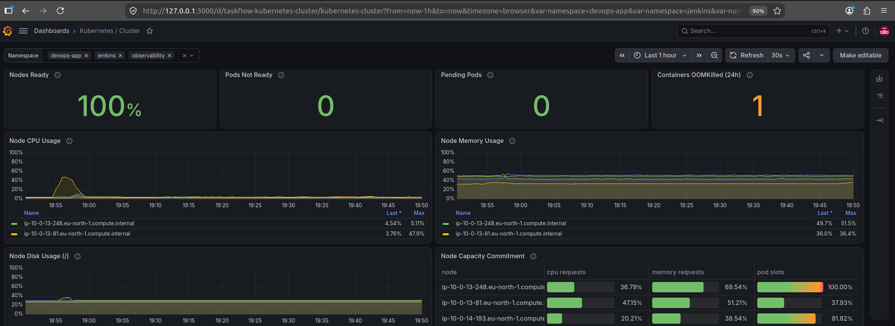
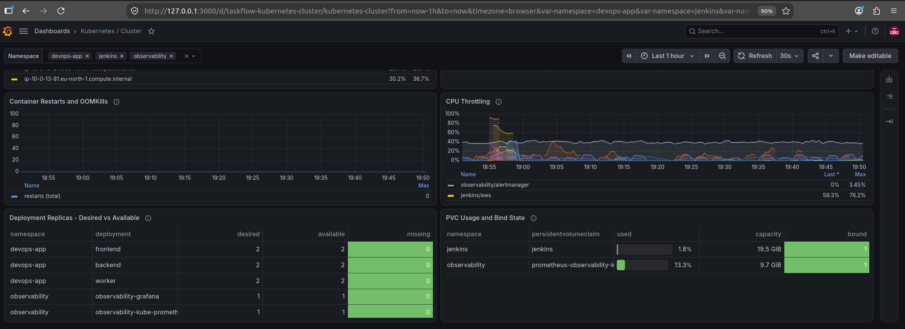
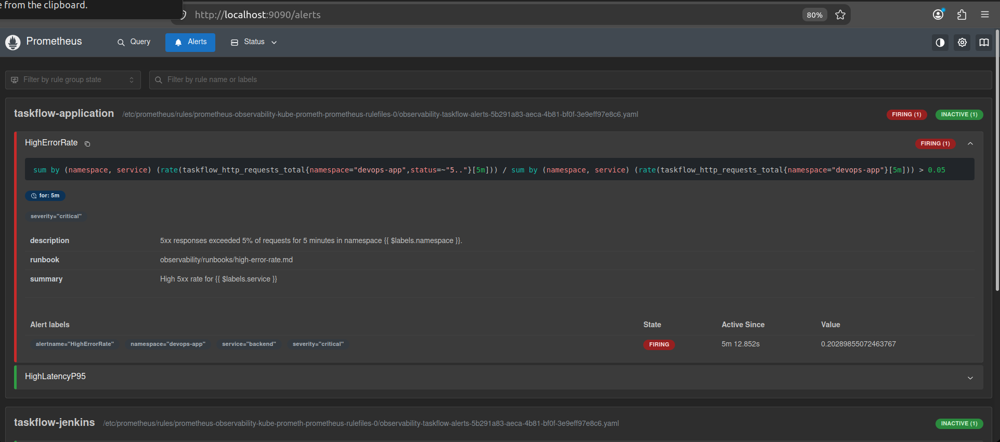
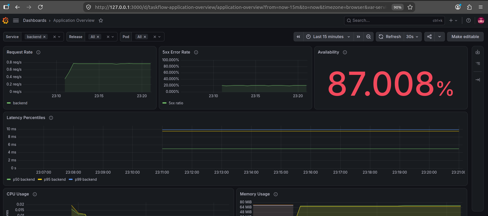
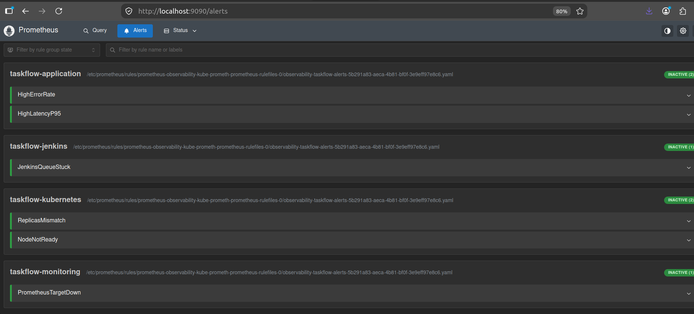
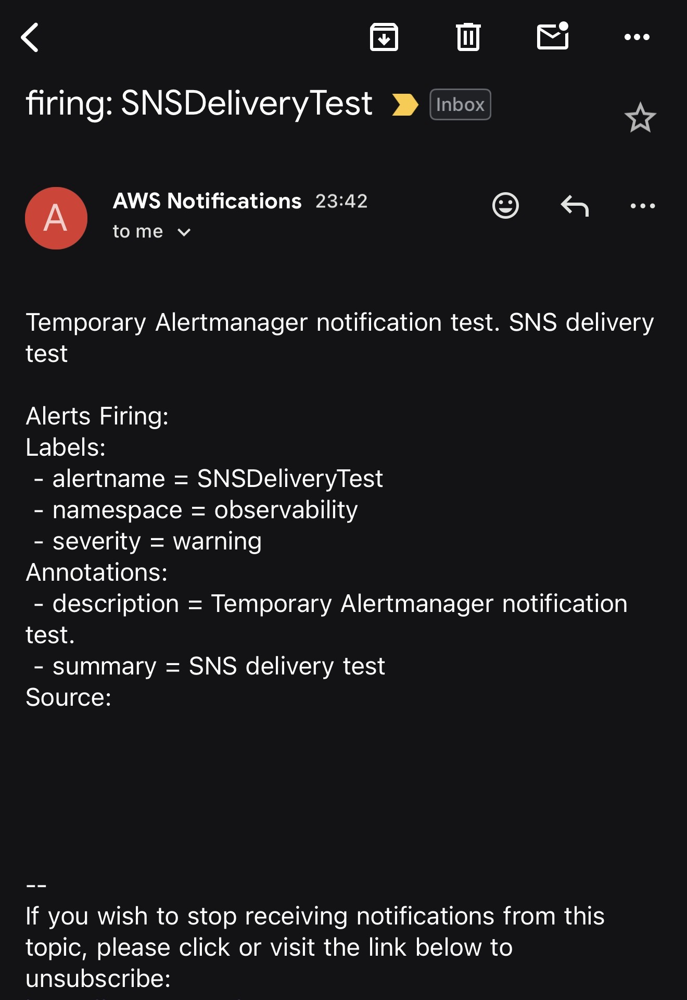
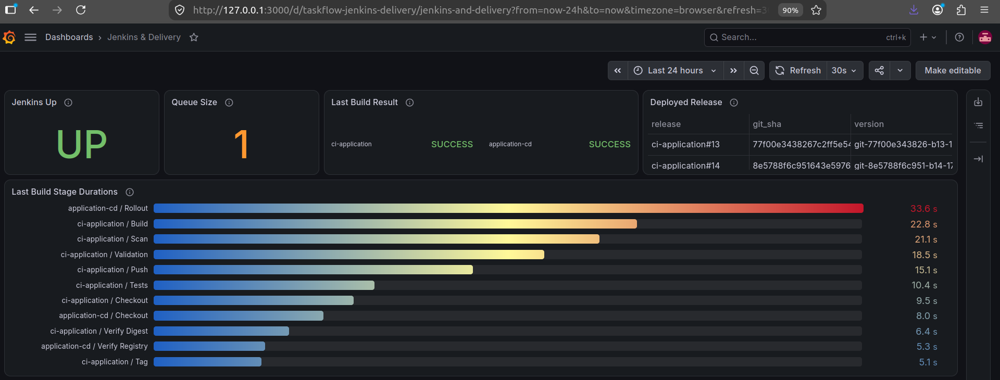
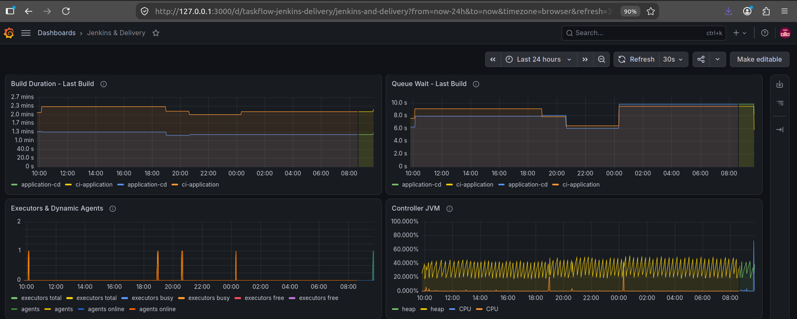
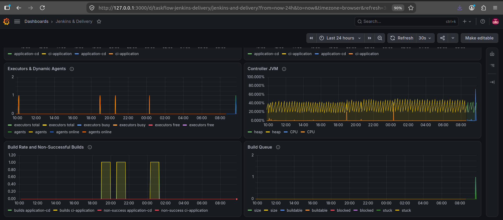

# Observability Evidence

This folder contains screenshots that show the main runtime checks for TaskFlow monitoring and observability. Each item below explains what the screenshot demonstrates.

## 🟣 01 — Prometheus Platform Targets

Prometheus platform targets are healthy: 31 targets are UP and 0 are DOWN.

## 🟣 02 — Observability Stack and Network Policies

The observability stack is running in EKS, node-exporter covers all cluster nodes, and the required ingress NetworkPolicies are applied.

## 🟣 03 — NetworkPolicy Enforcement

NetworkPolicy enforcement blocks unauthorized access to Prometheus while allowing the required monitoring communication.

## 🟣 04 — Application and Jenkins Targets

Prometheus successfully discovers and scrapes two Frontend targets, two Backend targets, two Worker targets, and one Jenkins metrics target.

## 🟣 05 — Application Overview

The Application Overview dashboard shows real traffic, 0% 5xx errors, 100% availability, p50/p95/p99 latency, CPU usage, and memory usage.

## 🟣 06 — Release Identity

The running application Pods are linked to the deployed version, Git SHA, and CI release, providing runtime release traceability.

## 🟣 07 — Kubernetes Cluster Overview

The Kubernetes Cluster dashboard shows all nodes ready, no pending or unready Pods, and node CPU, memory, disk, and capacity commitment per node.

## 🟣 08 — Kubernetes Cluster Workloads and Storage

The same dashboard covers container restarts and OOMKills, CPU throttling, Deployment replicas desired versus available, and PVC usage with bind state.

## 🟣 09 — HighErrorRate Firing

Controlled backend failures drive HighErrorRate into the firing state with the affected service, severity, and runbook visible.

## 🟣 10 — Application Overview During Fault

Application Overview shows the backend 5xx error rate rising to about 20% and availability falling below the 99% SLO.

## 🟣 11 — HighErrorRate Resolved

After recovery, all TaskFlow alert rules are inactive and monitoring has returned to a healthy state.

## 🟣 12 — SNS Alert Notification

Alertmanager successfully delivers the controlled alert notification through Amazon SNS to email.

## 🟣 13 — Jenkins Delivery Overview

The Jenkins and Delivery dashboard shows Jenkins controller health, live queue activity, successful CI and CD results, deployed release information, and stage durations for the latest pipeline run.

## 🟣 14 — Jenkins Delivery Performance

The same dashboard covers build duration and queue wait for the latest build, dynamic executor and agent activity, and controller JVM heap and CPU usage.

## 🟣 15 — Jenkins Delivery Activity

Build rate and non-successful builds are shown together with Jenkins queue behavior during pipeline execution.

