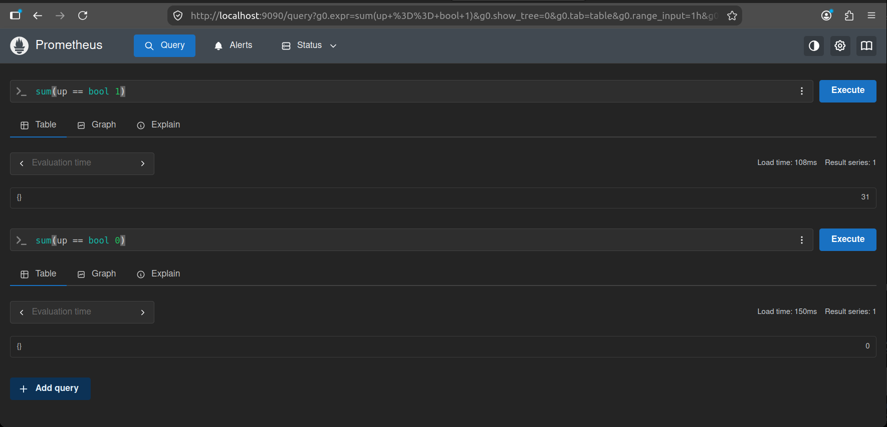
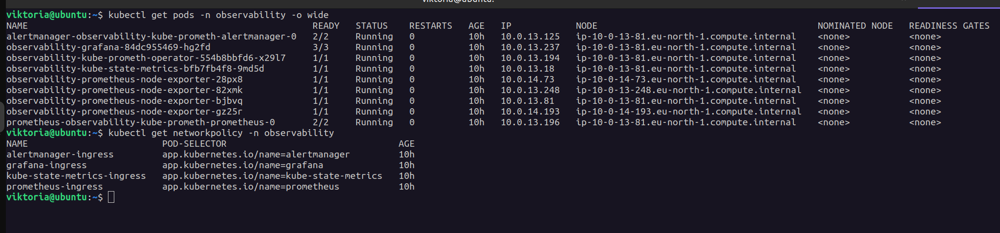
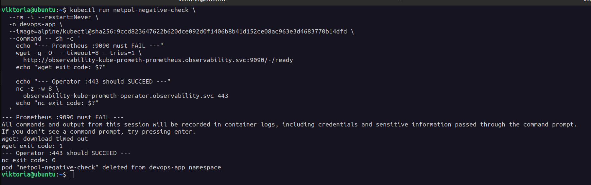
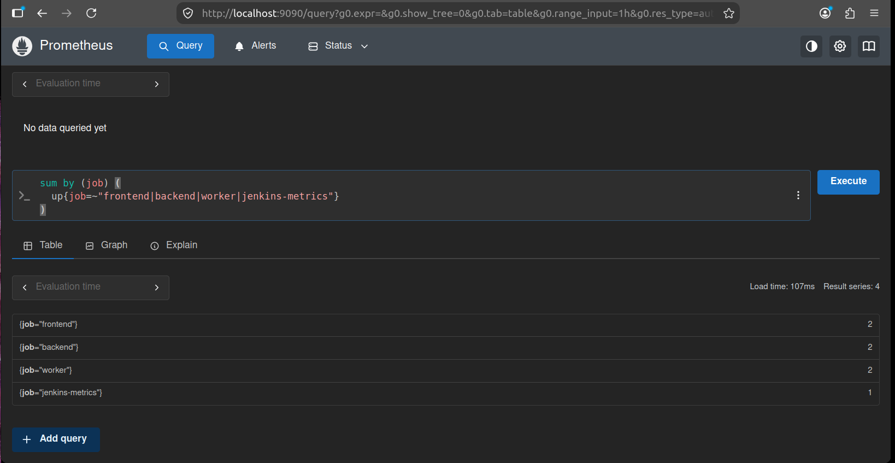
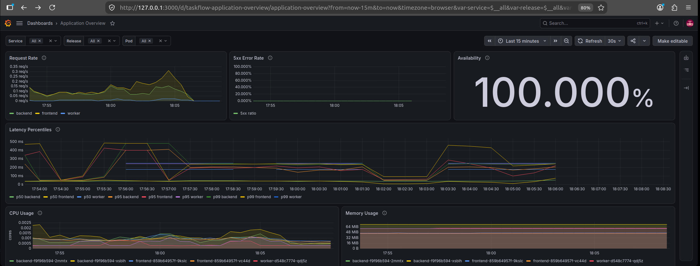
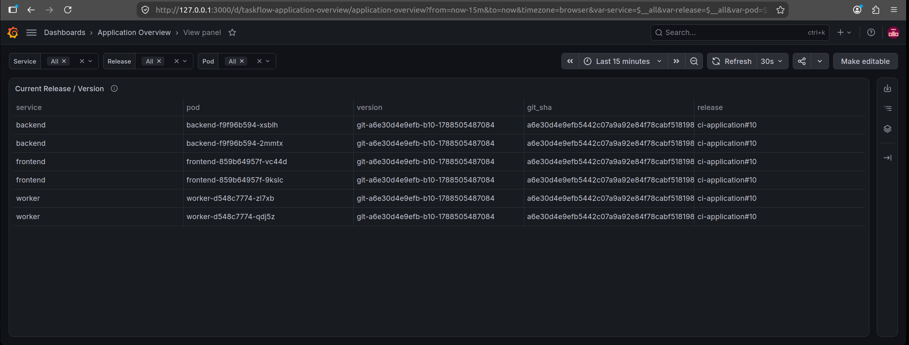

# Observability Evidence

This folder contains screenshots that show the main runtime checks for TaskFlow monitoring and observability. Each item below explains what the screenshot demonstrates.

## 🟣 01 — Prometheus Platform Targets

Prometheus platform targets are healthy: 31 targets are UP and 0 are DOWN.

## 🟣 02 — Observability Stack and Network Policies

The observability stack is running in EKS, node-exporter covers all cluster nodes, and the required ingress NetworkPolicies are applied.

## 🟣 03 — NetworkPolicy Enforcement

NetworkPolicy enforcement blocks unauthorized access to Prometheus while allowing the required monitoring communication.

## 🟣 04 — Application and Jenkins Targets

Prometheus successfully discovers and scrapes two Frontend targets, two Backend targets, two Worker targets, and one Jenkins metrics target.

## 🟣 05 — Application Overview

The Application Overview dashboard shows real traffic, 0% 5xx errors, 100% availability, p50/p95/p99 latency, CPU usage, and memory usage.

## 🟣 06 — Release Identity

The running application Pods are linked to the deployed version, Git SHA, and CI release, providing runtime release traceability.

